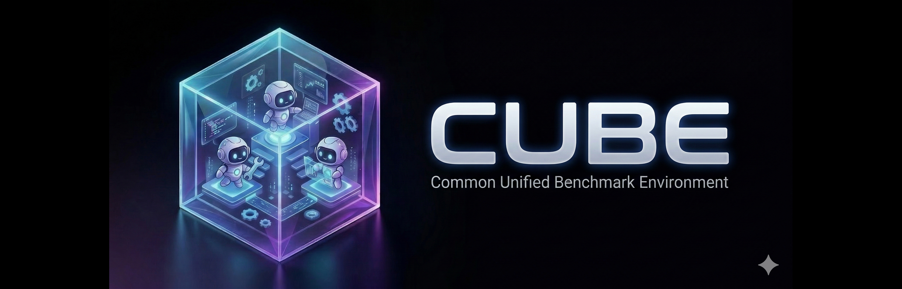

# CUBE Standard

> [!NOTE]
> **CUBE is in active development (alpha).** Interfaces may change. We welcome early adopters and contributors who want to shape the standard, not just use it.
> See our [Roadmap](ROADMAP.md) and [Contributing Guide](CONTRIBUTING.md).
>
> **Have a benchmark to contribute?** [Fill out this short form](https://docs.google.com/forms/d/e/1FAIpQLSddMFyRXZJPpD0I2K27OEmIPUpj57w--u2NuMscrjNlkqy8rQ/viewform) — no commitment required. Want to go deeper? [Apply to join the core team](https://forms.gle/JFiBi4ynfVLMghAH8).

<!--
[Published Documentation](https://the-ai-alliance.github.io/cube-standard/)
-->

This repo contains the code and documentation for the **AI Alliance: CUBE Standard** project, which standardizes benchmark wrapping so the community can wrap otherwise-incompatible benchmarks uniformly and use them everywhere.

**CUBE Standard** defines the protocol — the `Tool`, `Task`, `Benchmark`, `Observation`, and `Action` interfaces that any benchmark must implement. **[cube-harness](https://github.com/The-AI-Alliance/cube-harness)** is the evaluation runtime that runs agents against CUBE-compatible benchmarks.

**Paper:** [arXiv:2603.15798](https://arxiv.org/abs/2603.15798)

Principal developer: [ServiceNow AI Research](https://servicenow.com/research).

## Components

CUBE Standard is organized into three layers:

| Layer | Package | Description |
| --- | --- | --- |
| **Core** | `cube-standard` (this repo) | interfaces: `Tool`, `Task`, `Benchmark`, `Observation`, `Action` |
| **Resources** | [`cube-resources/`](cube-resources/README.md) | Optional shared infrastructure (browser sessions, VM backends) |
| **Tools** | [`cube-tools/`](cube-tools/README.md) | Optional action executors (browser tools, computer tools) |

**Resources** are pieces of shared infrastructure — e.g. a running browser instance or a VM — that are launched once and shared across tasks. **Tools** execute agent actions against that infrastructure.

```text
Benchmark ──► TaskConfig ──► Task ──► Tool ──► Resource ──► Environment
                                ▲               (cube-tools)  (cube-resources)
                         cube-standard
```

See [`cube-resources/README.md`](cube-resources/README.md) and [`cube-tools/README.md`](cube-tools/README.md) for available implementations and usage examples.

## Installation

Requires Python 3.12+. Install with [uv](https://docs.astral.sh/uv/):

```sh
uv add cube-standard
```

Or with pip:

```sh
pip install cube-standard
```

To include optional container backends:

```sh
# Docker support
uv add "cube-standard[docker]"

# Modal support
uv add "cube-standard[modal]"

# Daytona support
uv add "cube-standard[daytona]"
```

For development (includes test and lint tools):

```sh
git clone https://github.com/The-AI-Alliance/cube-standard
cd cube-standard
uv sync --extra dev
```

## CLI commands

| Command | What it does |
| --- | --- |
| `cube init [NAME]` | Scaffolds a new benchmark package from the built-in template |
| `cube list` | Lists all installed benchmarks registered under `cube.benchmarks` entry points |
| `cube test NAME` | Runs the debug suite and asserts `reward == 1.0` on every debug task |

## For benchmark contributors

Three ways to start:

1. **Guided** — run `/new-cube` in [Claude Code](https://claude.ai/claude-code) with this repo checked out. The skill interviews you, scaffolds the package, fills TODOs, and validates end-to-end.
2. **Copy** — `cp -r examples/counter-cube my-bench && cd my-bench && uv sync`, then edit the placeholders.
3. **Scaffold** — `cube init my-bench && cd my-bench && uv sync`, then work through the `TODO` markers.

Validate with `cube test my-bench` (every debug task must reach `reward == 1.0`), self-audit with `/review-cube ./my-bench`, and submit with `cube registry add --submit`.

See the **[Authoring a CUBE guide](https://the-ai-alliance.github.io/cube-standard/authoring-a-cube)** for the full walkthrough. [CONTRIBUTING.md](CONTRIBUTING.md) covers framework invariants and the RFC process.

> [!NOTE]
> `cube test` discovers benchmarks via the `cube.benchmarks` entry point group. Install the package (`uv sync` or `pip install -e .`) before running.

## For framework contributors

Want to change CUBE *itself* — a field, a method, a protocol type — rather than wrap a benchmark? CUBE is a small contract many cubes depend on, so we hold framework changes to a high bar (lean and general beats convenient-for-one). Start here:

- **[Design Philosophy](https://the-ai-alliance.github.io/cube-standard/design-philosophy)** — the broader picture and the bar a change must clear. **Read this before proposing an API change.** Most needs have a smaller in-schema form.
- **[Contribution workflow](CONTRIBUTING.md#the-contribution-workflow-end-to-end)** — branch → RFC → code → smoke → review, end to end.
- **[ROADMAP.md](ROADMAP.md)** — where the project is heading, so your change rides with it.
- **`/gatekeep-rfc`** ([skill](.claude/skills/gatekeep-rfc)) — run it locally and iteratively *while shaping* your idea (on a rough sketch, not just a finished draft); it reads it the way a maintainer will and points at the smallest change that fits. Converge locally before opening a PR — don't polish a full proposal only to get reshaped.

## Getting Involved

All contributions are welcome — open an issue, submit a PR, or wrap a new benchmark. See [CONTRIBUTING.md](CONTRIBUTING.md) for the development guide and RFC process.

**Want to contribute a benchmark?** Whether you're an original author or just a frequent user, [fill out this short form](https://docs.google.com/forms/d/e/1FAIpQLSddMFyRXZJPpD0I2K27OEmIPUpj57w--u2NuMscrjNlkqy8rQ/viewform) to let us know. No commitment required — we'll follow up based on your interest and the benchmark's fit.

Want deeper involvement? Join the core team, shape the roadmap, and get credit for what you build. [Apply here](https://forms.gle/JFiBi4ynfVLMghAH8).

For general AI Alliance contribution guidelines, see the [community repo](https://github.com/The-AI-Alliance/community/) and [Code of Conduct](https://github.com/The-AI-Alliance/community/blob/main/CODE_OF_CONDUCT.md).

All _code_ contributions are licensed under the [Apache 2.0 LICENSE](https://github.com/The-AI-Alliance/community/blob/main/LICENSE.Apache-2.0) (which is also in this repo, [LICENSE.Apache-2.0](LICENSE.Apache-2.0)).

All _documentation_ contributions are licensed under the [Creative Commons Attribution 4.0 International](https://github.com/The-AI-Alliance/community/blob/main/LICENSE.CC-BY-4.0) (which is also in this repo, [LICENSE.CC-BY-4.0](LICENSE.CC-BY-4.0)).

All _data_ contributions are licensed under the [Community Data License Agreement - Permissive - Version 2.0](https://github.com/The-AI-Alliance/community/blob/main/LICENSE.CDLA-2.0) (which is also in this repo, [LICENSE.CDLA-2.0](LICENSE.CDLA-2.0)).

### We use the "Developer Certificate of Origin" (DCO).

> [!WARNING]
> Before you make any git commits with changes, understand what's required for DCO.

See the Alliance contributing guide [section on DCO](https://github.com/The-AI-Alliance/community/blob/main/CONTRIBUTING.md#developer-certificate-of-origin) for details. In practical terms, supporting this requirement means you must use the `-s` flag with your `git commit` commands.

### Pre-commit hooks (recommended)

This repo uses the [`pre-commit`](https://pre-commit.com/) framework to run fast checks locally before you commit, including enforcing the DCO `Signed-off-by` line.

Install the hooks (you only need to do this once per clone):

```sh
pre-commit install --hook-type pre-commit --hook-type commit-msg
```

Run the checks on all files (optional, useful the first time):

```sh
pre-commit run --all-files
```

When committing, include your sign-off:

```sh
git commit -s -m "your message"
```
