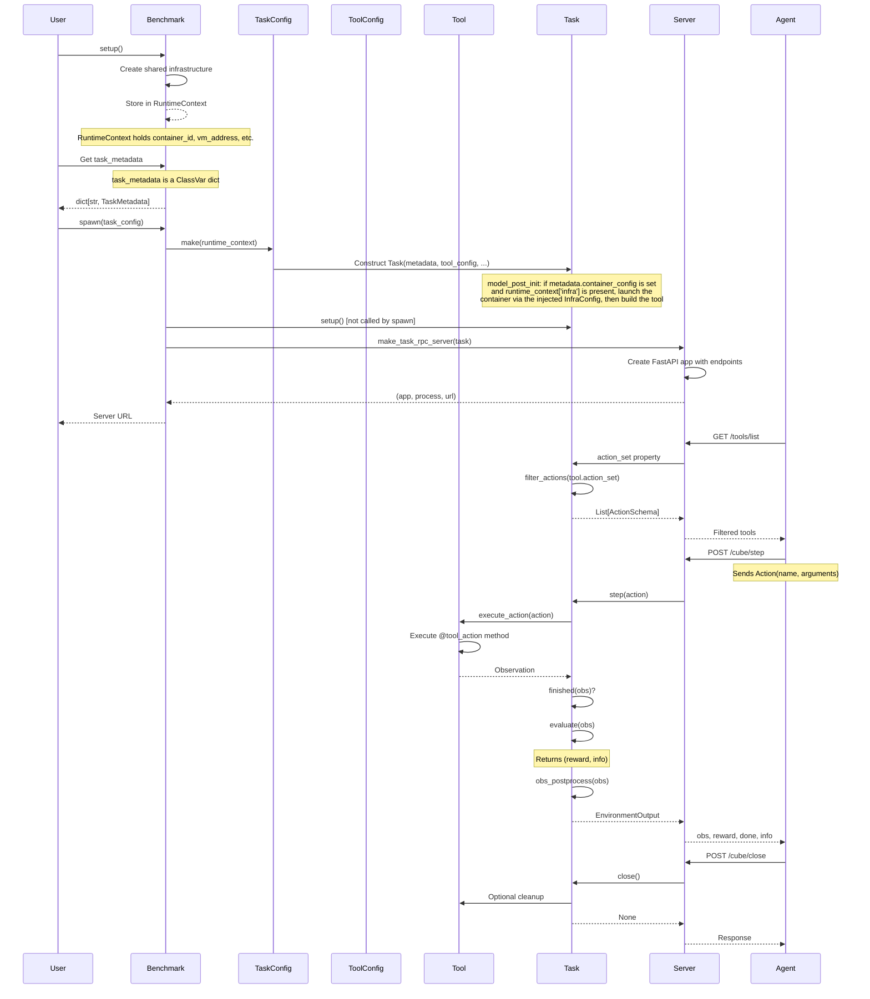
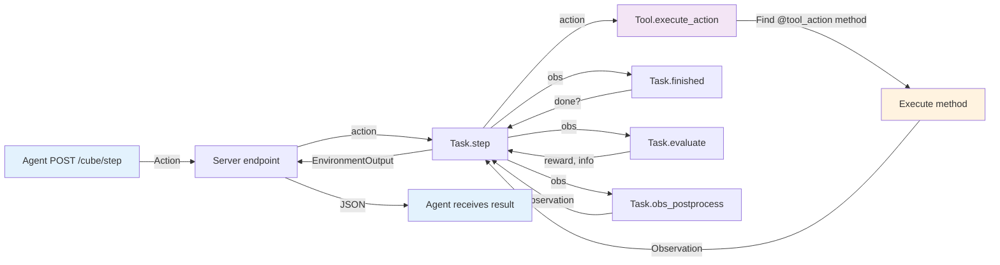
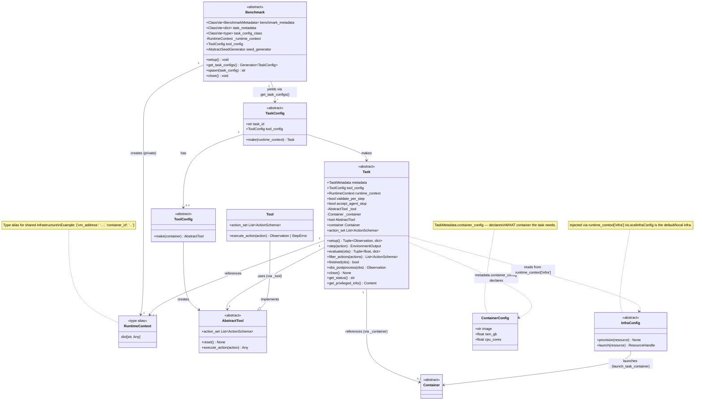

# CUBE Architecture Diagram

## Component Relationships

```mermaid
graph TD
    %% Main Components
    Benchmark[Benchmark<br/>Container for multiple tasks]
    Task[Task<br/>Task logic, validation & env dynamics]
    TaskConfig[TaskConfig<br/>Serializable task configuration]
    ToolConfig[ToolConfig<br/>Defines tool implementation]
    Tool[Tool<br/>Action executor with @tool_action decorator]
    Server[FastAPI Server<br/>REST API for task/benchmark]
    RuntimeContext[RuntimeContext<br/>Shared infrastructure resources]
    Container[Container<br/>Optional containerized environment]

    %% Benchmark lifecycle
    Benchmark -->|"setup()"| RuntimeContext
    Benchmark -->|"task_metadata"| TaskMetadataList[Dict of TaskMetadata]
    Benchmark -->|"get_task_configs()"| TaskConfig
    Benchmark -->|"spawn(task_config)"| Server

    %% TaskConfig creates Task
    TaskConfig -->|"make(runtime_context)"| Task
    TaskConfig -->|"has"| ToolConfig

    %% Container provisioning via injected InfraConfig
    InfraConfig[InfraConfig<br/>Provisions containers/VMs<br/>via runtime_context['infra']]
    Task -->|"model_post_init: launch_task_container()"| InfraConfig
    InfraConfig -->|"launch(ContainerConfig)"| Container

    %% ToolConfig creates Tool
    ToolConfig -->|"make(container)"| Tool

    %% Task uses Tool
    Task -->|"tool field"| Tool
    Task -->|"step(action)"| Tool
    Tool -->|"execute_action()"| Task
    Task -->|"action_set"| Tool
    Tool -->|"list actions"| Task

    %% Task uses RuntimeContext and Container
    Task -->|"runtime_context field"| RuntimeContext
    Task -->|"container field"| Container

    %% Task lifecycle
    Task -->|"setup()"| Task
    Task -->|"evaluate(obs)"| Task
    Task -->|"filter_actions()"| Task
    Task -->|"close()"| Task

    %% Server wraps Task
    Server -->|"wraps"| Task
    Server -->|"exposes REST API"| Task

    %% Styling
    classDef benchmark fill:#e1f5ff,stroke:#0288d1
    classDef core fill:#fff3e0,stroke:#f57c00
    classDef config fill:#f3e5f5,stroke:#7b1fa2
    classDef factory fill:#e8f5e9,stroke:#388e3c
    classDef infra fill:#fce4ec,stroke:#c2185b

    class Benchmark benchmark
    class Task,Tool core
    class TaskConfig,ToolConfig config
    class Server factory
    class RuntimeContext,Container,InfraConfig infra
```

## Flow Diagram: From Benchmark to Task Execution



## Data Flow: Task Execution Step



## Class Relationship Diagram



## Key Relationships Summary

| From | To | Relationship | Method |
|------|-----|--------------|--------|
| **Benchmark** | RuntimeContext | Creates shared resources | `setup()` populates `_runtime_context` (private) |
| **Benchmark** | TaskMetadata | Contains multiple | `task_metadata` ClassVar holds `dict[str, TaskMetadata]` |
| **Benchmark** | TaskConfig | Yields on demand | `get_task_configs()` yields `TaskConfig` |
| **Benchmark** | Task | Spawns via server | `spawn(task_config)` creates task and server |
| **TaskConfig** | Task | Factory | `make(runtime_context)` returns `Task` |
| **TaskConfig** | ToolConfig | Has one (optional) | `tool_config` field |
| **ToolConfig** | Tool | Factory | `make()` returns `AbstractTool` |
| **Task** | Tool | Uses | `tool` field, `step()` calls `tool.execute_action()` |
| **Task** | RuntimeContext | References | `runtime_context` field |
| **Task** | Container | Optional reference | `container` field |
| **Tool** | ActionSchema | Exposes actions | `action_set` property returns `List[ActionSchema]` |
| **Tool** | Action | Executes | `execute_action(action)` returns `Observation` |
| **Task** | Tool | Filters actions | `action_set` calls `filter_actions(tool.action_set)` |
| **Server** | Task | Wraps | FastAPI endpoints delegate to task methods |
| **Task** | InfraConfig | Reads injected infra | `runtime_context["infra"]` provisions the container in `model_post_init` |
| **InfraConfig** | Container | Launches | `launch_task_container()` provisions from `metadata.container_config` |

## Lifecycle Flow

1. **Benchmark Setup**:
   - User builds `BenchmarkConfig` and calls `config.make(infra)`; `infra` is forwarded as `Benchmark._infra`
   - `make()` calls `benchmark.setup()`
   - Benchmark implementation (`_setup()`) sets:
     - `_runtime_context`: Shared infrastructure references; cubes that need per-task containers publish the injected infra as `_runtime_context["infra"] = self._infra`
   - Note: `benchmark_metadata`, `task_metadata`, `task_config_class` are **class-level attributes** defined on the subclass, not set in `_setup()`

2. **Task Config Creation**:
   - User calls `benchmark.get_task_configs()` to iterate over `TaskConfig` objects
   - Benchmark yields one `task_config_class` instance per task (and per seed if `seed_generator` is set):
     - `task_id`: unique identifier
     - `tool_config`: from `benchmark.tool_config`
     - `seed`: from `seed_generator(task_metadata)` or `None`

3. **Task Spawning**:
   - User calls `benchmark.spawn(task_config)`
   - **Creates Task**:
     - Calls `task_config.make(runtime_context=benchmark._runtime_context)`
     - Inside `make()`: constructs `Task(metadata, tool_config, runtime_context, ...)`
     - Inside `Task.model_post_init()`:
       - If `metadata.container_config` is set and `runtime_context["infra"]` is present, provisions the container via the injected `InfraConfig` (`cube.task_infra.launch_task_container`)
       - Creates tool: `_tool = tool_config.make(container=_container)`
   - **Creates Server**:
     - Calls `make_task_rpc_server(task)`
     - Creates FastAPI app with REST endpoints
     - Spawns server in separate process
     - Returns URL

4. **Task Execution**:
   - Agent queries available tools via `GET /tools/list`
     - Server returns `task.action_set`
     - Task internally calls `task.filter_actions(task.tool.action_set)`
     - Tool's action_set discovered via @tool_action decorators
   - Agent executes step via `POST /cube/step`
     - Sends `Action(name, arguments)`
     - Server calls `task.step(action)`
     - Task calls `tool.execute_action(action)`
     - Tool finds method decorated with @tool_action matching action name
     - Tool executes method, returns Observation
     - Task checks if done: `task.finished(obs)`
     - Task evaluates: `task.evaluate(obs)` returns (reward, info)
     - Task post-processes: `task.obs_postprocess(obs)`
     - Returns `EnvironmentOutput(obs, reward, done, info, error)`

5. **Cleanup**:
   - Agent calls `POST /cube/close`
   - Server calls `task.close()`
   - Task cleans up resources (browser, container, temp files)
   - User calls `benchmark.close()` to cleanup shared resources

## Key Architecture Decisions

### ToolConfig as Factory Pattern

The architecture uses **ToolConfig** as a factory for creating Tool instances:

- **ToolConfig**: Serializable Pydantic model containing configuration
- **ToolConfig.make()**: Factory method that creates Tool instances
- **Benefit**: Enables research flexibility - different ToolConfigs can create different tool implementations for the same task
- **Example**: `CounterToolConfig` vs `ConfigurableCounterToolConfig` vs `DoubleIncrementToolConfig`

### Tool as Action Executor

Tools are standalone objects that execute actions:

- **Tool base class**: Provides automatic action discovery via decorators
- **@tool_action decorator**: Marks methods as executable actions
- **action_set property**: Automatically discovers all @tool_action methods
- **execute_action(action)**: Routes actions to decorated methods by name
- **Benefits**:
  - Zero boilerplate - just add decorator
  - Single source of truth - method signature defines the action
  - Clear intent - obvious which methods are actions

### Task has Tool, not Environment

Task directly holds a reference to its Tool:

- **task.tool**: AbstractTool instance created in `Task.model_post_init()` via `tool_config.make(container)`
- **task.step()**: Directly calls `self.tool.execute_action(action)`
- **task.action_set**: Returns `self.filter_actions(self.tool.action_set)`
- **No Environment wrapper**: Task implements environment dynamics directly
- **Benefit**: Simpler architecture, fewer abstractions

### Decorator-Based Action Discovery

Actions are discovered automatically via Python decorators:

```python
class CounterTool(Tool):
    @tool_action
    def increment(self) -> str:
        """Increment the counter by 1"""
        self.counter += 1
        return f"Counter is now {self.counter}"

    @tool_action
    def get_value(self) -> str:
        """Get the current counter value"""
        return f"Counter value is: {self.counter}"
```

- Tool introspects itself to find all @tool_action methods
- Creates ActionSchema from function signature and docstring
- No manual registration needed

### REST API via FastAPI

Server exposes REST endpoints, not MCP protocol:

- **Benchmark endpoints**: `/cube/info`, `/cube/tasks`, `/cube/spawn`, `/cube/shutdown`
- **Task endpoints**: `/tools/list`, `/tools/call`, `/cube/step`, `/cube/reset`, `/cube/close`, `/cube/status`, `/cube/privileged_info`
- **Resources**: `/resources/list`, `/resources/read` (not yet implemented)
- **Benefits**: Standard HTTP, easy to test, compatible with any HTTP client

### TaskConfig as Serializable Factory

TaskConfig is a Pydantic model that can be serialized:

- **JSON-serializable**: Can be passed over network, saved to disk
- **make() method**: Creates Task instance from config
- **Benefits**:
  - Can distribute task configs to workers
  - Can spawn tasks remotely
  - Configuration separate from implementation

### RuntimeContext for Shared Infrastructure

Benchmark creates shared resources once, tasks reference them:

- **RuntimeContext**: Holds references to shared infrastructure (containers, VMs, SSH sessions)
- **Created in benchmark._setup()**: One-time initialization, stored in `benchmark._runtime_context` (private)
- **Passed to task_config.make()**: Tasks can access shared resources via `runtime_context` field
- **Benefits**:
  - Efficient resource usage
  - Consistent environment across tasks
  - Easy cleanup in benchmark.close()
