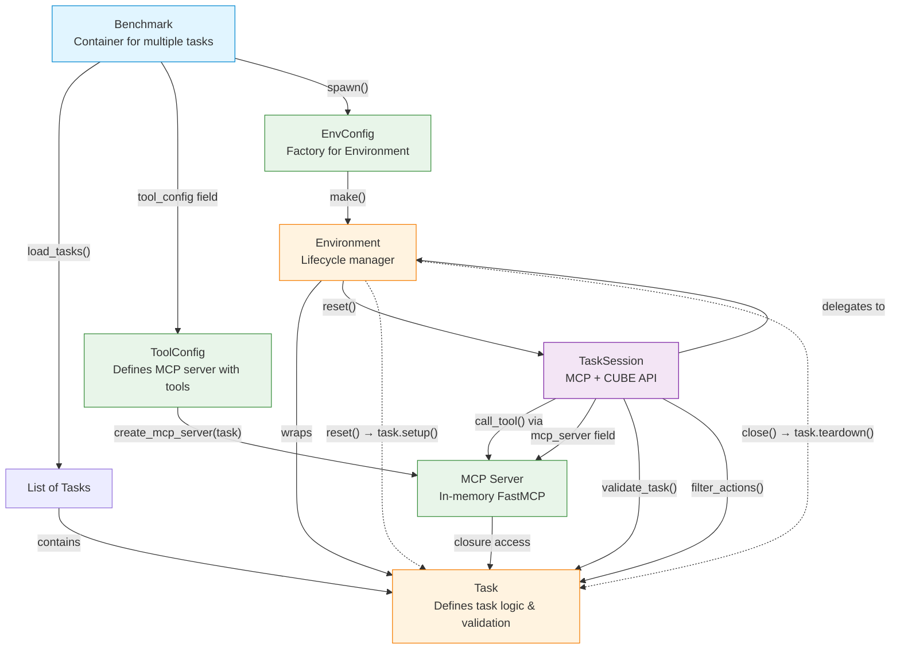
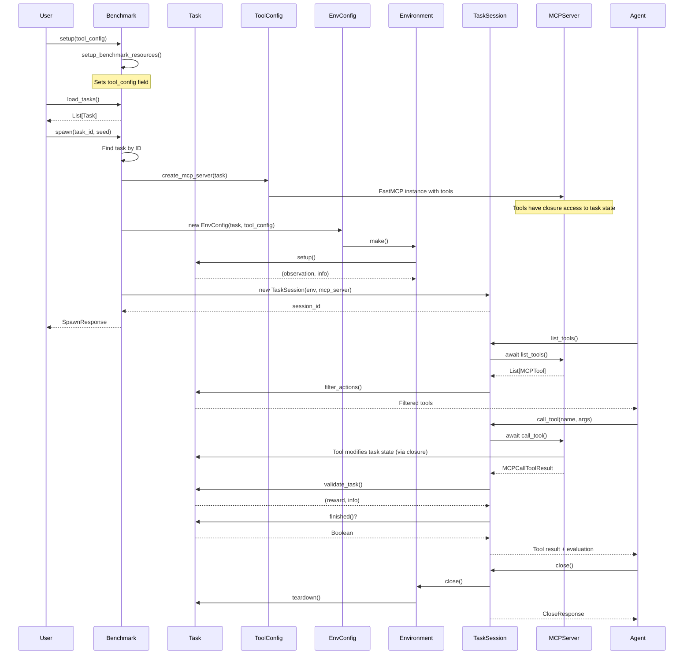
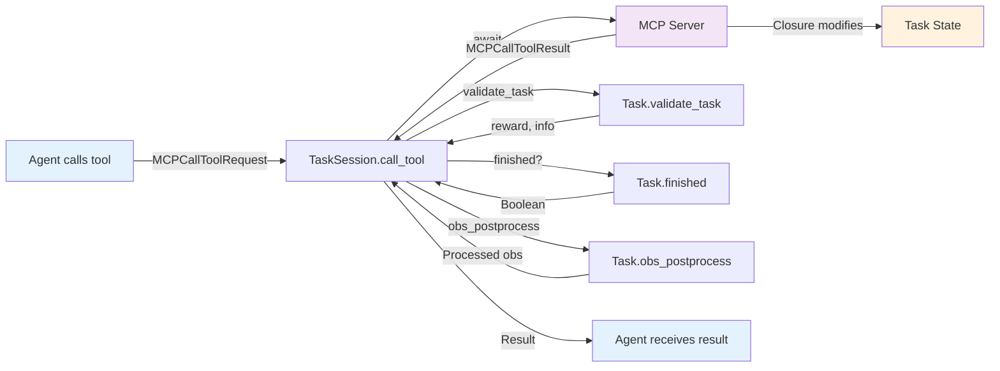
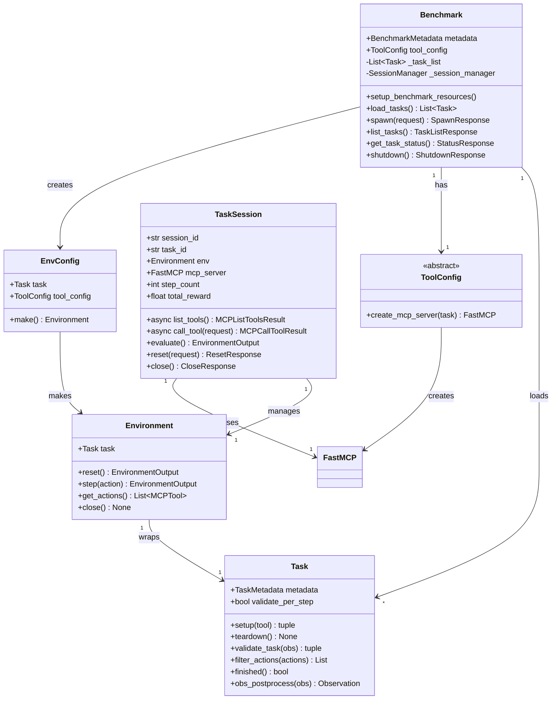

# CUBE Architecture Diagram

## Component Relationships



## Flow Diagram: From Benchmark to Task Execution



## Data Flow: Task Execution Step



## Class Relationship Diagram



## Key Relationships Summary

| From | To | Relationship | Method |
|------|-----|--------------|--------|
| **Benchmark** | Task | Contains multiple | `load_tasks()` returns `List[Task]` |
| **Benchmark** | ToolConfig | Has one | `tool_config` field (optional) |
| **ToolConfig** | FastMCP | Creates | `create_mcp_server(task)` returns `FastMCP` |
| **Benchmark** | EnvConfig | Creates | `spawn()` creates `EnvConfig(task, tool_config)` |
| **EnvConfig** | Environment | Factory | `make()` returns `Environment(task)` |
| **Environment** | Task | Wraps | Constructor takes `Task` |
| **Environment** | Task | Delegates lifecycle | `reset()` → `task.setup()` |
| **Environment** | Task | Delegates cleanup | `close()` → `task.teardown()` |
| **TaskSession** | Environment | Manages | Constructor takes `Environment` |
| **TaskSession** | FastMCP | Uses for tools | Constructor takes `mcp_server` parameter |
| **TaskSession** | Task | Validates | `call_tool()` calls `task.validate_task()` |
| **TaskSession** | Task | Filters | `list_tools()` calls `task.filter_actions()` |
| **FastMCP** | Task | Accesses state | Tools defined with closure over task instance |

## Lifecycle Flow

1. **Benchmark Setup**:
   - User calls `benchmark.setup()` or `benchmark.setup_benchmark_resources()` to initialize
   - Sets `benchmark.tool_config` field with a ToolConfig instance

2. **Task Loading**:
   - Benchmark loads tasks via `load_tasks()`, caches in `_task_list`

3. **Session Spawn**:
   - User calls `benchmark.spawn(task_id, seed)`
   - Benchmark finds task from loaded list
   - **ToolConfig creates MCP server**: `tool_config.create_mcp_server(task)` returns FastMCP instance
     - Tools are defined with closures that access task state directly
   - Creates `EnvConfig(task, tool_config)` → `Environment(task)`
   - Calls `env.reset()` which calls `task.setup()`
   - Creates `TaskSession(env, mcp_server)` with MCP server reference

4. **Task Execution**:
   - Agent lists tools via `await session.list_tools()`
     - TaskSession calls `await mcp_server.list_tools()`
     - Filters through `task.filter_actions()`
   - Agent calls tools via `await session.call_tool()`
     - TaskSession calls `await mcp_server.call_tool()`
     - MCP tool function executes, modifying task state via closure
     - Task validates via `task.validate_task()` (returns reward)
     - Task checks completion via `task.finished()`

5. **Cleanup**:
   - Agent calls `session.close()`
   - Calls `env.close()` → `task.teardown()`
   - Returns profiling data

## Key Architecture Decisions

### ToolConfig as Single Source of Truth

The architecture uses **ToolConfig** as the single source of truth for defining task action spaces:

- **Before**: Tasks had `register_mcp_tools()` method that was called during session creation
- **After**: ToolConfig's `create_mcp_server(task)` creates the MCP server with all tools defined
- **Benefit**: Enables research flexibility - different ToolConfigs can expose different tools for the same task

### In-Memory MCP Server

MCP servers are **in-memory FastMCP instances**, not subprocesses:

- TaskSession holds a reference to the MCP server instance
- `call_tool()` and `list_tools()` are async methods that await the MCP server
- Tools defined in ToolConfig use closures to access task state directly
- No subprocess overhead, simpler architecture

### Async Task Session Methods

TaskSession methods are async for MCP server interaction:

- `async list_tools()` - awaits MCP server's async list_tools()
- `async call_tool()` - awaits MCP server's async tool execution
- FastAPI endpoints are already async, so no changes needed for HTTP clients
- Python mode callers must use `await` when calling these methods

### Tool State Access via Closure

Tools access task state through closure, not through parameters:

```python
def create_mcp_server(self, task: Task) -> FastMCP:
    mcp = FastMCP(f"Counter Task: {task.metadata.id}")

    @mcp.tool()
    def increment() -> str:
        # Direct access to task state via closure
        task.counter += 1
        return f"Counter is now {task.counter}"

    return mcp
```

### No register_mcp_tools()

The `Task.register_mcp_tools()` method was **removed**:

- Tasks no longer define their own tools
- ToolConfig is responsible for creating the MCP server with tools
- Cleaner separation: Task defines logic, ToolConfig defines interface
