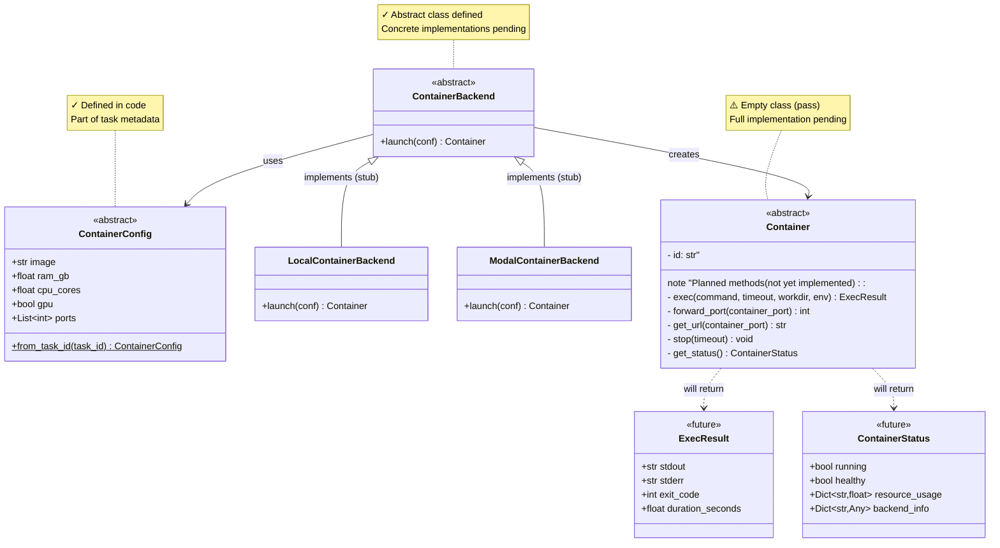

# CUBE Container API - Core Concept

> **CUBE Layer:** Task-level infrastructure (containers)
> **Related:** [main_specs.md](main_specs.md) | [vm_wrapper.md](vm_wrapper.md) | [user_experience.md](user_experience.md)

> **Key Insight:** Separate "what to run" (ContainerConfig) from "how to run it" (ContainerBackend)

> **Implementation Status:** Core abstractions defined, detailed implementations pending

## Overview

The Container API provides a unified abstraction for launching and communicating with Docker containers across different backends (local Docker, Modal, HPC via EAI Toolkit).

**The fundamental separation:**
- **ContainerConfig** - What to run (owned by benchmark, part of task metadata)
- **ContainerBackend** - How to run it (owned by harness user, defined once and shared)

## The Separation

### ContainerConfig - What to Run

**Owned by:** Benchmark (part of task metadata)
**Serializable:** Yes (Pydantic model)
**Status:** ✓ Defined in code

```python
class ContainerConfig(ABC, TypedBaseModel):
    """
    What to run. Owned by CUBE benchmark/task.
    Part of task metadata - retrieved via task_id.
    """
    image: str
    ram_gb: float
    cpu_cores: float
    gpu: bool = False
    ports: List[int] | None = None

    @abstractmethod
    @staticmethod
    def from_task_id(task_id: str) -> "ContainerConfig":
        """Load container config from task metadata."""
        pass
```

### ContainerBackend - How to Run It

**Owned by:** Harness user (config object)
**Serializable:** Yes (Pydantic with type information, can pass to Ray workers)
**Status:** ✓ Abstract class defined, implementations pending

```python
class ContainerBackend(ABC, TypedBaseModel):
    """
    How to run. Owned by harness users.
    Serializable (can pass to Ray workers).
    User chooses which backend to use.
    """

    @abstractmethod
    def launch(self, conf: ContainerConfig) -> Container:
        """Launch container from config. Blocks until ready."""
        pass

# Concrete implementations (stubs in current code)
class LocalContainerBackend(ContainerBackend):
    """Uses docker CLI/docker-py. Direct port mapping."""
    # TODO: Implement

class ModalContainerBackend(ContainerBackend):
    """Uses Modal API. HTTP RPC communication. Public URLs."""
    # TODO: Implement
```

**Note:** Backend is a **config object** (Pydantic). Serializes with `_type` field (e.g., `cube.backends.ToolkitContainerBackend`) to preserve concrete subclass when saved/loaded.

### Container - Runtime Object

**Status:** ⚠️ Abstract class defined but empty - full implementation pending

```python
class Container(ABC, TypedBaseModel):
    """Running container with exec and port forwarding capabilities."""
    pass  # Current implementation
```

**Planned methods (to be implemented):**

```python
class Container(ABC, TypedBaseModel):
    """Running container with exec and port forwarding capabilities."""

    @abstractmethod
    def exec(self, command: str, timeout: int | None = None,
             workdir: str | None = None, env: Dict[str, str] | None = None) -> ExecResult:
        """Execute command inside container. Returns ExecResult(stdout, stderr, exit_code, duration)."""

    @abstractmethod
    def forward_port(self, container_port: int) -> int:
        """Make container port accessible. Returns local port number."""

    @abstractmethod
    def get_url(self, container_port: int) -> str:
        """Get URL to access container port. Returns http://localhost:PORT or https://xyz.modal.run"""

    @abstractmethod
    def stop(self, timeout: int = 10):
        """Stop container gracefully. Cleanup: stop process, close tunnels, release ports."""

    @abstractmethod
    def get_status(self) -> ContainerStatus:
        """Check container health for debugging."""

    @property
    @abstractmethod
    def id(self) -> str:
        """Unique container identifier (backend-specific format)."""
```

## Why This Matters

**ContainerBackend** - Defined once by the user, shared across ALL benchmarks
- Lives in harness config as Pydantic model with type information
- Same backend instance used for WebArena, SWE-Bench, OSWorld, etc.
- User decides: "I want to run everything on Toolkit with these SLURM settings"

**ContainerConfig** - Unique to each task, owned by the benchmark
- Different for every task (different images, resources)
- Part of task metadata, retrieved via `task_id`
- Benchmark developer defines what each task needs

## Primary Use Case

Ray-based parallel evaluation where workers spin up containers, run benchmarks, and clean up.

```python
# 0. User defines backend ONCE in harness config
backend = ToolkitContainerBackend(
    backend_config={"partition": "gpu", "account": "my-project", "time": "24:00:00"}
)

# 1. Benchmark provides task metadata and creates configs on demand
benchmark = SWEBenchBenchmark()
benchmark.setup()
task_metadata_list = benchmark.task_list

# 2. Ray worker evaluates task
@ray.remote
def evaluate_task(task_metadata, task_config, backend, runtime_context):
    # Create task with running container
    # container_backend.launch() is called inside task_config.make()
    task = task_config.make(
        metadata=task_metadata,
        runtime_context=runtime_context,
        container_backend=backend
    )
    obs, info = task.setup()
    result = run_eval(task, obs)
    task.close()
    return result

# 3. Execute in parallel - same backend, 1000 different configs
runtime_context = benchmark.runtime_context
futures = []
for tm in task_metadata_list:
    tc = benchmark.create_task_config(task_id=tm.id)
    futures.append(evaluate_task.remote(tm, tc, backend, runtime_context))
results = ray.get(futures)
```

## Key Benefits

1. **No duplication** - Backend defined once, used for 1000s of tasks across multiple benchmarks
2. **Lightweight TaskConfig** - No bulky container config, just task_id
3. **Clear ownership** - User owns backend (harness config), benchmark owns spec (task metadata)
4. **Flexible deployment** - Switch ALL benchmarks from local → HPC by changing one config line
5. **Deterministic tasks** - task_id fully defines the task, backend is a user preference

## Key Design Decisions

**1. Separation of Config and Backend**
- **ContainerConfig:** Task metadata (Pydantic model, retrieved via task_id)
- **ContainerBackend:** User config (Pydantic with type information)
- Rationale: Eliminate duplication - backend shouldn't be repeated 1000x
- Status: ✓ Implemented

**2. Separation of Backend and Container**
- **ContainerBackend:** Serializable config (can pass to Ray workers)
- **Container:** Live object with connections (not serializable)
- Rationale: Ray workers serialize backend config, not live connections
- Status: ✓ Classes defined, implementations pending

**3. Blocking `launch()` Method**
- Blocks until container ready (or timeout: Local 30s, Modal 2min, Toolkit 30min)
- Rationale: Ray workers can block on I/O. Simpler than callbacks/polling.
- Status: ✓ API defined, implementations pending

**4. Backend as Abstract Classes**
- Each backend subclasses `ContainerBackend` with different implementations
- Local uses docker exec, Modal uses HTTP RPC, Toolkit uses SSH
- Rationale: Backends are too different to share implementation
- Status: ✓ Abstract class defined, concrete backends pending

## Backend Implementations

**Status:** ⚠️ Stubs defined, full implementations pending

```python
class LocalContainerBackend(ContainerBackend):
    """Uses docker CLI/docker-py. Direct port mapping."""
    def launch(self, conf: ContainerConfig) -> LocalContainer:
        # TODO: Implement
        pass

class ModalContainerBackend(ContainerBackend):
    """Uses Modal API. HTTP RPC communication. Public URLs."""
    def launch(self, conf: ContainerConfig) -> ModalContainer:
        # TODO: Implement
        pass

# Not yet in code, but planned:
class ToolkitContainerBackend(ContainerBackend):
    """Uses EAI Toolkit + SLURM. SSH tunnels for port forwarding."""
    def launch(self, conf: ContainerConfig) -> ToolkitContainer:
        # TODO: Implement
        pass
```

Each backend will return its own `Container` subclass with different exec/port-forwarding implementations.

## Port Forwarding Strategy

Note: this proposal is a placeholder, update this spec once we have a real implementation.
**User code (same for all backends):**
```python
backend = ToolkitContainerBackend(backend_config={"partition": "gpu"})
container = backend.launch(spec)
local_port = container.forward_port(8080)
response = requests.get(f"http://localhost:{local_port}/api")
```

**Backend implementations:**
- **Local:** Direct port mapping via Docker (`-p host_port:container_port`)
- **Modal:** No traditional forwarding - Modal provides public URLs. `forward_port()` extracts port number, `get_url()` returns full URL.
- **Toolkit:** Container runs on compute node (e.g., `node042:8080`). Creates SSH tunnel: `localhost:random_port → head_node → node042:8080`.

## Error Handling

**Fail-fast with rich diagnostics.** Error messages must indicate precisely where startup failed (job submission, queue wait, container start, port access, health check).

**Cleanup on failure.** If `launch()` fails partway, must clean up: cancel jobs, stop containers, close SSH connections, release ports.

**Optional health checks.** Beyond "container running", validate it's truly ready (e.g., database accepting connections). If health check fails, `launch()` raises `HealthCheckError` after cleanup.

## Updated TaskConfig API

**Status:** ✓ Implemented as documented

```python
class TaskConfig(ABC, TypedBaseModel):
    """Serializable task configuration."""

    task_id: str  # Used to retrieve task metadata
    tool_config: ToolConfig  # Tool configuration
    # NO container_config field ❌ - retrieved separately via task_id

    @abstractmethod
    def make(
        self,
        runtime_context: RuntimeContext | None = None,
        container_backend: ContainerBackend | None = None,
    ) -> Task:
        """
        Instantiate task from config.

        Container is launched inside make() using container_backend if provided:
        1. Load container config: ContainerConfig.from_task_id(self.task_id)
        2. Launch container: container = container_backend.launch(container_config)
        3. Assign to task: task.container = container
        """
        pass
```


## Integration with CUBE Hierarchy

`ContainerConfig` is part of task metadata retrieved by `task_id` via `ContainerConfig.from_task_id()` as defined in [main_specs.md](main_specs.md). In practice, `backend.launch(config)` is typically called inside `task_config.make()` on Ray workers.

**Typical flow:**
1. User defines `ContainerBackend` in harness config (once for all benchmarks)
2. Benchmark provides task_id in TaskConfig
3. Ray worker calls `task_config.make(container_backend=backend)`
4. Inside `make()`:
   - Retrieve config: `container_config = ContainerConfig.from_task_id(task_id)`
   - Launch container: `container = backend.launch(container_config)`
   - Assign to task: `task.container = container`
5. Container lives for the duration of the task
6. Container is stopped in `task.close()` via `container.stop()`

For benchmarks using VMs instead of containers (e.g., WebArena), see [vm_wrapper.md](vm_wrapper.md).

## Success Criteria

The design succeeds if:
1. User can define backend once and use it for all benchmarks
2. CUBE-Developer can swap backends by changing harness config
3. Ray parallelization works without modification
4. Port forwarding is transparent across backends
5. Error messages clearly indicate failure point
6. No resource leaks on failures
7. Toolkit/HPC works despite complexity (SSH tunnels, SLURM, etc)
8. No duplication of backend config across tasks

## Class Diagram


