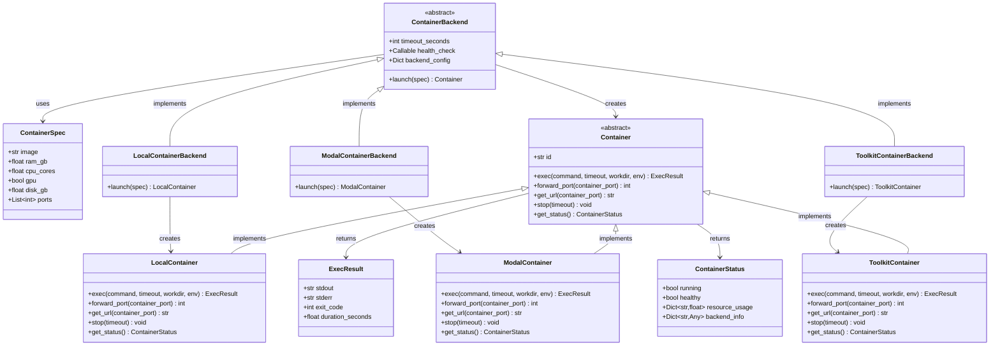

# CUBE Container API - Core Concept

> **CUBE Layer:** Task-level infrastructure (containers)
> **Related:** [main_specs.md](main_specs.md) | [vm_wrapper.md](vm_wrapper.md) | [user_experience.md](user_experience.md)

> **Key Insight:** Separate "what to run" (ContainerSpec) from "how to run it" (ContainerBackend)

## Overview

The Container API provides a unified abstraction for launching and communicating with Docker containers across different backends (local Docker, Modal, HPC via EAI Toolkit).

**The fundamental separation:**
- **ContainerSpec** - What to run (owned by benchmark, part of task metadata)
- **ContainerBackend** - How to run it (owned by harness user, defined once and shared)

## The Separation

### ContainerSpec - What to Run

**Owned by:** Benchmark (part of task metadata)
**Serializable:** Yes (plain dict/dataclass in JSON)

```python
@dataclass
class ContainerSpec:
    """Part of task metadata - retrieved via task_id."""
    image: str
    ram_gb: float = 4.0
    cpu_cores: float = 2.0
    gpu: bool = False
    ports: List[int] | None = None
```

### ContainerBackend - How to Run It

**Owned by:** Harness user (config object)
**Serializable:** Yes (Pydantic with type information, can pass to Ray workers)

```python
class ContainerBackend(TypedBaseModel, ABC):
    """User's choice of how to run containers."""

    timeout_seconds: int = 1800
    health_check: Callable[[Container], bool] | None = None
    backend_config: Dict[str, Any] = {}

    @abstractmethod
    def launch(self, spec: ContainerSpec) -> Container:
        """Launch container from spec. Blocks until ready."""
        pass

# Concrete implementations
class LocalContainerBackend(ContainerBackend): ...
class ModalContainerBackend(ContainerBackend): ...
class ToolkitContainerBackend(ContainerBackend): ...
```

**Note:** Backend is a **config object** (Pydantic). Serializes with `_type` field (e.g., `cube.backends.ToolkitContainerBackend`) to preserve concrete subclass when saved/loaded.

### Container - Runtime Object

```python
class Container(ABC):
    """Running container with exec and port forwarding capabilities."""

    @abstractmethod
    def exec(self, command: str, timeout: int | None = None,
             workdir: str | None = None, env: Dict[str, str] | None = None) -> ExecResult:
        """Execute command inside container. Returns ExecResult(stdout, stderr, exit_code, duration)."""

    @abstractmethod
    def forward_port(self, container_port: int) -> int:
        """Make container port accessible. Returns local port number."""

    @abstractmethod
    def get_url(self, container_port: int) -> str:
        """Get URL to access container port. Returns http://localhost:PORT or https://xyz.modal.run"""

    @abstractmethod
    def stop(self, timeout: int = 10):
        """Stop container gracefully. Cleanup: stop process, close tunnels, release ports."""

    @abstractmethod
    def get_status(self) -> ContainerStatus:
        """Check container health for debugging."""

    @property
    @abstractmethod
    def id(self) -> str:
        """Unique container identifier (backend-specific format)."""
```

## Why This Matters

**ContainerBackend** - Defined once by the user, shared across ALL benchmarks
- Lives in harness config as Pydantic model with type information
- Same backend instance used for WebArena, SWE-Bench, OSWorld, etc.
- User decides: "I want to run everything on Toolkit with these SLURM settings"

**ContainerSpec** - Unique to each task, owned by the benchmark
- Different for every task (different images, resources)
- Part of task metadata, never changes
- Benchmark developer defines what each task needs

## Primary Use Case

Ray-based parallel evaluation where workers spin up containers, run benchmarks, and clean up.

```python
# 0. User defines backend ONCE in harness config
backend = ToolkitContainerBackend(
    backend_config={"partition": "gpu", "account": "my-project", "time": "24:00:00"}
)

# 1. Benchmark provides lightweight task configs
benchmark = SWEBenchBenchmark()
task_configs = benchmark.get_task_list()  # Just task_ids

# 2. Ray worker evaluates task
@ray.remote
def evaluate_task(task_config, backend):
    # Retrieve container spec from task metadata
    task_logic = load_task_logic(task_config.task_id)
    container_spec = task_logic.container_spec  # Unique per task

    # User's backend launches it
    container = backend.launch(container_spec)  # Same backend, different spec

    # Create task with running container
    task = task_config.make(container=container)
    result = run_eval(task)
    container.stop()
    return result

# 3. Execute in parallel - same backend, 1000 different specs
futures = [evaluate_task.remote(cfg, backend) for cfg in task_configs]
results = ray.get(futures)
```

## Key Benefits

1. **No duplication** - Backend defined once, used for 1000s of tasks across multiple benchmarks
2. **Lightweight TaskConfig** - No bulky container config, just task_id
3. **Clear ownership** - User owns backend (harness config), benchmark owns spec (task metadata)
4. **Flexible deployment** - Switch ALL benchmarks from local → HPC by changing one config line
5. **Deterministic tasks** - task_id fully defines the task, backend is a user preference

## Key Design Decisions

**1. Separation of Spec and Backend**
- **ContainerSpec:** Task metadata (plain dataclass/dict)
- **ContainerBackend:** User config (Pydantic with type information)
- Rationale: Eliminate duplication - backend shouldn't be repeated 1000x

**2. Separation of Backend and Container**
- **ContainerBackend:** Serializable config (can pass to Ray workers)
- **Container:** Live object with connections (not serializable)
- Rationale: Ray workers serialize backend config, not live connections

**3. Blocking `launch()` Method**
- Blocks until container ready (or timeout: Local 30s, Modal 2min, Toolkit 30min)
- Rationale: Ray workers can block on I/O. Simpler than callbacks/polling.

**4. Backend as Abstract Classes**
- Each backend subclasses `ContainerBackend` with different implementations
- Local uses docker exec, Modal uses HTTP RPC, Toolkit uses SSH
- Rationale: Backends are too different to share implementation

## Backend Implementations

```python
class LocalContainerBackend(ContainerBackend):
    """Uses docker CLI/docker-py. Direct port mapping."""
    def launch(self, spec: ContainerSpec) -> LocalContainer: ...

class ModalContainerBackend(ContainerBackend):
    """Uses Modal API. HTTP RPC communication. Public URLs."""
    def launch(self, spec: ContainerSpec) -> ModalContainer: ...

class ToolkitContainerBackend(ContainerBackend):
    """Uses EAI Toolkit + SLURM. SSH tunnels for port forwarding."""
    def launch(self, spec: ContainerSpec) -> ToolkitContainer: ...
```

Each backend returns its own `Container` subclass with different exec/port-forwarding implementations.

## Port Forwarding Strategy

Note: this proposal is a placeholder, update this spec once we have a real implementation.
**User code (same for all backends):**
```python
backend = ToolkitContainerBackend(backend_config={"partition": "gpu"})
container = backend.launch(spec)
local_port = container.forward_port(8080)
response = requests.get(f"http://localhost:{local_port}/api")
```

**Backend implementations:**
- **Local:** Direct port mapping via Docker (`-p host_port:container_port`)
- **Modal:** No traditional forwarding - Modal provides public URLs. `forward_port()` extracts port number, `get_url()` returns full URL.
- **Toolkit:** Container runs on compute node (e.g., `node042:8080`). Creates SSH tunnel: `localhost:random_port → head_node → node042:8080`.

## Error Handling

**Fail-fast with rich diagnostics.** Error messages must indicate precisely where startup failed (job submission, queue wait, container start, port access, health check).

**Cleanup on failure.** If `launch()` fails partway, must clean up: cancel jobs, stop containers, close SSH connections, release ports.

**Optional health checks.** Beyond "container running", validate it's truly ready (e.g., database accepting connections). If health check fails, `launch()` raises `HealthCheckError` after cleanup.

## Updated TaskConfig API

```python
@dataclass
class TaskConfig(ABC):
    task_id: str  # Used to retrieve everything
    tool_config: ToolConfig | None = None
    # NO MORE: container_config field ❌

    def make(
        self,
        runtime_info: Dict[str, Any] | None = None,
        container: Container | None = None,  # NEW: passed from harness
    ) -> Task:
        """Container is pre-launched and passed in."""
        pass
```


## Integration with CUBE Hierarchy

`ContainerSpec` is part of task metadata retrieved by `task_id` in [main_specs.md](main_specs.md). In practice, `backend.launch(spec)` is called inside the harness before calling `task_config.make()` on Ray workers.

**Typical flow:**
1. User defines `ContainerBackend` in harness config (once for all benchmarks)
2. Benchmark provides task_id which includes `ContainerSpec` in metadata
3. Ray worker retrieves spec and calls `backend.launch(spec)`
4. Container is passed to `task_config.make(container=container)`
5. Container lives for the duration of the task, then `container.stop()` is called in `task.close()`

For benchmarks using VMs instead of containers (e.g., WebArena), see [vm_wrapper.md](vm_wrapper.md).

## Success Criteria

The design succeeds if:
1. User can define backend once and use it for all benchmarks
2. CUBE-Developer can swap backends by changing harness config
3. Ray parallelization works without modification
4. Port forwarding is transparent across backends
5. Error messages clearly indicate failure point
6. No resource leaks on failures
7. Toolkit/HPC works despite complexity (SSH tunnels, SLURM, etc)
8. No duplication of backend config across tasks

## Class Diagram


