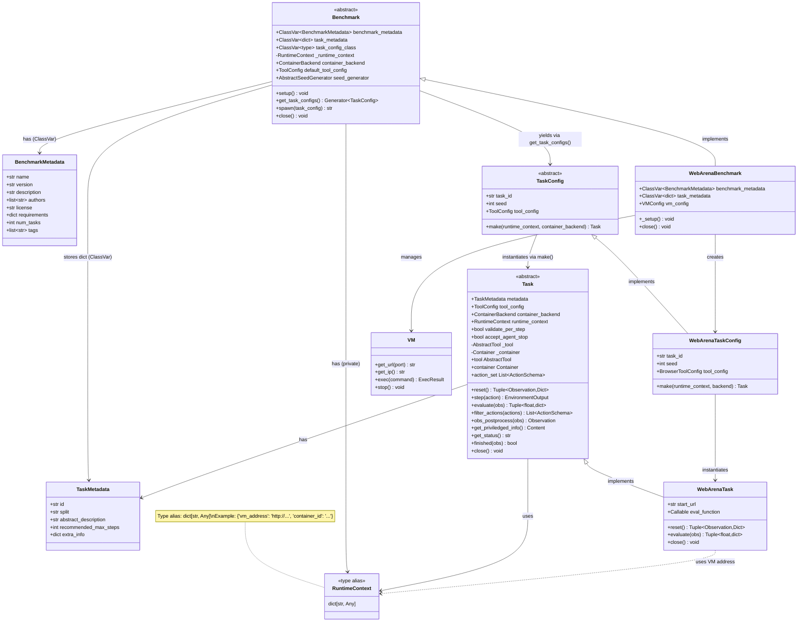

# CUBE Benchmark and Task API Specification

> **CUBE Layer:** Benchmark & Task API (core abstract classes)
> **Related:** [docker_wrapper.md](docker_wrapper.md) | [vm_wrapper.md](vm_wrapper.md) | [user_experience.md](user_experience.md)

## Overview

The Benchmark and Task API defines how benchmarks expose tasks and how tasks are executed on Ray workers. Tasks are created from serializable configs that can be passed to distributed workers.

## Primary Use Case

```python
# On coordinator (main process)
benchmark = WebArenaBenchmark(
    default_tool_config=BrowserToolConfig(),
    seed_generator=BasicSeedGenerator(n_seed=3, meta_seed=42),
)
benchmark.setup()  # Initialize infrastructure

# Distribute to Ray workers
@ray.remote
def evaluate_task(task_config, runtime_context, container_backend, agent_config):
    task = task_config.make(
        runtime_context=runtime_context,
        container_backend=container_backend,
    )
    agent = agent_config.make()

    obs, info = task.reset()
    for step in range(max_steps):
        action = agent.get_action(obs)
        result = task.step(action)
        obs = result.obs
        if result.done:
            break

    task.close()
    return result

# Execute in parallel
futures = []
for task_config in benchmark.get_task_configs():
    futures.append(evaluate_task.remote(
        task_config,
        benchmark._runtime_context,
        benchmark.container_backend,
        agent_config,
    ))
results = ray.get(futures)

# Cleanup
benchmark.close()
```

## Key Design Decisions

**1. Metadata/Config/Instance Separation**
- `TaskMetadata`: Static task description (loaded from disk, can be arbitrarily large)
- `TaskConfig`: Lightweight runtime config with task_id, seed, and tool_config (serializable, sent over network)
- `Task`: Live instance with tools and state (not serializable)

**2. Self-Contained Configs**
- TaskConfig contains everything needed to recreate task (task_id references metadata, seed for reproducibility, tool_config)
- TaskMetadata is passed separately to `make()` by the coordinator, not embedded in TaskConfig
- Can be retried independently if worker crashes
- May reference external services (VMs, containers) via runtime_context

**3. Runtime Context**
- Benchmark stores infrastructure references in `benchmark.runtime_context` (public attribute)
- `runtime_context` defaults to `{}` for benchmarks with no shared infrastructure
- Harness passes `runtime_context` to `task_config.make()` so tasks can connect to live infrastructure
- TaskConfig itself remains infrastructure-agnostic and serializable

**4. Seed Generation**
- Seeds are runtime-specific, not stored in TaskMetadata
- Benchmark accepts a `seed_generator: AbstractSeedGenerator | None` constructor parameter
- `AbstractSeedGenerator.__call__(task_metadata) -> list[int]` returns one seed per desired repetition

## Core API

### Supporting Types

```python
class BenchmarkMetadata(TypedBaseModel):
    """
    Metadata describing a benchmark.

    Attributes:
        name (str): Benchmark name
        version (str): Benchmark version
        description (str): Benchmark description
        authors (list[str]): List of benchmark author names
        license (str): Benchmark license
        requirements (dict[str, Any]): Hardware requirements
        num_tasks (int): Total number of tasks
        tags (list[str]): Benchmark tags
        other (dict[str, Any]): Additional metadata
    """
    name: str
    version: str
    description: str
    authors: list[str] = []
    license: str = ""
    requirements: dict[str, Any] = {}
    num_tasks: int = 0
    tags: list[str] = []
    other: dict[str, Any] = {}


RuntimeContext = dict[str, Any]
"""
Type alias for shared infrastructure references created during benchmark._setup().

Contains mutable references to infrastructure like VMs, containers, or
other services that are shared across tasks. This is passed to
task_config.make() so tasks can connect to the live infrastructure.

Example:
    {"container_id": "abc123", "vm_address": "http://12.34.56.78", "ssh_session": session}
"""


class TaskMetadata(TypedBaseModel):
    """
    Static metadata describing a task.

    Saved to/loaded from disk. Can be arbitrarily large.
    Does NOT contain runtime-specific info like seeds or tool configs.

    Attributes:
        id (str): Unique task identifier
        split (Literal["train", "val", "test"]): Split for the task (default: "test")
        abstract_description (str): Broad description of the task for searching and filtering only. The task objective is part of the first Observation returned by task.reset(). (default: "")
        recommended_max_steps (int | None): Recommended maximum number of steps to help harness prevent infinite running agents. Not a hard limit, the task can still run longer if needed. (default: None)
        container_config (ContainerConfig | None): Optional container configuration for this task (default: None)
        extra_info (dict[str, Any]): Additional task metadata, eg: difficulty level, domain, etc. (default: empty dict)
    """
    id: str
    split: Literal["train", "val", "test"] = "test"
    abstract_description: str = ""
    recommended_max_steps: int | None = None
    container_config: ContainerConfig | None = None
    extra_info: dict[str, Any] = {}
```

### Benchmark (Abstract Base Class)

Manages benchmark-level infrastructure and task enumeration.

```python
class Benchmark(TypedBaseModel, ABC):
    """Represents a benchmark consisting of multiple tasks."""

    # Class-level attributes that must be defined by subclasses (not constructor params)
    benchmark_metadata: ClassVar[BenchmarkMetadata]
    task_metadata: ClassVar[dict[str, TaskMetadata]]
    task_config_class: ClassVar[type[TaskConfig]]

    # Set during _setup() by the benchmark creator
    _runtime_context: RuntimeContext = PrivateAttr(default_factory=dict)

    # Set by benchmark users (constructor params)
    container_backend: ContainerBackend | None = Field(default=None)
    default_tool_config: ToolConfig | None = Field(default=None)
    seed_generator: AbstractSeedGenerator | None = Field(default=None)

    @abstractmethod
    def _setup(self) -> None:
        """
        Initialize shared benchmark infrastructure.

        Should (optional):
        - Create shared infrastructure and store references in self._runtime_context

        Note: task_metadata, task_config_class, and benchmark_metadata are
        defined as class-level attributes on the Benchmark subclass, not set here.

        Examples:
        - Start VMs for WebArena (shared across tasks)
        - Initialize shared services

        Note: For SWE-Bench style benchmarks, containers are started
        per-task (in Task.model_post_init()), not here.

        Called by setup() wrapper before task distribution.
        """

    def setup(self) -> None:
        """
        Public method to setup the benchmark. Calls _setup() and validates configuration.
        """

    def get_task_configs(self) -> Generator[TaskConfig]:
        """
        Yield TaskConfig objects for all tasks in this benchmark.

        For each task in task_metadata, yields one config per seed
        (if seed_generator is set) or one config with seed=None.

        Returns: Generator of TaskConfig instances
        """

    def spawn(self, task_config: TaskConfig) -> str:
        """
        Spawn a new RPC server for the specified task.

        Args:
            task_config: A TaskConfig produced by get_task_configs()

        Returns: URL endpoint where the task RPC server is accessible
        """

    @abstractmethod
    def close(self):
        """
        Cleanup benchmark infrastructure.

        Examples:
        - Stop VMs
        - Destroy containers
        - Close connections
        """


class TaskConfig(ABC, TypedBaseModel):
    """
    Lightweight, serializable task configuration (Pydantic BaseModel).

    Must be JSON-serializable to pass to Ray workers.
    Contains only runtime configuration, NOT task metadata/logic.
    TaskMetadata is retrieved inside make() via the benchmark's task_metadata.
    """

    task_id: str  # Unique identifier (references TaskMetadata)
    seed: int | None = None  # Random seed for reproducibility
    tool_config: ToolConfig | None = None  # Tool configuration (e.g., BrowserToolConfig)

    @abstractmethod
    def make(
        self,
        runtime_context: RuntimeContext | None = None,
        container_backend: ContainerBackend | None = None,
    ) -> Task:
        """
        Instantiate task from config.

        Called on Ray worker after deserialization.

        Args:
            runtime_context: Current infrastructure references from benchmark._runtime_context
                           (e.g., VM addresses, service URLs). None for self-contained tasks.
            container_backend: Optional container backend for launching task-specific containers.
                             Passed through to the Task; container is launched in model_post_init().

        Returns: Ready-to-use Task instance

        Example:
            task_metadata = MyBenchmark.task_metadata[self.task_id]
            return MyTask(
                metadata=task_metadata,
                tool_config=self.tool_config,
                runtime_context=runtime_context,
                container_backend=container_backend,
            )

        Note: For RPC, spawn = task_config.make() + make_task_rpc_server()
        RPC support can be added later without changing this API.
        """
```

### Task (Abstract Base Class)

Gym-like interface for task execution.

```python
class Task(TypedBaseModel, ABC):
    """
    Individual task instance with Gym-like API.

    Created from TaskConfig on worker.

    Components:
    - metadata: Task metadata (id, description, tags, etc.)
    - tool: Instantiated tool (browser, terminal, etc) — accessed via .tool property
    - runtime_context: Shared infrastructure references (VMs, etc.)
    - container: Running container (if task uses one) — accessed via .container property
    """

    # Serializable fields
    metadata: TaskMetadata
    tool_config: ToolConfig  # Required; launched container is passed to tool_config.make(container)
    container_backend: ContainerBackend | None = None  # Backend for launching container
    runtime_context: RuntimeContext | None = None  # Shared infrastructure references
    validate_per_step: bool = False  # Whether to evaluate after each step
    accept_agent_stop: bool = True  # Whether task accepts agent STOP action

    # Non-serializable runtime state (set during model_post_init)
    _tool: AbstractTool | None = PrivateAttr(default=None)
    _container: Container | None = PrivateAttr(default=None)

    def model_post_init(self, __context: Any) -> None:
        """Called after Pydantic __init__. Launches container if configured, then creates tool."""

    @property
    def tool(self) -> AbstractTool: ...

    @property
    def container(self) -> Container | None: ...

    @property
    def id(self) -> str:
        """Task identifier."""
        return self.metadata.id

    @property
    def action_set(self) -> List[ActionSchema]:
        """
        Tool definitions in litellm-compatible format.

        Returns tool.action_set filtered by self.filter_actions().

        Returns a list of ActionSchema objects with:
        - type: "function"
        - name: Function name
        - description: Function description
        - parameters: JSON Schema for parameters

        ActionSchema objects can be converted to litellm/OpenAI format via .as_dict().
        Agents use this to discover available actions without knowing
        tool implementations in advance.

        Example return value:
        [
            ActionSchema(
                type="function",
                name="click",
                description="Click on a web element",
                parameters={
                    "type": "object",
                    "properties": {
                        "selector": {"type": "string", "description": "CSS selector"}
                    },
                    "required": ["selector"]
                }
            )
        ]

        Note: ActionSchema.as_dict() produces litellm-compatible format:
        {
            "type": "function",
            "function": {
                "name": "click",
                "description": "Click on a web element",
                "parameters": {...}
            }
        }
        """
        return self.filter_actions(self.tool.action_set)

    def filter_actions(self, actions: list[ActionSchema]) -> list[ActionSchema]:
        """
        (Optional) Whitelist subset of tool actions.

        Allows task to restrict which tool actions are available.
        By default returns all actions unfiltered.

        Args:
            actions: Full list of tool actions

        Returns: Filtered list of actions
        """
        return actions

    @abstractmethod
    def reset(self) -> Tuple[Observation, Dict]:
        """
        Set up the task to its initial state.

        Should call self.tool.reset() to reset the tool as well.

        Returns:
            Tuple of (initial observation, info dict with additional context)

        Examples:
        - WebArena: Navigate to starting URL
        - SWE-Bench: Clone repo, checkout commit
        """

    def step(self, action: Action | List[Action]) -> EnvironmentOutput:
        """
        Execute action(s), return next state.

        Process:
        1. Check if agent action is STOP_ACTION
        2. Execute action via self.tool.execute_action(action)
        3. Check if task is done via self.finished(obs)
        4. Evaluate if done or validate_per_step is True
        5. Post-process observation

        Args:
            action: Single action or list of actions to execute

        Returns:
            EnvironmentOutput containing:
                obs: Next state observation
                reward: Reward signal (0.0 if not available)
                done: Task completed successfully
                truncated: Task hit limit (time, steps)
                info: Additional metadata
                error: StepError if exception occurred

        Follows Gymnasium API conventions.
        """

    def obs_postprocess(self, obs: Observation) -> Observation:
        """
        (Optional) Post-process observation before returning to agent.

        By default does nothing.

        Args:
            obs: Raw observation

        Returns: Processed observation
        """
        return obs

    @abstractmethod
    def evaluate(self, obs: Observation) -> Tuple[float, dict]:
        """
        Evaluate current state and return (reward, info).

        Args:
            obs: Current observation

        Returns:
            Tuple of (reward, info dict with evaluation details)
        """

    def get_priviledged_info(self) -> Content:
        """
        Return privileged information for evaluation judges.

        Provides context that helps automated judges (LLM-based or otherwise)
        more accurately diagnose agent failures. May include:
        - Solution trajectory: list[Action]
        - Evaluation function source code
        - Ground-truth answers
        - Environment internal state summaries

        Returns: Content with privileged context. Default: empty StructuredContent.
        """
        return StructuredContent(data={})

    def get_status(self) -> str:
        """
        (Optional) Return current task status.

        Can check self.runtime_context and/or self.container for status.

        Returns: Status string
        """
        return ""

    def finished(self, obs: Observation) -> bool:
        """
        (Optional) Check if task is finished based on observation.

        By default returns False (task only finishes when agent emits STOP or error).

        Args:
            obs: Current observation

        Returns: True if task is complete
        """
        return False

    def close(self):
        """
        (Optional) Cleanup task resources.

        Examples:
        - Close browser
        - Stop container
        - Cleanup temp files
        - Reset state for next task
        """
```

## Concrete Example: WebArena

### Task Metadata (JSON)

Task metadata can be stored in JSON format and loaded during benchmark setup:

```json
[
  {
    "task_id": "webarena_shopping_001",
    "split": "test",
    "abstract_description": "Find and add cheapest laptop to cart",
    "recommended_max_steps": 20,
    "extra_info": {
      "domain": "web",
      "category": "shopping",
      "difficulty": "easy",
      "start_path": "/shop",
      "eval_type": "url_match",
      "eval_target": "/cart.*laptop"
    }
  },
  {
    "task_id": "webarena_shopping_002",
    "split": "test",
    "abstract_description": "Compare prices of two products",
    "recommended_max_steps": 15,
    "extra_info": {
      "domain": "web",
      "category": "shopping",
      "difficulty": "medium",
      "start_path": "/shop/compare",
      "eval_type": "element_check",
      "eval_target": "#comparison-table"
    }
  }
]
```

Note: Seeds are NOT in metadata - they are generated at runtime when creating TaskConfig.

### WebArenaTaskConfig

```python
class WebArenaTaskConfig(TaskConfig):
    """Serializable WebArena task configuration."""

    task_id: str
    seed: int | None = None
    tool_config: BrowserToolConfig | None = None  # How to create browser

    def make(
        self,
        runtime_context: RuntimeContext | None = None,
        container_backend: ContainerBackend | None = None,
    ) -> Task:
        """Create WebArenaTask instance."""
        # 1. Retrieve task metadata from the benchmark class variable
        metadata = WebArenaBenchmark.task_metadata[self.task_id]

        # 2. Extract task-specific data from metadata.extra_info
        start_path = metadata.extra_info["start_path"]
        eval_type = metadata.extra_info["eval_type"]
        eval_target = metadata.extra_info["eval_target"]

        # 3. Create task instance (tool created automatically in model_post_init)
        vm_address = runtime_context["vm_address"] if runtime_context else "http://localhost"
        return WebArenaTask(
            metadata=metadata,
            tool_config=self.tool_config,
            runtime_context=runtime_context,
            start_url=f"{vm_address}{start_path}",
            eval_function=create_eval_fn(eval_type, eval_target),
        )


class WebArenaTask(Task):
    """WebArena task instance."""

    # Additional serializable fields
    start_url: str
    eval_function: Callable  # type: ignore[assignment]

    def reset(self) -> Tuple[Observation, Dict]:
        """Navigate to starting URL and return initial observation."""
        self.tool.reset()
        self.tool.navigate(self.start_url)
        obs = self.tool.get_observation()
        return obs, {"start_url": self.start_url}

    def evaluate(self, obs: Observation) -> Tuple[float, dict]:
        """Evaluate if task is complete."""
        success = self.eval_function(obs)
        reward = 1.0 if success else 0.0
        return reward, {"success": success}

    def close(self):
        """Close browser."""
        self.tool.close()


class WebArenaBenchmark(Benchmark):
    """WebArena benchmark with VM infrastructure."""

    # Required class-level attributes
    benchmark_metadata = BenchmarkMetadata(  # or auto-loaded from benchmark_metadata.json
        name="WebArena",
        version="1.0",
        description="Web navigation benchmark",
        tags=["web", "navigation"]
    )
    task_config_class = WebArenaTaskConfig
    task_metadata: ClassVar[dict[str, TaskMetadata]] = _load_webarena_tasks()  # or auto-loaded from task_metadata.json

    # Additional constructor param specific to this benchmark
    vm_config: VMConfig

    def _setup(self) -> None:
        """Start VM infrastructure."""
        self.vm = self.vm_config.make()  # Blocks until ready
        self._runtime_context = {"vm_address": self.vm.get_url(80)}

    def close(self):
        """Stop VM."""
        if hasattr(self, "vm"):
            self.vm.stop()
```


## Runtime Context Pattern

When shared infrastructure is recreated (e.g., VM gets a new IP), the harness
simply re-reads `benchmark.runtime_context` and passes it to `task_config.make()`.
TaskConfigs remain immutable and infrastructure-agnostic.

```python
# VM crashed, need to recreate
benchmark.vm.stop()
benchmark.vm = benchmark.vm_config.make()  # New IP
benchmark._runtime_context = {"vm_address": benchmark.vm.get_url(80)}  # Update context

# Retry failed tasks — _runtime_context automatically has new IP
failed_task_ids = get_failed_task_ids()
futures = [
    evaluate_task.remote(
        task_config,
        benchmark._runtime_context,
        benchmark.container_backend,
        agent_config,
    )
    for task_config in benchmark.get_task_configs()
    if task_config.task_id in failed_task_ids
]
```

### TaskLogic (Future Design)

> **Status:** Not currently implemented. TaskLogic as a separate abstraction is deferred.
>
> **Current Approach:** Task metadata (loaded via task_id) and task logic (reset, evaluate)
> are directly implemented in Task subclasses. The intent/description is stored in
> TaskMetadata.
>
> **Future Consideration:** A separate TaskLogic abstraction could help isolate
> CUBE-Developer concerns (task logic vs. Gym API plumbing), but adds complexity.
> This separation may be revisited as the CUBE-Developer API matures if a clear need emerges.
>
> If TaskLogic were to be reintroduced, it would look like:

```python
class TaskLogic(ABC):
    """
    Task-specific logic (intent, evaluation, setup).

    Loaded from task metadata (not in TaskConfig).
    """

    task_id: str
    intent: str  # Natural language task description

    @abstractmethod
    def setup(self, **kwargs) -> None:
        """
        Prepare task environment.

        Called during task.reset().

        Args may include pre-initialized tools (e.g., browser page):
            setup(page=playwright_page)  # For browser tasks
            setup(container=container)   # For container tasks

        Examples:
        - Navigate to starting URL
        - Initialize database state
        - Clone repository
        """

    @abstractmethod
    def evaluate(self, observation: Observation) -> bool:
        """
        Check if task is successfully completed.

        Returns: True if task completed successfully
        """
```

## Best Practices

**TaskConfig Design:**
- Keep configs small and lightweight (serialize/deserialize frequently)
- Contains task_id (reference to metadata), seed (runtime), and tool_config (runtime)
- TaskMetadata is passed separately to `make()`, not embedded in config
- Use Pydantic for validation and serialization
- Mutable infrastructure refs (VM IPs, URLs) come via `runtime_context`, not stored in config

**TaskMetadata Design:**
- Static, immutable task description (can be saved to/loaded from disk)
- Can be arbitrarily large (not frequently serialized over network)
- Does NOT contain runtime-specific data like seeds or tool configs
- Store as list of dicts (can load into pandas DataFrame)
- Include filterable fields in `extra_info` (category, difficulty, etc)
- Keep task-specific data (intent, eval criteria) separate from infrastructure refs

**RPC Support:**
- RPC spawn implemented via `benchmark.spawn()`: `task_config.make()` + `make_task_rpc_server()`
- Returns URL endpoint where task RPC server is accessible
- Current API supports both local (direct) and remote (RPC) task execution

## Error Handling

**Fail-fast with diagnostics.** Error messages must indicate precisely where failure occurred.

**Error Recovery:**
- TaskConfig is idempotent (can retry `make()`)
- Task cleanup is safe (can call `close()` multiple times)
- Benchmark exposes `runtime_context` with current infrastructure state for retries

**Cleanup on failure:** If `make()` fails partway, must clean up: stop containers, close connections, release ports.

## Success Criteria

The design succeeds if:
1. CUBE-User can evaluate an agent on a benchmark with minimal boilerplate
2. TaskConfigs are fully serializable and retryable across Ray workers
3. Benchmark manages shared infrastructure only (VMs, services), not per-task state
4. Tool definitions are discoverable via `task.tools` in litellm-compatible format
5. Error messages clearly indicate failure point
6. No resource leaks on failures or crashes
7. RPC can be added later without changing the Python API

## Position Paper API Mapping

Mapping between the CUBE position paper's RPC endpoints and the Python API/RPC implementation:

### Benchmark-Level Endpoints

| Position Paper Endpoint | Python Method | RPC Endpoint | Description |
|---|---|---|---|
| `cube/info` | `benchmark.benchmark_metadata` | `GET /cube/info` | Get benchmark metadata |
| `cube/tasks` | `benchmark.task_metadata` | `GET /cube/tasks` | List available task metadata |
| `cube/spawn` | `benchmark.spawn(task_config)` | `POST /cube/spawn` | Spawn new task RPC server |
| `cube/shutdown` | `benchmark.close()` | `POST /cube/shutdown` | Cleanup benchmark infrastructure |

### Task-Level Endpoints

| Position Paper Endpoint | Python Method | RPC Endpoint | Description |
|---|---|---|---|
| `cube/reset` | `task.reset()` | `POST /cube/reset` | Reset task to initial state |
| `cube/step` | `task.step()` | `POST /cube/step` | Execute action + evaluation |
| `cube/evaluation` | `task.evaluate()` | `POST /cube/evaluate` | Evaluate observation |
| `cube/close` | `task.close()` | `POST /cube/close` | Cleanup task resources |
| `cube/status` | `task.get_status()` | `GET /cube/status` | Get task status |
| `cube/privilege_info` | `task.get_priviledged_info()` | `GET /cube/priviledged_info` | Privileged info for judges |
| `tools/list` | `task.action_set` | `GET /tools/list` | Tool definitions (litellm format) |
| `tools/call` | `task.tool.execute_action()` | `POST /tools/call` | Execute a single tool action |
| `resources/list` | Not yet implemented | `GET /resources/list` | List available resources |
| `resources/read` | Not yet implemented | `POST /resources/read` | Read resource data |

**Notes:**
- Python API can be used directly for in-process execution
- RPC endpoints (via `make_task_rpc_server()` and `create_benchmark_rpc_server()`) enable remote task execution
- `task_config.make()` is the Python method that instantiates a task; `benchmark.spawn()` wraps this + RPC server creation

## Class Diagram

> See [docker_wrapper.md](docker_wrapper.md) for `ContainerConfig`/`Container` details and [vm_wrapper.md](vm_wrapper.md) for `VMConfig`/`VM` details.


