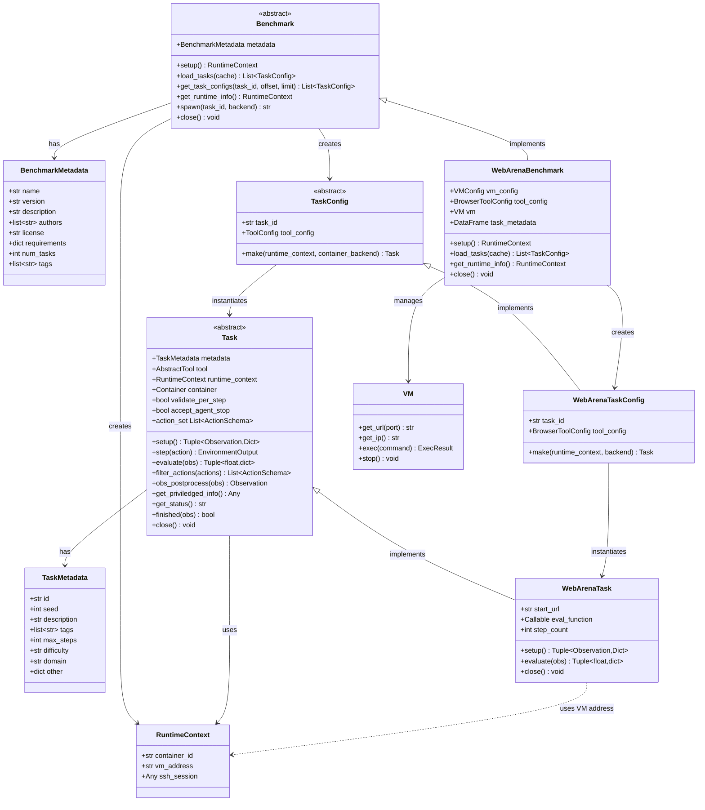

# CUBE Benchmark and Task API Specification

> **CUBE Layer:** Benchmark & Task API (core abstract classes)
> **Related:** [docker_wrapper.md](docker_wrapper.md) | [vm_wrapper.md](vm_wrapper.md) | [user_experience.md](user_experience.md)

## Overview

The Benchmark and Task API defines how benchmarks expose tasks and how tasks are executed on Ray workers. Tasks are created from serializable configs that can be passed to distributed workers.

## Primary Use Case

```python
# On coordinator (main process)
benchmark = WebArenaBenchmark(vm_config, tool_config)
benchmark.setup()  # Initialize infrastructure (VMs, containers, etc)

# Get serializable task configs
task_configs = benchmark.load_tasks()

# Distribute to Ray workers
@ray.remote
def evaluate_task(task_config, agent_config, runtime_context):
    task = task_config.make(runtime_context=runtime_context)
    agent = agent_config.make()

    obs, info = task.setup()
    for step in range(max_steps):
        action = agent.get_action(obs)
        result = task.step(action)
        obs = result.obs
        if result.done or result.truncated:
            break

    task.close()
    return result

# Execute in parallel
runtime_context = benchmark.get_runtime_info()
futures = [evaluate_task.remote(config, agent_config, runtime_context) for config in task_configs]
results = ray.get(futures)

# Cleanup
benchmark.close()
```

## Key Design Decisions

**1. Config/Instance Separation**
- `TaskConfig`: Serializable (can pass to Ray workers)
- `Task`: Live instance with tools, state (not serializable)

**2. Self-Contained Configs**
- TaskConfig contains everything needed to recreate task
- Can be retried independently if worker crashes
- May reference external services (VMs, containers)

**3. Runtime Info**
- Benchmark exposes a `runtime_info` property with current infrastructure references (e.g., VM IPs, URLs)
- `runtime_info` defaults to `None` for benchmarks with no shared infrastructure
- Harness passes `runtime_info` to `task_config.make()` so tasks can connect to live infrastructure
- TaskConfig itself remains infrastructure-agnostic and serializable

## Core API

### Supporting Types

```python
class BenchmarkMetadata(TypedBaseModel):
    """
    Metadata describing a benchmark.

    Attributes:
        name (str): Benchmark name
        version (str): Benchmark version
        description (str): Benchmark description
        authors (list[str]): List of benchmark author names
        license (str): Benchmark license
        requirements (dict[str, Any]): Hardware requirements
        num_tasks (int): Total number of tasks
        tags (list[str]): Benchmark tags
        other (dict[str, Any]): Additional metadata
    """
    name: str
    version: str
    description: str
    authors: list[str] = []
    license: str = ""
    requirements: dict[str, Any] = {}
    num_tasks: int = 0
    tags: list[str] = []
    other: dict[str, Any] = {}


class RuntimeContext(TypedBaseModel):
    """
    Shared infrastructure references created during benchmark.setup().

    Contains mutable references to infrastructure like VMs, containers, or
    other services that are shared across tasks. This is passed to
    task_config.make() so tasks can connect to the live infrastructure.

    Attributes:
        container_id (str | None): Shared container identifier
        vm_address (str | None): VM address/URL
        ssh_session (Any | None): SSH session for remote execution
        # ... whatever shared resources the benchmark provisions
    """
    container_id: str | None = None
    vm_address: str | None = None
    ssh_session: Any | None = None


class TaskMetadata(TypedBaseModel):
    """
    Metadata describing a task.

    Attributes:
        id (str): Unique task identifier
        seed (int | None): Random seed for the task
        description (str): Task description
        tags (list[str]): Task tags
        max_steps (int | None): Maximum number of steps allowed
        difficulty (str | None): Task difficulty level
        domain (str | None): Task domain (e.g., 'web', 'coding')
        other (dict[str, Any]): Additional task metadata
    """
    id: str
    seed: int | None = None
    description: str = ""
    tags: list[str] = []
    max_steps: int | None = None
    difficulty: str | None = None
    domain: str | None = None
    other: dict[str, Any] = {}
```

### Benchmark (Abstract Base Class)

Manages benchmark-level infrastructure and task enumeration.

```python
class Benchmark(ABC, TypedBaseModel):
    """Base class for all CUBE benchmarks."""

    metadata: BenchmarkMetadata  # Benchmark metadata (name, version, description, etc.)

    @abstractmethod
    def setup(self) -> RuntimeContext:
        """
        Initialize benchmark infrastructure.

        Examples:
        - Start VMs for WebArena (shared across tasks)
        - Load task metadata from JSON
        - Initialize shared services

        Note: For SWE-Bench style benchmarks, containers are started
        per-task (in task_config.make()), not here.

        Called once before task distribution.

        Returns: RuntimeContext with shared infrastructure references
        """

    @abstractmethod
    def load_tasks(self, cache: bool = True) -> List[TaskConfig]:
        """
        Load and return the list of tasks for this benchmark.

        Returns: List of serializable TaskConfig objects

        Task metadata is loaded from JSON (list of dicts) that can be
        converted to pandas DataFrame for analysis.

        Each config contains:
        - Task ID (used to retrieve task metadata and logic)
        - Tool configs (if needed)

        Configs can be distributed to Ray workers.

        Args:
            cache: If True, return cached task list if available
        """

    def get_task_configs(
        self,
        task_id: str | None = None,
        offset: int = 0,
        limit: int = -1
    ) -> List[TaskConfig]:
        """
        Get specific tasks with optional filtering, offset, and limit.

        Utility method (not abstract) — provides default filtering logic.
        Subclasses can override for custom filtering behavior.

        Args:
            task_id: Optional task ID to filter by
            offset: Number of tasks to skip
            limit: Maximum number of tasks to return (-1 for all)

        Returns: Filtered list of TaskConfig objects

        Example:
            configs = benchmark.get_task_configs(task_id="task_001")
            configs = benchmark.get_task_configs(offset=10, limit=5)
        """
        tasks = self.load_tasks()

        # Apply filtering
        if task_id:
            tasks = [task for task in tasks if task.task_id == task_id]

        # Apply offset and limit
        if limit == -1:
            return tasks[offset:]
        else:
            return tasks[offset : offset + limit]

    def get_runtime_info(self) -> RuntimeContext:
        """
        Get current infrastructure references (e.g., VM IPs, service URLs).

        Returns RuntimeContext with current infrastructure state.
        Harness passes this to task_config.make(runtime_context=...) so tasks
        can connect to live infrastructure without storing mutable refs in config.

        Examples:
        - WebArena: RuntimeContext(vm_address="http://12.34.56.78")
        - SWE-Bench: RuntimeContext() (containers are per-task)

        Raises: RuntimeError if benchmark not set up yet
        """

    def spawn(
        self,
        task_id: str,
        container_backend: ContainerBackend | None = None
    ) -> str:
        """
        Spawn a new RPC server for the specified task.

        Args:
            task_id: Task identifier
            container_backend: Optional container backend for task infrastructure

        Returns: URL endpoint where the task RPC server is accessible
        """

    @abstractmethod
    def close(self):
        """
        Cleanup benchmark infrastructure.

        Examples:
        - Stop VMs
        - Destroy containers
        - Close connections
        """


class TaskConfig(ABC, TypedBaseModel):
    """
    Serializable task configuration (Pydantic BaseModel).

    Must be JSON-serializable to pass to Ray workers.
    Contains references and configs, but NOT task logic/metadata.
    Task logic (intent, eval functions) is retrieved via task_id.
    """

    task_id: str  # Unique identifier (used to load task metadata and logic)
    tool_config: ToolConfig  # Tool configuration (e.g., BrowserToolConfig)

    @abstractmethod
    def make(
        self,
        runtime_context: RuntimeContext | None = None,
        container_backend: ContainerBackend | None = None
    ) -> Task:
        """
        Instantiate task from config.

        Called on Ray worker after deserialization.

        Args:
            runtime_context: Current infrastructure references from benchmark.get_runtime_info()
                           (e.g., VM addresses, service URLs). None for self-contained tasks.
            container_backend: Optional container backend for launching task-specific containers.
                             If provided, use it to launch containers defined in task metadata.

        Steps:
        1. Load task metadata from task_id
        2. Create tools (tool_config.make())
        3. Optionally launch container (container_backend.launch(container_spec))
        4. Create Task instance with metadata, tools, and container

        Returns: Ready-to-use Task instance

        Example:
            # Create the tool from config
            tool = self.tool_config.make()

            # Launch container if backend provided
            container = None
            if container_backend:
                container_spec = ContainerSpec.from_task_id(self.task_id)
                container = container_backend.launch(container_spec)

            # Create task metadata
            metadata = TaskMetadata(id=self.task_id, description="...")

            # Instantiate concrete Task subclass
            task = MyTask(metadata=metadata)
            task.tool = tool
            task.container = container
            task.runtime_context = runtime_context
            return task

        Note: For RPC, spawn = task_config.make() + make_task_rpc_server()
        RPC support can be added later without changing this API.
        """
```

### Task (Abstract Base Class)

Gym-like interface for task execution.

```python
class Task(ABC):
    """
    Individual task instance with Gym-like API.

    Created from TaskConfig on worker.
    Not serializable (has live tools, connections).

    Components:
    - metadata: Task metadata (id, description, tags, etc.)
    - tool: Instantiated tool (browser, terminal, etc)
    - runtime_context: Shared infrastructure references (VMs, etc.)
    - container: Running container (if task uses one)
    """

    metadata: TaskMetadata  # Task metadata
    tool: AbstractTool  # Instantiated tool, initialized in setup()
    runtime_context: RuntimeContext | None = None  # Shared infrastructure references
    container: Container | None = None  # Task-specific container
    validate_per_step: bool = False  # Whether to evaluate after each step
    accept_agent_stop: bool = True  # Whether task accepts agent STOP action

    @property
    def id(self) -> str:
        """Task identifier."""
        return self.metadata.id

    @property
    def seed(self) -> int | None:
        """Task random seed."""
        return self.metadata.seed

    @property
    def action_set(self) -> List[ActionSchema]:
        """
        Tool definitions in litellm-compatible format.

        Returns tool.action_set filtered by self.filter_actions().

        Returns a JSON-serializable list of tool descriptors, each with:
        - type: "function"
        - name: Function name
        - description: Function description
        - parameters: JSON Schema for parameters

        This format is compatible with litellm/OpenAI function calling.
        Agents use this to discover available actions without knowing
        tool implementations in advance.

        Example return value:
        [
            ActionSchema(
                type="function",
                name="click",
                description="Click on a web element",
                parameters={
                    "type": "object",
                    "properties": {
                        "selector": {"type": "string", "description": "CSS selector"}
                    },
                    "required": ["selector"]
                }
            )
        ]
        """
        return self.filter_actions(self.tool.action_set)

    def filter_actions(self, actions: list[ActionSchema]) -> list[ActionSchema]:
        """
        (Optional) Whitelist subset of tool actions.

        Allows task to restrict which tool actions are available.
        By default returns all actions unfiltered.

        Args:
            actions: Full list of tool actions

        Returns: Filtered list of actions
        """
        return actions

    @abstractmethod
    def setup(self) -> Tuple[Observation, Dict]:
        """
        Set up the task to its initial state.

        Should call self.tool.reset() to reset the tool as well.

        Returns:
            Tuple of (initial observation, info dict with additional context)

        Examples:
        - WebArena: Navigate to starting URL
        - SWE-Bench: Clone repo, checkout commit
        """

    def step(self, action: Action | List[Action]) -> EnvironmentOutput:
        """
        Execute action(s), return next state.

        Process:
        1. Check if agent action is STOP_ACTION
        2. Execute action via self.tool.execute_action(action)
        3. Check if task is done via self.finished(obs)
        4. Evaluate if done or validate_per_step is True
        5. Post-process observation

        Args:
            action: Single action or list of actions to execute

        Returns:
            EnvironmentOutput containing:
                obs: Next state observation
                reward: Reward signal (0.0 if not available)
                done: Task completed successfully
                truncated: Task hit limit (time, steps)
                info: Additional metadata
                error: StepError if exception occurred

        Follows Gymnasium API conventions.
        """

    def obs_postprocess(self, obs: Observation) -> Observation:
        """
        (Optional) Post-process observation before returning to agent.

        By default does nothing.

        Args:
            obs: Raw observation

        Returns: Processed observation
        """
        return obs

    @abstractmethod
    def evaluate(self, obs: Observation) -> Tuple[float, dict]:
        """
        Evaluate current state and return (reward, info).

        Args:
            obs: Current observation

        Returns:
            Tuple of (reward, info dict with evaluation details)
        """

    def get_priviledged_info(self) -> Any:
        """
        Return privileged information for evaluation judges.

        Provides context that helps automated judges (LLM-based or otherwise)
        more accurately diagnose agent failures. May include:
        - Solution trajectory: list[Action]
        - Evaluation function source code
        - Ground-truth answers
        - Environment internal state summaries

        Returns: Privileged context (format depends on task).
                 None if no privileged info available.
        """
        return None

    def get_status(self) -> str:
        """
        (Optional) Return current task status.

        Can check self.runtime_context and/or self.container for status.

        Returns: Status string
        """
        return ""

    def finished(self, obs: Observation) -> bool:
        """
        (Optional) Check if task is finished based on observation.

        By default returns False (task only finishes when agent emits STOP or error).

        Args:
            obs: Current observation

        Returns: True if task is complete
        """
        return False

    def close(self):
        """
        (Optional) Cleanup task resources.

        Examples:
        - Close browser
        - Stop container
        - Cleanup temp files
        - Reset state for next task
        """
```

## Concrete Example: WebArena

### Task Metadata (JSON)

```json
[
  {
    "task_id": "webarena_shopping_001",
    "category": "shopping",
    "difficulty": "easy",
    "intent": "Find and add cheapest laptop to cart",
    "start_path": "/shop",
    "eval_type": "url_match",
    "eval_target": "/cart.*laptop"
  },
  {
    "task_id": "webarena_shopping_002",
    "category": "shopping",
    "difficulty": "medium",
    "intent": "Compare prices of two products",
    "start_path": "/shop/compare",
    "eval_type": "element_check",
    "eval_target": "#comparison-table"
  }
]
```

### WebArenaTaskConfig

```python
class WebArenaTaskConfig(TaskConfig):
    """Serializable WebArena task configuration."""

    task_id: str
    tool_config: BrowserToolConfig  # How to create browser

    def make(self, runtime_context: RuntimeContext | None = None, container_backend: ContainerBackend | None = None) -> Task:
        """Create WebArenaTask instance."""
        # 1. Load task metadata from task_id
        metadata_dict = load_task_metadata(self.task_id)  # From JSON
        metadata = TaskMetadata(
            id=self.task_id,
            description=metadata_dict["intent"],
            domain="web",
            tags=[metadata_dict["category"]],
            difficulty=metadata_dict["difficulty"]
        )

        # 2. Create tool
        tool = self.tool_config.make()

        # 3. Create task instance
        task = WebArenaTask(
            metadata=metadata,
            start_url=f"{runtime_context.vm_address}{metadata_dict['start_path']}",
            eval_function=create_eval_fn(metadata_dict["eval_type"], metadata_dict["eval_target"])
        )
        task.tool = tool
        task.runtime_context = runtime_context

        return task


class WebArenaTask(Task):
    """WebArena task instance."""

    def __init__(self, metadata: TaskMetadata, start_url: str, eval_function: Callable):
        self.metadata = metadata
        self.start_url = start_url
        self.eval_function = eval_function
        self.step_count = 0

    def setup(self) -> Tuple[Observation, Dict]:
        """Navigate to starting URL and return initial observation."""
        self.tool.reset()
        # Navigate browser to start URL
        self.tool.navigate(self.start_url)
        obs = self.tool.get_observation()
        return obs, {"start_url": self.start_url}

    def evaluate(self, obs: Observation) -> Tuple[float, dict]:
        """Evaluate if task is complete."""
        success = self.eval_function(obs)
        reward = 1.0 if success else 0.0
        return reward, {"success": success}

    def close(self):
        """Close browser."""
        self.tool.close()


class WebArenaBenchmark(Benchmark):
    """WebArena benchmark with VM infrastructure."""

    def __init__(self, vm_config: VMConfig, tool_config: BrowserToolConfig):
        self.metadata = BenchmarkMetadata(
            name="WebArena",
            version="1.0",
            description="Web navigation benchmark",
            tags=["web", "navigation"]
        )
        self.vm_config = vm_config
        self.tool_config = tool_config
        self.vm: VM | None = None
        self.task_metadata = None  # Loaded in setup()

    def setup(self) -> RuntimeContext:
        """Start VM infrastructure (shared across all tasks)."""
        self.vm = self.vm_config.make()  # Blocks until ready

        # Load task metadata from JSON
        self.task_metadata = pd.read_json("webarena_tasks.json")

        return RuntimeContext(vm_address=self.vm.get_url(80))

    def get_runtime_info(self) -> RuntimeContext:
        """Current VM URLs for task instantiation."""
        if self.vm is None:
            raise RuntimeError("Benchmark not set up yet")
        return RuntimeContext(vm_address=self.vm.get_url(80))

    def load_tasks(self, cache: bool = True) -> List[TaskConfig]:
        """Generate configs for all tasks."""
        if self.task_metadata is None:
            raise RuntimeError("Benchmark not set up yet")

        return [
            WebArenaTaskConfig(
                task_id=row["task_id"],
                tool_config=self.tool_config,
            )
            for _, row in self.task_metadata.iterrows()
        ]

    def close(self):
        """Stop VM."""
        if self.vm:
            self.vm.stop()
```


## Runtime Context Pattern

When shared infrastructure is recreated (e.g., VM gets a new IP), the harness
simply re-reads `benchmark.get_runtime_info()` and passes it to `task_config.make()`.
TaskConfigs remain immutable and infrastructure-agnostic.

```python
# VM crashed, need to recreate
benchmark.vm.stop()
benchmark.vm = benchmark.vm_config.make()  # New IP

# Retry failed tasks — runtime_context automatically has new IP
failed_configs = get_failed_tasks()
runtime_context = benchmark.get_runtime_info()
futures = [
    evaluate_task.remote(config, runtime_context)
    for config in failed_configs
]
```

### TaskLogic (Future Design)

> **Status:** Not currently implemented. TaskLogic as a separate abstraction is deferred.
>
> **Current Approach:** Task metadata (loaded via task_id) and task logic (setup, evaluate)
> are directly implemented in Task subclasses. The intent/description is stored in
> TaskMetadata.
>
> **Future Consideration:** A separate TaskLogic abstraction could help isolate
> CUBE-Developer concerns (task logic vs. Gym API plumbing), but adds complexity.
> This separation may be revisited as the CUBE-Developer API matures if a clear need emerges.
>
> If TaskLogic were to be reintroduced, it would look like:

```python
class TaskLogic(ABC):
    """
    Task-specific logic (intent, evaluation, setup).

    Loaded from task metadata (not in TaskConfig).
    """

    task_id: str
    intent: str  # Natural language task description

    @abstractmethod
    def setup(self, **kwargs) -> None:
        """
        Prepare task environment.

        Called during task.setup().

        Args may include pre-initialized tools (e.g., browser page):
            setup(page=playwright_page)  # For browser tasks
            setup(container=container)   # For container tasks

        Examples:
        - Navigate to starting URL
        - Initialize database state
        - Clone repository
        """

    @abstractmethod
    def evaluate(self, observation: Observation) -> bool:
        """
        Check if task is successfully completed.

        Returns: True if task completed successfully
        """
```

## Best Practices

**TaskConfig Design:**
- Keep configs small (serialize/deserialize frequently)
- Store only static references, not mutable infrastructure state
- Task logic loaded via task_id from metadata JSON
- Use Pydantic for validation and serialization
- Include tool_config and container_config (provided by benchmark)
- Mutable infrastructure refs (VM IPs, URLs) come via `runtime_info`, not stored in config

**Task Metadata JSON:**
- Store as list of dicts (can load into pandas DataFrame)
- Include filterable fields (category, difficulty, etc)
- Keep task-specific data (intent, eval criteria) separate from infrastructure refs

**RPC Support (Future):**
- RPC spawn = task_config.make() + make_task_rpc_server()
- Don't implement until needed
- Current API doesn't prevent adding RPC later

## Error Handling

**Fail-fast with diagnostics.** Error messages must indicate precisely where failure occurred.

**Error Recovery:**
- TaskConfig is idempotent (can retry `make()`)
- Task cleanup is safe (can call `close()` multiple times)
- Benchmark exposes `runtime_info` with current infrastructure state for retries

**Cleanup on failure:** If `make()` fails partway, must clean up: stop containers, close connections, release ports.

## Success Criteria

The design succeeds if:
1. CUBE-User can evaluate an agent on a benchmark with minimal boilerplate
2. TaskConfigs are fully serializable and retryable across Ray workers
3. Benchmark manages shared infrastructure only (VMs, services), not per-task state
4. Tool definitions are discoverable via `task.tools` in litellm-compatible format
5. Error messages clearly indicate failure point
6. No resource leaks on failures or crashes
7. RPC can be added later without changing the Python API

## Position Paper API Mapping

Mapping between the CUBE position paper's RPC endpoints and the Python API/RPC implementation:

### Benchmark-Level Endpoints

| Position Paper Endpoint | Python Method | RPC Endpoint | Description |
|---|---|---|---|
| `cube/info` | `benchmark.metadata` | `GET /cube/info` | Get benchmark metadata |
| `cube/tasks` | `benchmark.get_task_configs()` | `GET /cube/tasks` | List available task configs |
| `cube/spawn` | `benchmark.spawn()` | `POST /cube/spawn` | Spawn new task RPC server |
| `cube/shutdown` | `benchmark.close()` | `POST /cube/shutdown` | Cleanup benchmark infrastructure |

### Task-Level Endpoints

| Position Paper Endpoint | Python Method | RPC Endpoint | Description |
|---|---|---|---|
| `cube/reset` | `task.setup()` | `POST /cube/reset` | Reset task to initial state |
| `cube/step` | `task.step()` | `POST /cube/step` | Execute action + evaluation |
| `cube/evaluation` | `task.evaluate()` | `POST /cube/evaluate` | Evaluate observation |
| `cube/close` | `task.close()` | `POST /cube/close` | Cleanup task resources |
| `cube/status` | `task.get_status()` | `GET /cube/status` | Get task status |
| `cube/privilege_info` | `task.get_priviledged_info()` | `GET /cube/priviledged_info` | Privileged info for judges |
| `tools/list` | `task.action_set` | `GET /tools/list` | Tool definitions (litellm format) |
| `tools/call` | `task.tool.execute_action()` | `POST /tools/call` | Execute a single tool action |
| `resources/list` | Not yet implemented | `GET /resources/list` | List available resources |
| `resources/read` | Not yet implemented | `POST /resources/read` | Read resource data |

**Notes:**
- Python API can be used directly for in-process execution
- RPC endpoints (via `make_task_rpc_server()` and `create_benchmark_rpc_server()`) enable remote task execution
- `task_config.make()` is the Python method that instantiates a task; `benchmark.spawn()` wraps this + RPC server creation

## Class Diagram

> See [docker_wrapper.md](docker_wrapper.md) for `ContainerConfig`/`Container` details and [vm_wrapper.md](vm_wrapper.md) for `VMConfig`/`VM` details.


