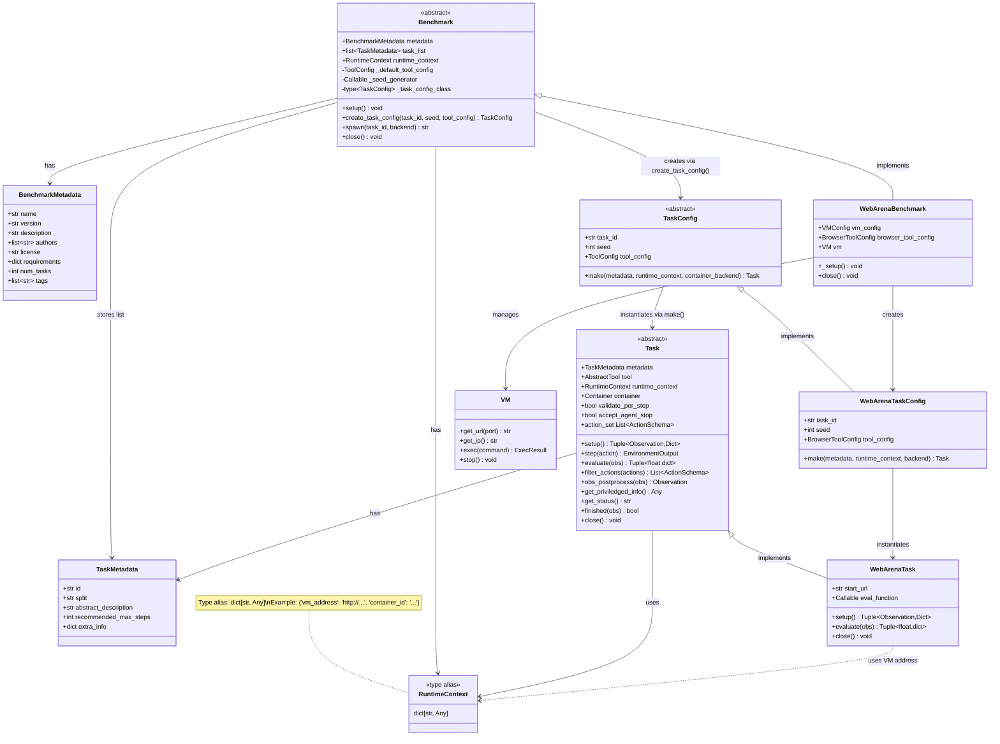

# CUBE Benchmark and Task API Specification

> **CUBE Layer:** Benchmark & Task API (core abstract classes)
> **Related:** [docker_wrapper.md](docker_wrapper.md) | [vm_wrapper.md](vm_wrapper.md) | [user_experience.md](user_experience.md)

## Overview

The Benchmark and Task API defines how benchmarks expose tasks and how tasks are executed on Ray workers. Tasks are created from serializable configs that can be passed to distributed workers.

## Primary Use Case

```python
# On coordinator (main process)
benchmark = WebArenaBenchmark()
benchmark.setup()  # Initialize infrastructure, load task metadata

# Get task metadata
task_metadata_list = benchmark.task_list

# Distribute to Ray workers
@ray.remote
def evaluate_task(task_metadata, task_config, agent_config, runtime_context):
    # TaskConfig.make() receives metadata from benchmark
    task = task_config.make(
        metadata=task_metadata,
        runtime_context=runtime_context
    )
    agent = agent_config.make()

    obs, info = task.setup()
    for step in range(max_steps):
        action = agent.get_action(obs)
        result = task.step(action)
        obs = result.obs
        if result.done:
            break

    task.close()
    return result

# Execute in parallel
runtime_context = benchmark.runtime_context
futures = []
for tm in task_metadata_list:
    task_config = benchmark.create_task_config(task_id=tm.id)
    futures.append(evaluate_task.remote(tm, task_config, agent_config, runtime_context))
results = ray.get(futures)

# Cleanup
benchmark.close()
```

## Key Design Decisions

**1. Metadata/Config/Instance Separation**
- `TaskMetadata`: Static task description (loaded from disk, can be arbitrarily large)
- `TaskConfig`: Lightweight runtime config with task_id, seed, and tool_config (serializable, sent over network)
- `Task`: Live instance with tools and state (not serializable)

**2. Self-Contained Configs**
- TaskConfig contains everything needed to recreate task (task_id references metadata, seed for reproducibility, tool_config)
- TaskMetadata is passed separately to `make()` by the coordinator, not embedded in TaskConfig
- Can be retried independently if worker crashes
- May reference external services (VMs, containers) via runtime_context

**3. Runtime Context**
- Benchmark stores infrastructure references in `benchmark.runtime_context` (public attribute)
- `runtime_context` defaults to `{}` for benchmarks with no shared infrastructure
- Harness passes `runtime_context` to `task_config.make()` so tasks can connect to live infrastructure
- TaskConfig itself remains infrastructure-agnostic and serializable

**4. Seed Generation**
- Seeds are runtime-specific, not stored in TaskMetadata
- Benchmark can provide a `_seed_generator: Callable[[], int]` during setup()
- Seeds can be specified explicitly or generated on-demand when creating TaskConfig

## Core API

### Supporting Types

```python
class BenchmarkMetadata(TypedBaseModel):
    """
    Metadata describing a benchmark.

    Attributes:
        name (str): Benchmark name
        version (str): Benchmark version
        description (str): Benchmark description
        authors (list[str]): List of benchmark author names
        license (str): Benchmark license
        requirements (dict[str, Any]): Hardware requirements
        num_tasks (int): Total number of tasks
        tags (list[str]): Benchmark tags
        other (dict[str, Any]): Additional metadata
    """
    name: str
    version: str
    description: str
    authors: list[str] = []
    license: str = ""
    requirements: dict[str, Any] = {}
    num_tasks: int = 0
    tags: list[str] = []
    other: dict[str, Any] = {}


RuntimeContext = dict[str, Any]
"""
Type alias for shared infrastructure references created during benchmark._setup().

Contains mutable references to infrastructure like VMs, containers, or
other services that are shared across tasks. This is passed to
task_config.make() so tasks can connect to the live infrastructure.

Example:
    {"container_id": "abc123", "vm_address": "http://12.34.56.78", "ssh_session": session}
"""


class TaskMetadata(TypedBaseModel):
    """
    Static metadata describing a task.

    Saved to/loaded from disk. Can be arbitrarily large.
    Does NOT contain runtime-specific info like seeds or tool configs.

    Attributes:
        id (str): Unique task identifier
        split (Literal["train", "val", "test"]): Split for the task (default: "test")
        abstract_description (str): Broad description of the task for searching and filtering only. The task objective is part of the first Observation returned by task.setup(). (default: "")
        recommended_max_steps (int | None): Recommended maximum number of steps to help harness prevent infinite running agents. Not a hard limit, the task can still run longer if needed. (default: None)
        extra_info (dict[str, Any]): Additional task metadata, eg: difficulty level, domain, etc. (default: empty dict)
    """
    id: str
    split: Literal["train", "val", "test"] = "test"
    abstract_description: str = ""
    recommended_max_steps: int | None = None
    extra_info: dict[str, Any] = {}
```

### Benchmark (Abstract Base Class)

Manages benchmark-level infrastructure and task enumeration.

```python
class Benchmark(TypedBaseModel, ABC):
    """Base class for all CUBE benchmarks."""

    metadata: BenchmarkMetadata  # Benchmark metadata (name, version, description, etc.)

    # Public fields set during setup()
    task_list: list[TaskMetadata] = Field(default_factory=list)  # Loaded task metadata
    runtime_context: RuntimeContext = Field(default_factory=dict)  # Shared infrastructure references

    # Private attributes set during setup()
    _default_tool_config: ToolConfig | None = PrivateAttr(default=None)
    _seed_generator: Callable[[], int] | None = PrivateAttr(default=None)
    _task_config_class: type[TaskConfig] | None = PrivateAttr(default=None)

    @abstractmethod
    def _setup(self) -> None:
        """
        Initialize benchmark infrastructure and populate task metadata.

        Must (required):
        - Populate self.task_list with TaskMetadata objects (loaded from file or created programmatically)
        - Set self._task_config_class to the TaskConfig class for this benchmark

        Should (optional):
        - Create shared infrastructure and store references in self.runtime_context
        - Define default tool config (self._default_tool_config)
        - Define seed generator if needed (self._seed_generator)

        Examples:
        - Start VMs for WebArena (shared across tasks)
        - Load task metadata from JSON/CSV, or create TaskMetadata instances directly
        - Initialize shared services

        Note: For SWE-Bench style benchmarks, containers are started
        per-task (in task_config.make()), not here.

        Called by setup() wrapper before task distribution.
        """

    def setup(self) -> None:
        """
        Public method to setup the benchmark. Calls _setup() and validates configuration.
        """

    def create_task_config(
        self,
        task_id: str,
        tool_config: ToolConfig | None = None,
        seed: int | None = None
    ) -> TaskConfig:
        """
        Create TaskConfig for the specified task_id.

        Uses provided tool_config and seed if given, otherwise falls back
        to defaults defined in the benchmark.

        Args:
            task_id: Task identifier
            tool_config: Optional tool config (uses _default_tool_config if not provided)
            seed: Optional random seed (uses _seed_generator if not provided)

        Returns: TaskConfig ready to be passed to workers

        Example:
            config = benchmark.create_task_config("task_001")
            config = benchmark.create_task_config("task_001", seed=42)
        """

    def spawn(
        self,
        task_id: str,
        container_backend: ContainerBackend | None = None
    ) -> str:
        """
        Spawn a new RPC server for the specified task.

        Args:
            task_id: Task identifier
            container_backend: Optional container backend for task infrastructure

        Returns: URL endpoint where the task RPC server is accessible
        """

    @abstractmethod
    def close(self):
        """
        Cleanup benchmark infrastructure.

        Examples:
        - Stop VMs
        - Destroy containers
        - Close connections
        """


class TaskConfig(ABC, TypedBaseModel):
    """
    Lightweight, serializable task configuration (Pydantic BaseModel).

    Must be JSON-serializable to pass to Ray workers.
    Contains only runtime configuration, NOT task metadata/logic.
    TaskMetadata is passed separately to make().
    """

    task_id: str  # Unique identifier (references TaskMetadata)
    seed: int | None = None  # Random seed for reproducibility
    tool_config: ToolConfig  # Tool configuration (e.g., BrowserToolConfig)

    @abstractmethod
    def make(
        self,
        metadata: TaskMetadata,
        runtime_context: RuntimeContext | None = None,
        container_backend: ContainerBackend | None = None
    ) -> Task:
        """
        Instantiate task from config.

        Called on Ray worker after deserialization.

        Args:
            metadata: TaskMetadata for this task (passed by coordinator, not embedded in config)
            runtime_context: Current infrastructure references from benchmark.runtime_context
                           (e.g., VM addresses, service URLs). None for self-contained tasks.
            container_backend: Optional container backend for launching task-specific containers.
                             If provided, use it to launch containers defined in task metadata.

        Steps:
        1. Create tool from tool_config
        2. Optionally launch container (container_backend.launch(container_spec))
        3. Create Task instance with metadata, tool, and container

        Returns: Ready-to-use Task instance

        Example:
            # Create the tool from config
            tool = self.tool_config.make()

            # Launch container if backend provided
            container = None
            if container_backend:
                container_config = ContainerConfig.from_task_id(self.task_id)
                container = container_backend.launch(container_config)

            # Instantiate concrete Task subclass
            task = MyTask(task_id=self.task_id, target=metadata.extra_info.get("target", 0))
            task.tool = tool  # type: ignore[assignment]
            task.container = container
            task.runtime_context = runtime_context
            return task

        Note: For RPC, spawn = task_config.make() + make_task_rpc_server()
        RPC support can be added later without changing this API.
        """
```

### Task (Abstract Base Class)

Gym-like interface for task execution.

```python
class Task(ABC):
    """
    Individual task instance with Gym-like API.

    Created from TaskConfig on worker.
    Not serializable (has live tools, connections).

    Components:
    - metadata: Task metadata (id, description, tags, etc.)
    - tool: Instantiated tool (browser, terminal, etc)
    - runtime_context: Shared infrastructure references (VMs, etc.)
    - container: Running container (if task uses one)
    """

    metadata: TaskMetadata  # Task metadata
    tool: AbstractTool  # Instantiated tool, initialized in TaskConfig.make()
    runtime_context: RuntimeContext | None = None  # Shared infrastructure references
    container: Container | None = None  # Task-specific container
    validate_per_step: bool = False  # Whether to evaluate after each step
    accept_agent_stop: bool = True  # Whether task accepts agent STOP action

    @property
    def id(self) -> str:
        """Task identifier."""
        return self.metadata.id

    @property
    def action_set(self) -> List[ActionSchema]:
        """
        Tool definitions in litellm-compatible format.

        Returns tool.action_set filtered by self.filter_actions().

        Returns a list of ActionSchema objects with:
        - type: "function"
        - name: Function name
        - description: Function description
        - parameters: JSON Schema for parameters

        ActionSchema objects can be converted to litellm/OpenAI format via .as_dict().
        Agents use this to discover available actions without knowing
        tool implementations in advance.

        Example return value:
        [
            ActionSchema(
                type="function",
                name="click",
                description="Click on a web element",
                parameters={
                    "type": "object",
                    "properties": {
                        "selector": {"type": "string", "description": "CSS selector"}
                    },
                    "required": ["selector"]
                }
            )
        ]

        Note: ActionSchema.as_dict() produces litellm-compatible format:
        {
            "type": "function",
            "function": {
                "name": "click",
                "description": "Click on a web element",
                "parameters": {...}
            }
        }
        """
        return self.filter_actions(self.tool.action_set)

    def filter_actions(self, actions: list[ActionSchema]) -> list[ActionSchema]:
        """
        (Optional) Whitelist subset of tool actions.

        Allows task to restrict which tool actions are available.
        By default returns all actions unfiltered.

        Args:
            actions: Full list of tool actions

        Returns: Filtered list of actions
        """
        return actions

    @abstractmethod
    def setup(self) -> Tuple[Observation, Dict]:
        """
        Set up the task to its initial state.

        Should call self.tool.reset() to reset the tool as well.

        Returns:
            Tuple of (initial observation, info dict with additional context)

        Examples:
        - WebArena: Navigate to starting URL
        - SWE-Bench: Clone repo, checkout commit
        """

    def step(self, action: Action | List[Action]) -> EnvironmentOutput:
        """
        Execute action(s), return next state.

        Process:
        1. Check if agent action is STOP_ACTION
        2. Execute action via self.tool.execute_action(action)
        3. Check if task is done via self.finished(obs)
        4. Evaluate if done or validate_per_step is True
        5. Post-process observation

        Args:
            action: Single action or list of actions to execute

        Returns:
            EnvironmentOutput containing:
                obs: Next state observation
                reward: Reward signal (0.0 if not available)
                done: Task completed successfully
                truncated: Task hit limit (time, steps)
                info: Additional metadata
                error: StepError if exception occurred

        Follows Gymnasium API conventions.
        """

    def obs_postprocess(self, obs: Observation) -> Observation:
        """
        (Optional) Post-process observation before returning to agent.

        By default does nothing.

        Args:
            obs: Raw observation

        Returns: Processed observation
        """
        return obs

    @abstractmethod
    def evaluate(self, obs: Observation) -> Tuple[float, dict]:
        """
        Evaluate current state and return (reward, info).

        Args:
            obs: Current observation

        Returns:
            Tuple of (reward, info dict with evaluation details)
        """

    def get_priviledged_info(self) -> Any:
        """
        Return privileged information for evaluation judges.

        Provides context that helps automated judges (LLM-based or otherwise)
        more accurately diagnose agent failures. May include:
        - Solution trajectory: list[Action]
        - Evaluation function source code
        - Ground-truth answers
        - Environment internal state summaries

        Returns: Privileged context (format depends on task).
                 None if no privileged info available.
        """
        return None

    def get_status(self) -> str:
        """
        (Optional) Return current task status.

        Can check self.runtime_context and/or self.container for status.

        Returns: Status string
        """
        return ""

    def finished(self, obs: Observation) -> bool:
        """
        (Optional) Check if task is finished based on observation.

        By default returns False (task only finishes when agent emits STOP or error).

        Args:
            obs: Current observation

        Returns: True if task is complete
        """
        return False

    def close(self):
        """
        (Optional) Cleanup task resources.

        Examples:
        - Close browser
        - Stop container
        - Cleanup temp files
        - Reset state for next task
        """
```

## Concrete Example: WebArena

### Task Metadata (JSON)

Task metadata can be stored in JSON format and loaded during benchmark setup:

```json
[
  {
    "task_id": "webarena_shopping_001",
    "split": "test",
    "abstract_description": "Find and add cheapest laptop to cart",
    "recommended_max_steps": 20,
    "extra_info": {
      "domain": "web",
      "category": "shopping",
      "difficulty": "easy",
      "start_path": "/shop",
      "eval_type": "url_match",
      "eval_target": "/cart.*laptop"
    }
  },
  {
    "task_id": "webarena_shopping_002",
    "split": "test",
    "abstract_description": "Compare prices of two products",
    "recommended_max_steps": 15,
    "extra_info": {
      "domain": "web",
      "category": "shopping",
      "difficulty": "medium",
      "start_path": "/shop/compare",
      "eval_type": "element_check",
      "eval_target": "#comparison-table"
    }
  }
]
```

Note: Seeds are NOT in metadata - they are generated at runtime when creating TaskConfig.

### WebArenaTaskConfig

```python
class WebArenaTaskConfig(TaskConfig):
    """Serializable WebArena task configuration."""

    task_id: str
    seed: int | None = None
    tool_config: BrowserToolConfig  # How to create browser

    def make(
        self,
        metadata: TaskMetadata,
        runtime_context: RuntimeContext | None = None,
        container_backend: ContainerBackend | None = None
    ) -> Task:
        """Create WebArenaTask instance."""
        # 1. Create tool
        tool = self.tool_config.make()

        # 2. Extract task-specific data from metadata.extra_info
        start_path = metadata.extra_info["start_path"]
        eval_type = metadata.extra_info["eval_type"]
        eval_target = metadata.extra_info["eval_target"]

        # 3. Create task instance
        vm_address = runtime_context["vm_address"] if runtime_context else "http://localhost"
        task = WebArenaTask(
            task_id=self.task_id,
            start_url=f"{vm_address}{start_path}",
            eval_function=create_eval_fn(eval_type, eval_target)
        )
        task.tool = tool  # type: ignore[assignment]
        task.runtime_context = runtime_context

        return task


class WebArenaTask(Task):
    """WebArena task instance."""

    tool: BrowserTool  # type: ignore[assignment]

    def __init__(self, task_id: str, start_url: str, eval_function: Callable):
        self.metadata = TaskMetadata(id=task_id)
        self.start_url = start_url
        self.eval_function = eval_function

    def setup(self) -> Tuple[Observation, Dict]:
        """Navigate to starting URL and return initial observation."""
        self.tool.reset()
        # Navigate browser to start URL
        self.tool.navigate(self.start_url)
        obs = self.tool.get_observation()
        return obs, {"start_url": self.start_url}

    def evaluate(self, obs: Observation) -> Tuple[float, dict]:
        """Evaluate if task is complete."""
        success = self.eval_function(obs)
        reward = 1.0 if success else 0.0
        return reward, {"success": success}

    def close(self):
        """Close browser."""
        self.tool.close()


class WebArenaBenchmark(Benchmark):
    """WebArena benchmark with VM infrastructure."""

    def __init__(self, vm_config: VMConfig, browser_tool_config: BrowserToolConfig):
        super().__init__(
            metadata=BenchmarkMetadata(
                name="WebArena",
                version="1.0",
                description="Web navigation benchmark",
                tags=["web", "navigation"]
            )
        )
        self.vm_config = vm_config
        self.browser_tool_config = browser_tool_config
        self.vm: VM | None = None

    def _setup(self) -> None:
        """Start VM infrastructure and load task metadata."""
        # 1. Start VM infrastructure (shared across all tasks)
        self.vm = self.vm_config.make()  # Blocks until ready
        self.runtime_context = {"vm_address": self.vm.get_url(80)}

        # 2. Load task metadata from JSON
        tasks_data = pd.read_json("webarena_tasks.json")
        self.task_list = [
            TaskMetadata(
                id=row["task_id"],
                abstract_description=row["intent"],
                extra_info={
                    "domain": "web",
                    "category": row["category"],
                    "difficulty": row["difficulty"],
                    "start_path": row["start_path"],
                    "eval_type": row["eval_type"],
                    "eval_target": row["eval_target"]
                }
            )
            for _, row in tasks_data.iterrows()
        ]

        # 3. Set TaskConfig class (required)
        self._task_config_class = WebArenaTaskConfig

        # 4. Set default tool config
        self._default_tool_config = self.browser_tool_config

        # 5. Optional: set seed generator (sequential seeds in this example)
        import itertools
        counter = itertools.count(0)
        self._seed_generator = lambda: next(counter)

    def close(self):
        """Stop VM."""
        if self.vm:
            self.vm.stop()
```


## Runtime Context Pattern

When shared infrastructure is recreated (e.g., VM gets a new IP), the harness
simply re-reads `benchmark.runtime_context` and passes it to `task_config.make()`.
TaskConfigs remain immutable and infrastructure-agnostic.

```python
# VM crashed, need to recreate
benchmark.vm.stop()
benchmark.vm = benchmark.vm_config.make()  # New IP
benchmark.runtime_context = {"vm_address": benchmark.vm.get_url(80)}  # Update context

# Retry failed tasks — runtime_context automatically has new IP
failed_task_ids = get_failed_task_ids()
runtime_context = benchmark.runtime_context
futures = [
    evaluate_task.remote(
        benchmark.task_list[i],
        benchmark.create_task_config(task_id=task_id),
        agent_config,
        runtime_context
    )
    for i, task_id in enumerate(failed_task_ids)
]
```

### TaskLogic (Future Design)

> **Status:** Not currently implemented. TaskLogic as a separate abstraction is deferred.
>
> **Current Approach:** Task metadata (loaded via task_id) and task logic (setup, evaluate)
> are directly implemented in Task subclasses. The intent/description is stored in
> TaskMetadata.
>
> **Future Consideration:** A separate TaskLogic abstraction could help isolate
> CUBE-Developer concerns (task logic vs. Gym API plumbing), but adds complexity.
> This separation may be revisited as the CUBE-Developer API matures if a clear need emerges.
>
> If TaskLogic were to be reintroduced, it would look like:

```python
class TaskLogic(ABC):
    """
    Task-specific logic (intent, evaluation, setup).

    Loaded from task metadata (not in TaskConfig).
    """

    task_id: str
    intent: str  # Natural language task description

    @abstractmethod
    def setup(self, **kwargs) -> None:
        """
        Prepare task environment.

        Called during task.setup().

        Args may include pre-initialized tools (e.g., browser page):
            setup(page=playwright_page)  # For browser tasks
            setup(container=container)   # For container tasks

        Examples:
        - Navigate to starting URL
        - Initialize database state
        - Clone repository
        """

    @abstractmethod
    def evaluate(self, observation: Observation) -> bool:
        """
        Check if task is successfully completed.

        Returns: True if task completed successfully
        """
```

## Best Practices

**TaskConfig Design:**
- Keep configs small and lightweight (serialize/deserialize frequently)
- Contains task_id (reference to metadata), seed (runtime), and tool_config (runtime)
- TaskMetadata is passed separately to `make()`, not embedded in config
- Use Pydantic for validation and serialization
- Mutable infrastructure refs (VM IPs, URLs) come via `runtime_context`, not stored in config

**TaskMetadata Design:**
- Static, immutable task description (can be saved to/loaded from disk)
- Can be arbitrarily large (not frequently serialized over network)
- Does NOT contain runtime-specific data like seeds or tool configs
- Store as list of dicts (can load into pandas DataFrame)
- Include filterable fields in `extra_info` (category, difficulty, etc)
- Keep task-specific data (intent, eval criteria) separate from infrastructure refs

**RPC Support:**
- RPC spawn implemented via `benchmark.spawn()`: `task_config.make()` + `make_task_rpc_server()`
- Returns URL endpoint where task RPC server is accessible
- Current API supports both local (direct) and remote (RPC) task execution

## Error Handling

**Fail-fast with diagnostics.** Error messages must indicate precisely where failure occurred.

**Error Recovery:**
- TaskConfig is idempotent (can retry `make()`)
- Task cleanup is safe (can call `close()` multiple times)
- Benchmark exposes `runtime_context` with current infrastructure state for retries

**Cleanup on failure:** If `make()` fails partway, must clean up: stop containers, close connections, release ports.

## Success Criteria

The design succeeds if:
1. CUBE-User can evaluate an agent on a benchmark with minimal boilerplate
2. TaskConfigs are fully serializable and retryable across Ray workers
3. Benchmark manages shared infrastructure only (VMs, services), not per-task state
4. Tool definitions are discoverable via `task.tools` in litellm-compatible format
5. Error messages clearly indicate failure point
6. No resource leaks on failures or crashes
7. RPC can be added later without changing the Python API

## Position Paper API Mapping

Mapping between the CUBE position paper's RPC endpoints and the Python API/RPC implementation:

### Benchmark-Level Endpoints

| Position Paper Endpoint | Python Method | RPC Endpoint | Description |
|---|---|---|---|
| `cube/info` | `benchmark.metadata` | `GET /cube/info` | Get benchmark metadata |
| `cube/tasks` | `benchmark.get_task_configs()` | `GET /cube/tasks` | List available task configs |
| `cube/spawn` | `benchmark.spawn()` | `POST /cube/spawn` | Spawn new task RPC server |
| `cube/shutdown` | `benchmark.close()` | `POST /cube/shutdown` | Cleanup benchmark infrastructure |

### Task-Level Endpoints

| Position Paper Endpoint | Python Method | RPC Endpoint | Description |
|---|---|---|---|
| `cube/reset` | `task.setup()` | `POST /cube/reset` | Reset task to initial state |
| `cube/step` | `task.step()` | `POST /cube/step` | Execute action + evaluation |
| `cube/evaluation` | `task.evaluate()` | `POST /cube/evaluate` | Evaluate observation |
| `cube/close` | `task.close()` | `POST /cube/close` | Cleanup task resources |
| `cube/status` | `task.get_status()` | `GET /cube/status` | Get task status |
| `cube/privilege_info` | `task.get_priviledged_info()` | `GET /cube/priviledged_info` | Privileged info for judges |
| `tools/list` | `task.action_set` | `GET /tools/list` | Tool definitions (litellm format) |
| `tools/call` | `task.tool.execute_action()` | `POST /tools/call` | Execute a single tool action |
| `resources/list` | Not yet implemented | `GET /resources/list` | List available resources |
| `resources/read` | Not yet implemented | `POST /resources/read` | Read resource data |

**Notes:**
- Python API can be used directly for in-process execution
- RPC endpoints (via `make_task_rpc_server()` and `create_benchmark_rpc_server()`) enable remote task execution
- `task_config.make()` is the Python method that instantiates a task; `benchmark.spawn()` wraps this + RPC server creation

## Class Diagram

> See [docker_wrapper.md](docker_wrapper.md) for `ContainerConfig`/`Container` details and [vm_wrapper.md](vm_wrapper.md) for `VMConfig`/`VM` details.


