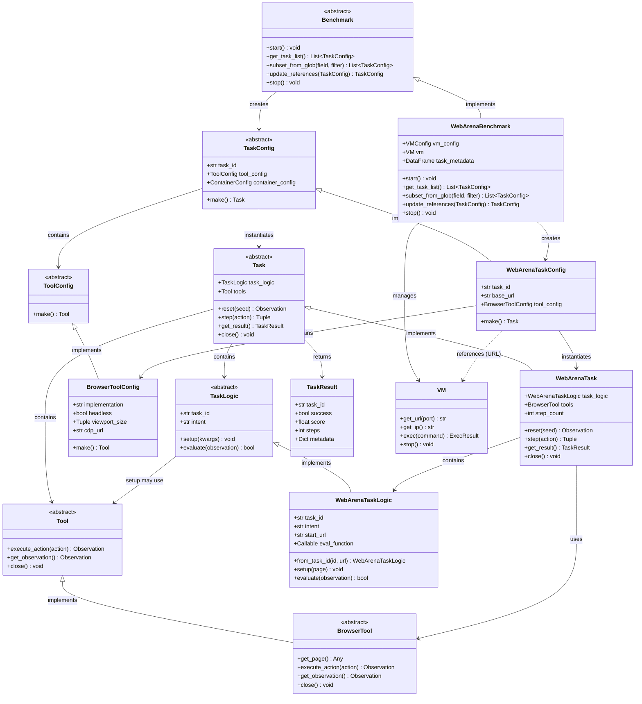

# CUBE Benchmark and Task API Specification

## Overview

The Benchmark and Task API defines how benchmarks expose tasks and how tasks are executed on Ray workers. Tasks are created from serializable configs that can be passed to distributed workers.

## Core Workflow

```python
# On coordinator (main process)
benchmark = WebArenaBenchmark()
benchmark.start()  # Initialize infrastructure (VMs, containers, etc)

# Get serializable task configs
task_configs = benchmark.get_task_list()

# Distribute to Ray workers
@ray.remote
def evaluate_task(task_config, agent_config):
    task = task_config.make()  # Deserialize and instantiate
    agent = agent_config.make()

    obs = task.reset()
    for step in range(max_steps):
        action = agent.get_action(obs)
        obs, reward, terminated, truncated, info = task.step(action)
        if terminated or truncated:
            break
    
    return task.get_result()

# Execute in parallel
futures = [evaluate_task.remote(config) for config in task_configs]
results = ray.get(futures)

# Cleanup
benchmark.stop()
```

## Key Design Decisions

**1. Config/Instance Separation**
- `TaskConfig`: Serializable (can pass to Ray workers)
- `Task`: Live instance with tools, state (not serializable)

**2. Self-Contained Configs**
- TaskConfig contains everything needed to recreate task
- Can be retried independently if worker crashes
- May reference external services (VMs, containers)

**3. Reference Updates**
- Infrastructure might be recreated (VM gets new IP)
- Benchmark can update configs with new references
- Worker doesn't need to know about infrastructure changes

## Core API

### Benchmark (Abstract Base Class)

Manages benchmark-level infrastructure and task enumeration.

```python
class Benchmark(ABC):
    """Base class for all CUBE benchmarks."""
    
    @abstractmethod
    def start(self):
        """
        Initialize benchmark infrastructure.
        
        Examples:
        - Start VMs for WebArena (shared across tasks)
        - Load task metadata from JSON
        - Initialize shared services
        
        Note: For SWE-Bench style benchmarks, containers are started 
        per-task (in task_config.make()), not here.
        
        Called once before task distribution.
        """
    
    @abstractmethod
    def get_task_list(self) -> List[TaskConfig]:
        """
        Get all task configurations.
        
        Returns: List of serializable TaskConfig objects
        
        Task metadata is loaded from JSON (list of dicts) that can be 
        converted to pandas DataFrame for analysis.
        
        Each config contains:
        - Task ID (used to retrieve task_logic)
        - References to services (URLs, ports)
        - Tool and container configs (if needed)
        
        Configs can be distributed to Ray workers.
        """
    
    @abstractmethod
    def subset_from_glob(self, field: str, glob_filter: str) -> List[TaskConfig]:
        """
        Select subset of tasks based on metadata field.
        
        Similar to BrowserGym's benchmark filtering.
        
        Args:
            field: Metadata field to filter on (e.g., "category", "difficulty")
            glob_filter: Glob pattern (e.g., "shopping.*", "level_[123]")
        
        Returns: Filtered list of TaskConfig objects
        
        Example:
            # Get only shopping tasks
            configs = benchmark.subset_from_glob("category", "shopping.*")
            
            # Get easy and medium tasks
            configs = benchmark.subset_from_glob("difficulty", "easy|medium")
        """
    
    @abstractmethod
    def update_references(self, task_config: TaskConfig) -> TaskConfig:
        """
        Update config with current infrastructure references.
        
        Use case: Infrastructure was recreated (new VM IP, new container)
        
        Args:
            task_config: Potentially stale config with old URLs/IPs
        
        Returns: Updated config with current references
        
        Example:
            # VM was restarted, has new IP
            old_config.base_url = "http://1.2.3.4"
            new_config = benchmark.update_references(old_config)
            new_config.base_url = "http://5.6.7.8"
        """
    
    @abstractmethod
    def stop(self):
        """
        Cleanup benchmark infrastructure.
        
        Examples:
        - Stop VMs
        - Destroy containers
        - Close connections
        """


@dataclass
class TaskConfig(ABC):
    """
    Serializable task configuration (Pydantic BaseModel).
    
    Must be JSON-serializable to pass to Ray workers.
    Contains references and configs, but NOT task logic/metadata.
    Task logic (intent, eval functions) is retrieved via task_id.
    """
    
    task_id: str  # Unique identifier (used to load task_logic)
    
    # Optional configs (provided by benchmark, usually constant)
    tool_config: ToolConfig | None = None  # How to create tools
    container_config: ContainerConfig | None = None  # Container if needed
    
    @abstractmethod
    def make(self) -> Task:
        """
        Instantiate task from config.
        
        Called on Ray worker after deserialization.
        
        Steps:
        1. Load task_logic from task_id
        2. Create tools (if tool_config provided)
        3. Start container (if container_config provided)
        4. Create Task with logic and tools
        
        Returns: Ready-to-use Task instance
        
        Note: For RPC, spawn = task_config.make() + make_task_rpc_server
        RPC support can be added later without changing this API.
        """
```

### Task (Abstract Base Class)

Gym-like interface for task execution.

```python
class Task(ABC):
    """
    Individual task instance with Gym-like API.
    
    Created from TaskConfig on worker.
    Not serializable (has live tools, connections).
    
    Components:
    - task_logic: Task-specific logic (intent, eval, setup)
    - tools: Instantiated tools (browser, terminal, etc)
    """
    
    task_logic: TaskLogic  # Task-specific logic
    tools: Tool | List[Tool]  # Instantiated tools
    
    @abstractmethod
    def reset(self, seed: int | None = None) -> Observation:
        """
        Reset task to initial state.
        
        Internally calls:
        1. task_logic.setup() - Prepare task environment
        2. Initialize tools to starting state
        
        Args:
            seed: Optional random seed for reproducibility
        
        Returns: Initial observation
        
        Examples:
        - WebArena: Navigate to starting URL
        - SWE-Bench: Clone repo, checkout commit
        """
    
    @abstractmethod
    def step(self, action: Action) -> Tuple[Observation, float, bool, bool, Dict]:
        """
        Execute action, return next state.
        
        Args:
            action: Agent action (format depends on task)
        
        Returns:
            observation: Next state
            reward: Reward signal (0.0 if not available)
            terminated: Task completed successfully
            truncated: Task hit limit (time, steps)
            info: Additional metadata
        
        Follows Gymnasium API conventions.
        """
    
    @abstractmethod
    def get_result(self) -> TaskResult:
        """
        Get final evaluation result.
        
        Called after episode ends.
        
        Returns: TaskResult with success, score, metadata
        """
    
    @abstractmethod
    def close(self):
        """
        Cleanup task resources.
        
        Examples:
        - Close browser
        - Cleanup temp files
        - Reset state for next task
        """
```

## Concrete Example: WebArena

### Task Metadata (JSON)

```json
[
  {
    "task_id": "webarena_shopping_001",
    "category": "shopping",
    "difficulty": "easy",
    "intent": "Find and add cheapest laptop to cart",
    "start_path": "/shop",
    "eval_type": "url_match",
    "eval_target": "/cart.*laptop"
  },
  {
    "task_id": "webarena_shopping_002",
    "category": "shopping", 
    "difficulty": "medium",
    "intent": "Compare prices of two products",
    "start_path": "/shop/compare",
    "eval_type": "element_check",
    "eval_target": "#comparison-table"
  }
]
```

### WebArenaTaskConfig

```python
from pydantic import BaseModel

class WebArenaTaskConfig(BaseModel, TaskConfig):
    """Serializable WebArena task configuration."""
    
    task_id: str
    base_url: str  # URL to WebArena site (may change if VM restarted)
    tool_config: BrowserToolConfig  # How to create browser
    container_config: None = None  # WebArena uses VM, not containers
    
    def make(self) -> Task:
        """Create WebArenaTask instance."""
        # 1. Load task logic from task_id
        task_logic = WebArenaTaskLogic.from_task_id(
            self.task_id, 
            self.base_url
        )
        
        # 2. Create tool
        tool = self.tool_config.make()
        
        # 3. Create task
        return WebArenaTask(
            task_logic=task_logic,
            tools=tool,
        )
```

### WebArenaTaskLogic

```python
class WebArenaTaskLogic(TaskLogic):
    """WebArena-specific logic loaded from metadata."""
    
    def __init__(
        self,
        task_id: str,
        intent: str,
        start_url: str,
        eval_function: Callable,
    ):
        self.task_id = task_id
        self.intent = intent
        self.start_url = start_url
        self.eval_function = eval_function
    
    @classmethod
    def from_task_id(cls, task_id: str, base_url: str):
        """Load task logic from metadata JSON."""
        metadata = load_task_metadata(task_id)  # From JSON
        
        return cls(
            task_id=task_id,
            intent=metadata["intent"],
            start_url=f"{base_url}{metadata['start_path']}",
            eval_function=create_eval_fn(metadata["eval_type"], metadata["eval_target"]),
        )
    
    def setup(self, page=None):
        """Navigate to starting URL."""
        if page:
            page.goto(self.start_url)
        # If no page provided, tool will navigate during task.reset()
    
    def evaluate(self, observation: Observation) -> bool:
        """Check if task completed successfully."""
        return self.eval_function(observation)
```

### WebArenaBenchmark

```python
class WebArenaBenchmark(Benchmark):
    def __init__(self, vm_config: VMConfig, tool_config):
        self.vm_config = vm_config
        self.tool_config = tool_config
        self.vm: VM | None = None
        
        # Load task metadata from JSON (can convert to pandas)
        self.task_metadata = pd.read_json("webarena_tasks.json")
    
    def start(self):
        """Start VM infrastructure."""
        self.vm = self.vm_config.make()  # Blocks until ready
    
    def get_task_list(self) -> List[TaskConfig]:
        """Generate configs for all tasks."""
        base_url = self.vm.get_url(80)
        

        return [
            WebArenaTaskConfig(
                task_id=row["task_id"],
                base_url=base_url,
                tool_config=self.tool_config,
            )
            for _, row in self.task_metadata.iterrows()
        ]
    
    
    def update_references(self, task_config: WebArenaTaskConfig) -> WebArenaTaskConfig:
        """Update URLs if VM was recreated."""
        new_base_url = self.vm.get_url(80)
        
        # Pydantic model_copy with updates
        return task_config.model_copy(update={
            "base_url": new_base_url,
        })
    
    def stop(self):
        """Stop VM."""
        if self.vm:
            self.vm.stop()
```


## Reference Update Scenarios

### Scenario 1: VM Restarted (New IP)

```python
# VM crashed, need to recreate
benchmark.vm.stop()
benchmark.vm = benchmark.vm_config.make()  # New IP

# Update all pending task configs
stale_configs = get_failed_tasks()  # Configs from before crash
fresh_configs = [benchmark.update_references(c) for c in stale_configs]

# Retry with fresh configs
futures = [evaluate_task.remote(c) for c in fresh_configs]
```

### Scenario 2: Container Pool Rotated

```python
# Container was recycled, new port
old_config.container_url = "http://localhost:8080"
new_config = benchmark.update_references(old_config)
new_config.container_url = "http://localhost:8192"  # New port
```


## Supporting Components

### TaskLogic

Task-specific logic retrieved from task_id.

```python
class TaskLogic(ABC):
    """
    Task-specific logic (intent, evaluation, setup).
    
    Loaded from task metadata (not in TaskConfig).
    """
    
    task_id: str
    intent: str  # Natural language task description
    
    @abstractmethod
    def setup(self, **kwargs) -> None:
        """
        Prepare task environment.
        
        Called during task.reset().
        
        Args may include pre-initialized tools (e.g., browser page):
            setup(page=playwright_page)  # For browser tasks
            setup(container=container)   # For container tasks
        
        Examples:
        - Navigate to starting URL
        - Initialize database state
        - Clone repository
        """
    
    @abstractmethod
    def evaluate(self, observation: Observation) -> bool:
        """
        Check if task is successfully completed.
        
        Returns: True if task completed successfully
        """
```

### ToolConfig

Configuration for tool instantiation.

```python
class ToolConfig(ABC):
    """
    Serializable tool configuration.
    
    Allows different tool implementations (BrowserGym, Playwright MCP, etc).
    """
    
    @abstractmethod
    def make(self) -> Tool:
        """
        Create tool instance.
        
        Called during task_config.make().
        
        Returns: Instantiated tool
        
        Implementation examples:
        - BrowserGymToolConfig -> BrowserGymTool
        - PlaywrightMCPToolConfig -> PlaywrightMCPTool
        - TerminalToolConfig -> TerminalTool
        """


class BrowserToolConfig(ToolConfig):
    """
    Configuration for browser tools.
    
    Different implementations share Chrome DevTools Protocol connection.
    """
    
    implementation: Literal["browsergym", "playwright-mcp", "custom"]
    headless: bool = True
    viewport_size: Tuple[int, int] = (1280, 720)
    
    # Chrome DevTools Protocol connection (for shared state)
    cdp_url: str | None = None
    
    def make(self) -> Tool:
        """Create browser tool based on implementation."""
        if self.implementation == "browsergym":
            return BrowserGymTool(self.headless, self.viewport_size)
        elif self.implementation == "playwright-mcp":
            return PlaywrightMCPTool(self.cdp_url or self._create_cdp())
        # ...
```

### Tool

Tool interface (browser, terminal, etc).

```python
class Tool(ABC):
    """
    Tool for agent interaction (browser, terminal, etc).
    
    Not serializable (has live connections).
    """
    
    @abstractmethod
    def execute_action(self, action: Action) -> Observation:
        """Execute action, return observation."""
    
    @abstractmethod
    def get_observation(self) -> Observation:
        """Get current state observation."""
    
    @abstractmethod
    def close(self):
        """Cleanup tool resources."""


class BrowserTool(Tool):
    """
    Browser tool (can be BrowserGym, Playwright, Puppeteer, etc).
    
    All implementations expose same API but may use different backends.
    For interop, they can share Chrome DevTools Protocol connection.
    """
    
    @abstractmethod
    def get_page(self) -> Any:
        """
        Get underlying page object for task_logic.setup().
        
        Returns:
        - Playwright: playwright.Page
        - Puppeteer: puppeteer.Page
        - BrowserGym: browsergym abstraction
        
        Allows task_logic.setup(page=tool.get_page()) regardless of tool impl.
        """
```

## Type Definitions (continued)

## Best Practices

**TaskConfig Design:**
- Keep configs small (serialize/deserialize frequently)
- Store references (URLs, ports), not task logic
- Task logic loaded via task_id from metadata JSON
- Use Pydantic for validation and serialization
- Include tool_config and container_config (provided by benchmark)

**Task Metadata JSON:**
- Store as list of dicts (can load into pandas DataFrame)
- Include filterable fields (category, difficulty, etc)
- Keep task-specific data (intent, eval criteria) separate from infrastructure refs

**Tool Configuration:**
- ToolConfig allows different implementations (BrowserGym vs Playwright MCP)
- Browser tools can share Chrome DevTools Protocol for interop
- task_logic.setup() can receive pre-initialized tool objects (e.g., page)

**Reference Updates:**
- Design configs to be updateable without re-reading task metadata
- Store only base_url in config, construct full URLs in task_logic
- Benchmark knows infrastructure state, tasks don't

**RPC Support (Future):**
- RPC spawn = task_config.make() + make_task_rpc_server()
- Don't implement until needed
- Current API doesn't prevent adding RPC later

**Error Recovery:**
- TaskConfig is idempotent (can retry make())
- Task cleanup is safe (can call close() multiple times)
- Benchmark tracks which configs are stale

## Class Diagram

