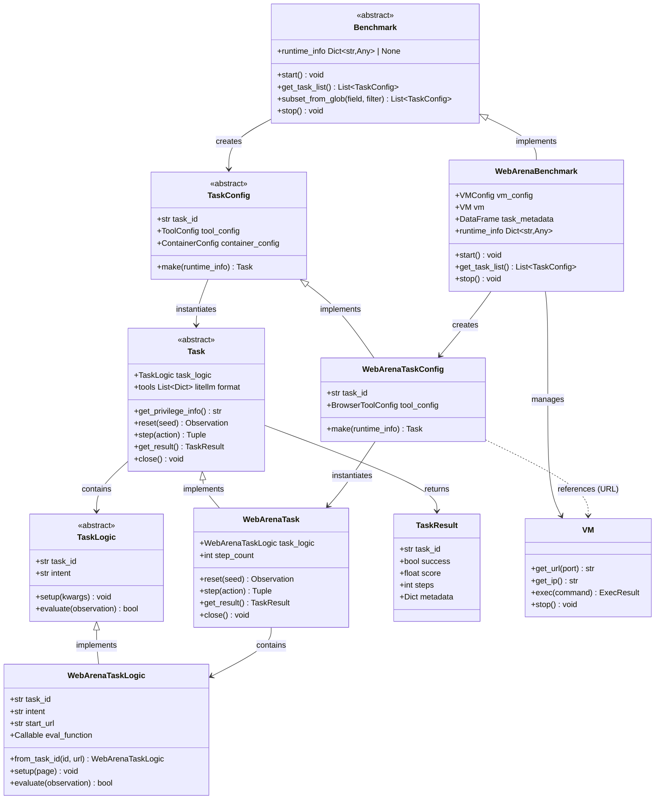

# CUBE Benchmark and Task API Specification

> **CUBE Layer:** Benchmark & Task API (core abstract classes)
> **Related:** [docker_wrapper.md](docker_wrapper.md) | [vm_wrapper.md](vm_wrapper.md) | [user_experience.md](user_experience.md)

## Overview

The Benchmark and Task API defines how benchmarks expose tasks and how tasks are executed on Ray workers. Tasks are created from serializable configs that can be passed to distributed workers.

## Primary Use Case

```python
# On coordinator (main process)
benchmark = WebArenaBenchmark(vm_config, tool_config)
benchmark.start()  # Initialize infrastructure (VMs, containers, etc)

# Get serializable task configs
task_configs = benchmark.get_task_list()

# Distribute to Ray workers
@ray.remote
def evaluate_task(task_config, agent_config, runtime_info):
    task = task_config.make(runtime_info=runtime_info)
    agent = agent_config.make()

    obs = task.reset()
    for step in range(max_steps):
        action = agent.get_action(obs)
        obs, reward, terminated, truncated, info = task.step(action)
        if terminated or truncated:
            break

    result = task.get_result()
    task.close()
    return result

# Execute in parallel
runtime_info = benchmark.runtime_info
futures = [evaluate_task.remote(config, agent_config, runtime_info) for config in task_configs]
results = ray.get(futures)

# Cleanup
benchmark.stop()
```

## Key Design Decisions

**1. Config/Instance Separation**
- `TaskConfig`: Serializable (can pass to Ray workers)
- `Task`: Live instance with tools, state (not serializable)

**2. Self-Contained Configs**
- TaskConfig contains everything needed to recreate task
- Can be retried independently if worker crashes
- May reference external services (VMs, containers)

**3. Runtime Info**
- Benchmark exposes a `runtime_info` property with current infrastructure references (e.g., VM IPs, URLs)
- `runtime_info` defaults to `None` for benchmarks with no shared infrastructure
- Harness passes `runtime_info` to `task_config.make()` so tasks can connect to live infrastructure
- TaskConfig itself remains infrastructure-agnostic and serializable

## Core API

### Benchmark (Abstract Base Class)

Manages benchmark-level infrastructure and task enumeration.

```python
class Benchmark(ABC):
    """Base class for all CUBE benchmarks."""
    
    @abstractmethod
    def start(self):
        """
        Initialize benchmark infrastructure.
        
        Examples:
        - Start VMs for WebArena (shared across tasks)
        - Load task metadata from JSON
        - Initialize shared services
        
        Note: For SWE-Bench style benchmarks, containers are started 
        per-task (in task_config.make()), not here.
        
        Called once before task distribution.
        """
    
    @abstractmethod
    def get_task_list(self) -> List[TaskConfig]:
        """
        Get all task configurations.
        
        Returns: List of serializable TaskConfig objects
        
        Task metadata is loaded from JSON (list of dicts) that can be 
        converted to pandas DataFrame for analysis.
        
        Each config contains:
        - Task ID (used to retrieve task_logic)
        - References to services (URLs, ports)
        - Tool and container configs (if needed)
        
        Configs can be distributed to Ray workers.
        """
    
    def subset_from_glob(self, field: str, glob_filter: str) -> List[TaskConfig]:
        """
        Select subset of tasks based on metadata field.

        Utility method (not abstract) — provides default filtering logic.
        Subclasses can override for custom filtering behavior.

        Args:
            field: Metadata field to filter on (e.g., "category", "difficulty")
            glob_filter: Glob pattern (e.g., "shopping.*", "level_[123]")

        Returns: Filtered list of TaskConfig objects

        Example:
            configs = benchmark.subset_from_glob("category", "shopping.*")
        """
        import fnmatch
        return [tc for tc in self.get_task_list()
                if fnmatch.fnmatch(getattr(tc, field, ""), glob_filter)]

    @property
    def runtime_info(self) -> Dict[str, Any] | None:
        """
        Current infrastructure references (e.g., VM IPs, service URLs).

        Returns None for benchmarks with no shared infrastructure.
        Harness passes this to task_config.make(runtime_info=...) so tasks
        can connect to live infrastructure without storing mutable refs in config.

        Examples:
        - WebArena: {"base_url": "http://12.34.56.78"}
        - SWE-Bench: None (containers are per-task)
        """
        return None

    @abstractmethod
    def stop(self):
        """
        Cleanup benchmark infrastructure.
        
        Examples:
        - Stop VMs
        - Destroy containers
        - Close connections
        """


@dataclass
class TaskConfig(ABC):
    """
    Serializable task configuration (Pydantic BaseModel).
    
    Must be JSON-serializable to pass to Ray workers.
    Contains references and configs, but NOT task logic/metadata.
    Task logic (intent, eval functions) is retrieved via task_id.
    """
    
    task_id: str  # Unique identifier (used to load task_logic)

    # Optional configs (provided by benchmark, usually constant)
    # ToolConfig: benchmark-specific tool configuration (e.g., BrowserToolConfig)
    tool_config: ToolConfig | None = None
    # ContainerConfig: see docker_wrapper.md for details
    container_config: ContainerConfig | None = None

    @abstractmethod
    def make(self, runtime_info: Dict[str, Any] | None = None) -> Task:
        """
        Instantiate task from config.

        Called on Ray worker after deserialization.

        Args:
            runtime_info: Current infrastructure references from benchmark.runtime_info
                         (e.g., VM IPs, service URLs). None for self-contained tasks.

        Steps:
        1. Load task_logic from task_id
        2. Create tools (tool_config.make()) if tool_config provided
        3. Start container (container_config.make()) if container_config provided
        4. Create Task with logic and tools

        Returns: Ready-to-use Task instance

        Note: For RPC, spawn = task_config.make() + make_task_rpc_server
        RPC support can be added later without changing this API.
        """
```

### Task (Abstract Base Class)

Gym-like interface for task execution.

```python
class Task(ABC):
    """
    Individual task instance with Gym-like API.
    
    Created from TaskConfig on worker.
    Not serializable (has live tools, connections).
    
    Components:
    - task_logic: Task-specific logic (intent, eval, setup)
    - tools: Instantiated tools (browser, terminal, etc)
    """
    
    task_logic: TaskLogic  # Task-specific logic
    _tools: Tool | List[Tool]  # Instantiated tools

    @property
    def tools(self) -> List[Dict[str, Any]]:
        """
        Tool definitions in litellm-compatible format.

        Returns a JSON-serializable list of tool descriptors, each with:
        - type: "function"
        - function: {name, description, parameters (JSON Schema)}

        This format is compatible with litellm/OpenAI function calling.
        Agents use this to discover available actions without knowing
        tool implementations in advance.

        Example return value:
        [
            {
                "type": "function",
                "function": {
                    "name": "click",
                    "description": "Click on a web element",
                    "parameters": {
                        "type": "object",
                        "properties": {
                            "selector": {"type": "string", "description": "CSS selector"}
                        },
                        "required": ["selector"]
                    }
                }
            }
        ]
        """

    @abstractmethod
    def get_privilege_info(self) -> str:
        """
        Return privileged information for evaluation judges.

        Provides context that helps automated judges (LLM-based or otherwise)
        more accurately diagnose agent failures. May include:
        - Evaluation function source code
        - Ground-truth answers
        - Environment internal state summaries

        Returns: Human-readable string with privileged context.
                 Empty string if no privileged info available.
        """

    @abstractmethod
    def reset(self, seed: int | None = None) -> Observation:
        """
        Reset task to initial state.
        
        Internally calls:
        1. task_logic.setup() - Prepare task environment
        2. Initialize tools to starting state
        
        Args:
            seed: Optional random seed for reproducibility
        
        Returns: Initial observation
        
        Examples:
        - WebArena: Navigate to starting URL
        - SWE-Bench: Clone repo, checkout commit
        """
    
    @abstractmethod
    def step(self, action: Action) -> Tuple[Observation, float, bool, bool, Dict]:
        """
        Execute action, return next state.
        
        Args:
            action: Agent action (format depends on task)
        
        Returns:
            observation: Next state
            reward: Reward signal (0.0 if not available)
            terminated: Task completed successfully
            truncated: Task hit limit (time, steps)
            info: Additional metadata
        
        Follows Gymnasium API conventions.
        """
    
    @abstractmethod
    def get_result(self) -> TaskResult:
        """
        Get final evaluation result.
        
        Called after episode ends.
        
        Returns: TaskResult with success, score, metadata
        """
    
    @abstractmethod
    def close(self):
        """
        Cleanup task resources.
        
        Examples:
        - Close browser
        - Cleanup temp files
        - Reset state for next task
        """
```

## Concrete Example: WebArena

### Task Metadata (JSON)

```json
[
  {
    "task_id": "webarena_shopping_001",
    "category": "shopping",
    "difficulty": "easy",
    "intent": "Find and add cheapest laptop to cart",
    "start_path": "/shop",
    "eval_type": "url_match",
    "eval_target": "/cart.*laptop"
  },
  {
    "task_id": "webarena_shopping_002",
    "category": "shopping", 
    "difficulty": "medium",
    "intent": "Compare prices of two products",
    "start_path": "/shop/compare",
    "eval_type": "element_check",
    "eval_target": "#comparison-table"
  }
]
```

### WebArenaTaskConfig

```python
from pydantic import BaseModel

class WebArenaTaskConfig(BaseModel, TaskConfig):
    """Serializable WebArena task configuration."""

    task_id: str
    tool_config: BrowserToolConfig  # How to create browser
    container_config: None = None  # WebArena uses VM, not containers

    def make(self, runtime_info: Dict[str, Any] | None = None) -> Task:
        """Create WebArenaTask instance."""
        base_url = runtime_info["base_url"]  # From benchmark.runtime_info

        # 1. Load task logic from task_id
        task_logic = WebArenaTaskLogic.from_task_id(self.task_id, base_url)

        # 2. Create tool
        tool = self.tool_config.make()

        # 3. Create task
        return WebArenaTask(
            task_logic=task_logic,
            tools=tool,
        )
```

### WebArenaTaskLogic

```python
class WebArenaTaskLogic(TaskLogic):
    """WebArena-specific logic loaded from metadata."""
    
    def __init__(
        self,
        task_id: str,
        intent: str,
        start_url: str,
        eval_function: Callable,
    ):
        self.task_id = task_id
        self.intent = intent
        self.start_url = start_url
        self.eval_function = eval_function
    
    @classmethod
    def from_task_id(cls, task_id: str, base_url: str):
        """Load task logic from metadata JSON."""
        metadata = load_task_metadata(task_id)  # From JSON
        
        return cls(
            task_id=task_id,
            intent=metadata["intent"],
            start_url=f"{base_url}{metadata['start_path']}",
            eval_function=create_eval_fn(metadata["eval_type"], metadata["eval_target"]),
        )
    
    def setup(self, page=None):
        """Navigate to starting URL."""
        if page:
            page.goto(self.start_url)
        # If no page provided, tool will navigate during task.reset()
    
    def evaluate(self, observation: Observation) -> bool:
        """Check if task completed successfully."""
        return self.eval_function(observation)
```

### WebArenaBenchmark

```python
class WebArenaBenchmark(Benchmark):
    def __init__(self, vm_config: VMConfig, tool_config):
        self.vm_config = vm_config
        self.tool_config = tool_config
        self.vm: VM | None = None

        # Load task metadata from JSON (can convert to pandas)
        # Note: metadata loading could also happen in get_task_list() instead.
        self.task_metadata = pd.read_json("webarena_tasks.json")

    def start(self):
        """Start VM infrastructure (shared across all tasks)."""
        self.vm = self.vm_config.make()  # Blocks until ready

    @property
    def runtime_info(self) -> Dict[str, Any] | None:
        """Current VM URLs for task instantiation."""
        if self.vm is None:
            return None
        return {"base_url": self.vm.get_url(80)}

    def get_task_list(self) -> List[TaskConfig]:
        """Generate configs for all tasks."""
        return [
            WebArenaTaskConfig(
                task_id=row["task_id"],
                tool_config=self.tool_config,
            )
            for _, row in self.task_metadata.iterrows()
        ]

    def stop(self):
        """Stop VM."""
        if self.vm:
            self.vm.stop()
```


## Runtime Info Pattern

When shared infrastructure is recreated (e.g., VM gets a new IP), the harness
simply re-reads `benchmark.runtime_info` and passes it to `task_config.make()`.
TaskConfigs remain immutable and infrastructure-agnostic.

```python
# VM crashed, need to recreate
benchmark.vm.stop()
benchmark.vm = benchmark.vm_config.make()  # New IP

# Retry failed tasks — runtime_info automatically has new IP
failed_configs = get_failed_tasks()
futures = [
    evaluate_task.remote(config, benchmark.runtime_info)
    for config in failed_configs
]
```

### TaskLogic (Abstract Base Class)

Task-specific logic retrieved from task_id.

> **Open Design Question:** Whether TaskLogic remains separate from Task or merges
> into it is an open question. The separation helps isolate CUBE-Developer concerns
> (task logic vs. Gym API plumbing) but adds complexity. This may be revisited as
> the CUBE-Developer API matures.

```python
class TaskLogic(ABC):
    """
    Task-specific logic (intent, evaluation, setup).

    Loaded from task metadata (not in TaskConfig).
    """

    task_id: str
    intent: str  # Natural language task description

    @abstractmethod
    def setup(self, **kwargs) -> None:
        """
        Prepare task environment.

        Called during task.reset().

        Args may include pre-initialized tools (e.g., browser page):
            setup(page=playwright_page)  # For browser tasks
            setup(container=container)   # For container tasks

        Examples:
        - Navigate to starting URL
        - Initialize database state
        - Clone repository
        """

    @abstractmethod
    def evaluate(self, observation: Observation) -> bool:
        """
        Check if task is successfully completed.

        Returns: True if task completed successfully
        """
```

## Best Practices

**TaskConfig Design:**
- Keep configs small (serialize/deserialize frequently)
- Store only static references, not mutable infrastructure state
- Task logic loaded via task_id from metadata JSON
- Use Pydantic for validation and serialization
- Include tool_config and container_config (provided by benchmark)
- Mutable infrastructure refs (VM IPs, URLs) come via `runtime_info`, not stored in config

**Task Metadata JSON:**
- Store as list of dicts (can load into pandas DataFrame)
- Include filterable fields (category, difficulty, etc)
- Keep task-specific data (intent, eval criteria) separate from infrastructure refs

**RPC Support (Future):**
- RPC spawn = task_config.make() + make_task_rpc_server()
- Don't implement until needed
- Current API doesn't prevent adding RPC later

## Error Handling

**Fail-fast with diagnostics.** Error messages must indicate precisely where failure occurred.

**Error Recovery:**
- TaskConfig is idempotent (can retry `make()`)
- Task cleanup is safe (can call `close()` multiple times)
- Benchmark exposes `runtime_info` with current infrastructure state for retries

**Cleanup on failure:** If `make()` fails partway, must clean up: stop containers, close connections, release ports.

## Success Criteria

The design succeeds if:
1. CUBE-User can evaluate an agent on a benchmark with minimal boilerplate
2. TaskConfigs are fully serializable and retryable across Ray workers
3. Benchmark manages shared infrastructure only (VMs, services), not per-task state
4. Tool definitions are discoverable via `task.tools` in litellm-compatible format
5. Error messages clearly indicate failure point
6. No resource leaks on failures or crashes
7. RPC can be added later without changing the Python API

## Position Paper API Mapping

Mapping between the CUBE position paper's RPC endpoints and the Python API in these design docs:

| Position Paper Endpoint | Design Doc Method | Description |
|---|---|---|
| `cube/spawn` | `task_config.make()` | Instantiate a task |
| `cube/reset` | `task.reset()` | Reset task to initial state |
| `cube/evaluation` | `task.step()` return value | Get (obs, reward, terminated, truncated, info) |
| `cube/close` | `task.close()` | Cleanup task resources |
| `cube/privilege_info` | `task.get_privilege_info()` | Privileged info for evaluation judges |
| `cube/tasks` | `benchmark.get_task_list()` | List available tasks |
| `cube/info` | Not yet implemented | Benchmark metadata |
| `cube/status` | Not yet implemented | Health of running tasks |
| `cube/shutdown` | `benchmark.stop()` | Cleanup benchmark infrastructure |
| `tools/list` | `task.tools` | Tool definitions (litellm format) |
| `tools/call` | Via tool instances | Execute an action |
| `resources/list` | Not yet implemented | List resources |
| `resources/read` | Not yet implemented | Read observation/task data |

## Class Diagram

> See [docker_wrapper.md](docker_wrapper.md) for `ContainerConfig`/`Container` details and [vm_wrapper.md](vm_wrapper.md) for `VMConfig`/`VM` details.

