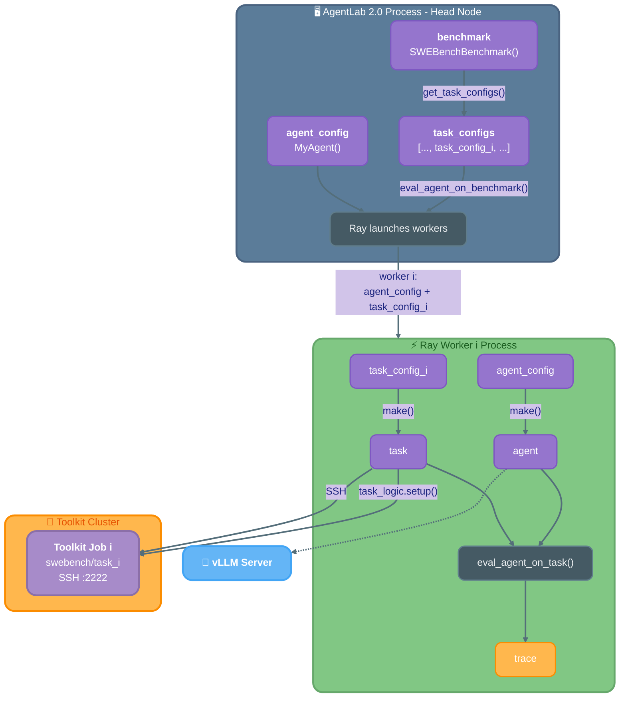
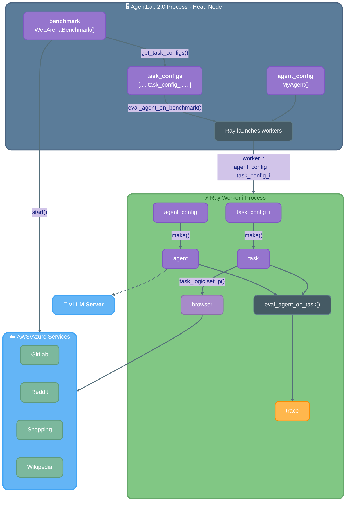

# User Experience

> **CUBE Layer:** UX Philosophy & Developer Workflow
> **Related:** [main_specs.md](main_specs.md) | [docker_wrapper.md](docker_wrapper.md) | [vm_wrapper.md](vm_wrapper.md)

## Overview

This document describes the user experience goals and developer workflow for CUBE. The CUBE position paper defines a 4-layer schema (Task, Benchmark, Package, Registry). These design docs focus on the Task and Benchmark layers for Phase 1, with Package and Registry deferred to Phase 2.

## CUBE-Users

A CUBE-User will likely use a CUBE through a harness. The actual users are either developers building a broad scope platform, e.g., AgentLab2, or developers making some minimalistic platforms to test their agent on some benchmarks. The user experience is good if:

* **Quick zero-to-hero:** APIs are easy to understand and quick to learn.
* **Minimal trade-offs:**
  * The usage of CUBE doesn’t bring big complexity to the harness codebase
  * RL training can scale and is not inherently slowed down by more than 50% from optimal
* **Robustness:** Make sure harness building over CUBE will not bring brittleness, e.g., if any process crashes, the harness may want to implement graceful recovery.
* **Debugging:** Debugging is integrated. If a process crashes, there is enough information to identify what happened. In debug mode, most components should be able to run in the same process, and breakpoints in VSCode expose you to the whole system.
* **Trust:** Users will want to trust that building on top of CUBE will not be a bad long-term decision.

The position paper attempts to address many of these at a discussion level. The API of the CUBE position paper is not fixed and can still be modified.

Here are a few diagrams showing how the workflow of CUBE is across multiple processes

### SWE-Bench Evaluation Flow

### WebArena Evaluation Flow

## CUBE-Developers

There are 2 categories of CUBE-Developers:

* **Benchmark-Wrapper:** Wants to expose an existing benchmark implemented in a specific format and adapt it to CUBE, i.e. benchmark existed before CUBE.
* **Benchmark-Owners:** A benchmark designer who wants to expose their new benchmark to the community, and already knows that CUBE exists. Assuming CUBE has reached some level of critical mass, the developers have strong incentive to adapt to CUBE.

Obviously, we should focus now on Benchmark-Wrappers as they are crucial to achieve critical mass. In “phase-2”, we’ll focus on Benchmark-Developers.

The main role of a CUBE-Developer is to make a benchmark fit CUBE’s API, but it goes beyond that. They also need to ensure that the CUBE will work well in a variety of downstream users' infrastructure, and fulfill the CUBE-Users's user experience as described above. To achieve this, our CUBE implementation will provide a variety of composable “blocks” and guidelines to help CUBE-Developers implement in the right way without too much effort.

### Blocks vs Class Hierarchy

Providing an advanced hierarchy for Benchmark and Task classes could sound appealing for the user, but likely it will not fulfill all use cases. A better approach would be to provide a collection of blocks that are meant to interconnect together for implementing the different APIs of CUBE. Based on these blocks, we can provide a few derived classes from Benchmark that would give a good starting point for 80% of the cases. For the 20% remaining, CUBE-Developers can go from the abstract base class and recombine blocks. Examples of blocks are:

* **Launch Docker Abstraction**: the same Docker image could be local, Daytona, Modal, or onToolkit. Providing an API for that and implementing the common variants will be useful
* **Category of tools abstraction**: To support common categories of benchmarks, we can provide, e.g, BrowserTool, CUATool, and SWETool, each with a good API on how to instantiate and connect. Most benchmarks in those categories will be able to just use our tools.
* **Launch VM Abstraction:** Similar to Docker Abstraction, but for VMs
* …

### Workflow

We should target the following workflow for CUBE-Developers

1. Read quick guidelines with a decision tree to help users know which blocks and base classes they should use, and reference implementation.
2. Write code to fit the API
3. Run our provided automatic tests to see what’s working or what is failing
4. Run our provided stress tests to provide various metrics about speed, scalability, and robustness
5. Go back to step 2 to adjust the code if necessary
6. Run a generalist agent with AL2 to test performance. If performance is not as expected, debug using, e.g., AL2 and go back to step 2\.

## Cross-References

- [main_specs.md](main_specs.md) — Benchmark and Task API specification (core abstract classes)
- [docker_wrapper.md](docker_wrapper.md) — Container API for task-level infrastructure (Local, Modal, Toolkit)
- [vm_wrapper.md](vm_wrapper.md) — VM API for benchmark-level infrastructure (AWS, Azure, GCP)
