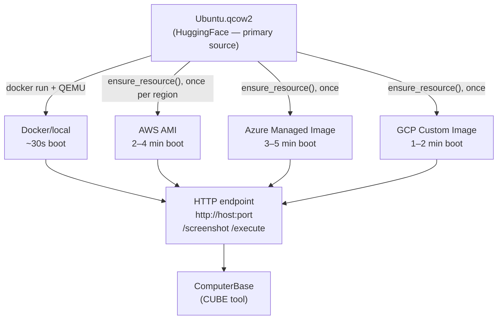

# VM Backend Design
## Resource abstraction for desktop-automation benchmarks (OSWorld and beyond)

> **CUBE Layer:** Infrastructure (VMs)
> **Related:** [docker_wrapper.md](docker_wrapper.md) | [main_specs.md](main_specs.md)
>
> **Key Insight:** Separate task requirements (VMConfig) from infrastructure (VMBackend).
> The core runtime resource is an HTTP endpoint, not a Docker image or a QEMU file.

---

## The Actual Resource Stack (OSWorld as reference)

OSWorld's Docker "provider" runs **QEMU inside Docker** with KVM acceleration. The primary source is a `.qcow2` disk image on HuggingFace — every provider derives from it.



All providers converge to the same HTTP interface. `ComputerBase` only ever talks to this endpoint.

---

## The Separation: What vs How

```
VMConfig    — WHAT the task needs   (owned by benchmark, in TaskMetadata)
VMBackend   — HOW to provision it   (owned by harness user, defined once)
VM          — The live handle       (runtime object, not serializable)
```

The image reference lives in the **backend**, not in `VMConfig`. A task says "I need Ubuntu 22.04, 4 cores" — not "from this AMI".

```python
class VMConfig(TypedBaseModel):
    """WHAT — task requirements. Owned by benchmark/TaskMetadata."""
    snapshot_name: str = "init_state"
    cpu_cores: int = 4
    ram_gb: int = 4
    screen_size: tuple[int, int] = (1920, 1080)
    os_type: str = "Ubuntu"


class VMBackend(ABC, TypedBaseModel):
    """HOW — infrastructure config. Owned by harness user, defined once."""

    @abstractmethod
    def ensure_resource(self, config: VMConfig) -> None:
        """
        Idempotent. Ensure a provider-specific image exists for this config.
        First call: download qcow2_source → convert → upload → import as snapshot.
        Subsequent calls: no-op (cached snapshot ID stored locally or as cloud tag).
        Called automatically by launch(), but can be called explicitly in benchmark.setup().
        """

    @abstractmethod
    def launch(self, config: VMConfig) -> "VM":
        """Calls ensure_resource(), then blocks until HTTP endpoint is reachable."""

    @abstractmethod
    def close(self) -> None:
        """Release all resources managed by this backend."""


class VM(ABC):
    """Live handle to a running desktop. Not serializable."""

    @property
    @abstractmethod
    def endpoint(self) -> str:
        """Base URL of the HTTP agent: http://host:port"""

    @abstractmethod
    def restore_snapshot(self, name: str) -> None:
        """Revert VM to a named snapshot. Called between tasks."""

    @abstractmethod
    def stop(self) -> None:
        """Shut down and release this VM's resources."""
```

> **Open design question (raised by Tao Yu / OSWorld):** Reset semantics are currently under-specified. Whether `restore_snapshot()` means a full VM savestate revert, a container restart, an app-level cleanup, or a fresh instance launch has large implications for reproducibility and safe parallelism — but nothing in the current API communicates this. The proposed fix: add a `reset_isolation` field to `BenchmarkMetadata` (not `VMConfig`) so harness users know what guarantees the benchmark provides:
>
> ```python
> class ResetIsolation(str, Enum):
>     SNAPSHOT     = "snapshot"      # VM reverted to known savestate (strong, ~5s)
>     RESTART      = "restart"       # Container/VM stopped and restarted (~30s)
>     APP_LEVEL    = "app_level"     # App state reset via scripts, VM stays running (~5s, risk of leakage)
>     NEW_INSTANCE = "new_instance"  # Fresh VM per task (strongest, ~3 min)
> ```
>
> The harness can then warn on unsafe parallelism (e.g. `APP_LEVEL` + multiple workers on the same VM), and the stress test can verify the declared level is actually delivered. This is a `cube-standard` change, not a `cube-vm-backend` change.

---

## Backend Implementations

### LocalQEMUVMBackend (Docker + QEMU)

```python
class LocalQEMUVMBackend(VMBackend):
    qcow2_source: str = UBUNTU_OSWORLD_HF_URL  # HuggingFace URL or local path
    cache_dir: str = str(CUBE_CACHE_ROOT / "vm_data")
    headless: bool = True
```

`ensure_resource()` downloads the qcow2 once (~4 GB). `launch()` runs `docker run` with QEMU + qcow2 mount, waits for `/screenshot`. Constraint: ~4 GB RAM + one KVM slot per VM.

**Relationship to `desktop_env`:** OSWorld's `desktop_env` library does two things: (1) Docker/QEMU lifecycle management, and (2) HTTP client calls to the in-VM server. The qcow2 already ships an HTTP server inside the VM — `desktop_env` is just a wrapper around it. In the CUBE design, `VMBackend` replaces role (1) and `ComputerBase` replaces role (2) with a direct `requests` client (~50 lines). `desktop_env` can optionally be used inside `LocalQEMUVMBackend` to avoid reimplementing Docker management, but it stays strictly behind the `VMBackend` interface — invisible to everything above it and not a dependency of `cube-standard`.

### AWSVMBackend (base) / AWSQEMUVMBackend / AWSPrebuiltVMBackend

```python
class AWSVMBackend(VMBackend):
    """Base: handles EC2 launch/terminate. Subclasses define image source."""
    instance_type: str = "m5.xlarge"
    region: str
    pool_size: int = 1
    # Credentials: AWS_ACCESS_KEY_ID + AWS_SECRET_ACCESS_KEY from env
    # launch(): run_instances() from AMI produced by ensure_resource()
    # close(): terminate_instances()

class AWSQEMUVMBackend(AWSVMBackend):
    """Desktop VM via QEMU. For OSWorld-style benchmarks."""
    qcow2_source: str = UBUNTU_OSWORLD_HF_URL
    # ensure_resource(): qcow2 → VHD → S3 upload → ec2.import_image() → cache AMI ID (~15–30 min, once per region)

class AWSPrebuiltVMBackend(AWSVMBackend):
    """VM from a pre-built AMI. For WebArena-style benchmarks or pre-published images."""
    ami_id: str
    # ensure_resource(): no-op — AMI already exists
```

Same base/subclass pattern applies to Azure and GCP:

```python
class AzureQEMUVMBackend(AzureVMBackend): qcow2_source: str  # VHD upload → az image create
class AzurePrebuiltVMBackend(AzureVMBackend): image_id: str   # no-op ensure_resource()

class GCPQEMUVMBackend(GCPVMBackend): qcow2_source: str       # raw upload → gcloud images import
class GCPPrebuiltVMBackend(GCPVMBackend): image_id: str       # no-op ensure_resource()
```

Credentials from env (`AZURE_CLIENT_ID` / `GOOGLE_APPLICATION_CREDENTIALS`).

### ToolkitVMBackend (HPC/SLURM)

```python
class ToolkitVMBackend(VMBackend):
    """
    Strategy A — KVM allowed: sbatch runs Singularity + QEMU.
    Strategy B — strict security: delegates to cloud_backend.
    """
    cloud_backend: AWSQEMUVMBackend | AWSPrebuiltVMBackend | AzureQEMUVMBackend | AzurePrebuiltVMBackend
    partition: str
    account: str
```

See [HPC Constraint](#hpc-constraint).

---

## Automation Summary

| Backend | `ensure_resource()` | `launch()` | `close()` | Credentials |
|---|---|---|---|---|
| **LocalQEMU** | download qcow2 (~4 GB, once) | `docker run` + QEMU (~30 s) | `docker stop` | None |
| **AWSQEMUVMBackend** | qcow2 → VHD → S3 → `ec2.import_image()` (~15–30 min, once/region) | `run_instances()` (~2–4 min) | `terminate_instances()` | `AWS_ACCESS_KEY_ID` + secret |
| **AWSPrebuiltVMBackend** | no-op | `run_instances()` (~2–4 min) | `terminate_instances()` | `AWS_ACCESS_KEY_ID` + secret |
| **Azure (QEMU)** | qcow2 → VHD → Blob → `az image create` (~10–20 min, once) | `begin_create_or_update()` (~3–5 min) | `begin_delete()` | `AZURE_CLIENT_ID` + secret + tenant |
| **GCP (QEMU)** | qcow2 → raw → GCS → `gcloud images import` (~10–20 min, once) | `instances.insert()` (~1–2 min) | `instances.delete()` | `GOOGLE_APPLICATION_CREDENTIALS` |
| **HPC/SLURM** | delegates to `cloud_backend.ensure_resource()` | `sbatch` or cloud | `scancel` | SSH key + cloud creds |

All fully automatable — if env vars are present at `benchmark.setup()`, the entire lifecycle runs without manual steps.

---

## CUA Benchmark Landscape

How existing desktop-automation benchmarks map to this abstraction:

| Benchmark | Resource | Image source | HTTP server inside | Abstraction fit |
|---|---|---|---|---|
| **OSWorld** | Docker + QEMU | qcow2 on HuggingFace (~24 GB) | ✓ Flask :5000 (`/screenshot`, `/execute`, …) | Perfect |
| **Windows Agent Arena** | Docker + QEMU | User-built from Windows 11 ISO (~30 GB) | ✓ Flask at 20.20.20.21:5000 | Perfect — same pattern, `ensure_resource()` builds instead of imports |
| **OSUniverse** | Docker + Webtop (no QEMU) | Docker image on GCP Artifact Registry | ✓ agentd REST API | Perfect — lighter, no KVM needed |
| **macOSWorld** | AWS EC2 mac2.metal (mandatory) | Pre-published AMIs (`ap-southeast-1`) | ✗ VNC over SSH | Perfect — local VNC→HTTP proxy bridges the gap (see below) |
| **WorldGUI** | Bare Windows host, no isolation | N/A — dataset only (HuggingFace) | ✗ pyautogui on host | Doesn't fit — no VM layer |

**Notes:**

- **macOSWorld** is cloud-only by Apple EULA (mac2.metal Dedicated Hosts). `MacOSVMBackend.ensure_resource()` is a no-op — AMIs are pre-published by benchmark authors. The VM communicates via VNC+SSH, not HTTP, but `launch()` starts a **local VNC→HTTP proxy** (~100 lines) so `VM.endpoint` still works and `ComputerBase` is unchanged:
  ```python
  class MacOSVMBackend(VMBackend):
      ami_ids: dict[str, str]  # pre-published, no import needed
      region: str = "ap-southeast-1"

      def ensure_resource(self, config: VMConfig) -> None:
          pass  # AMIs already exist

      def launch(self, config: VMConfig) -> VM:
          instance = ec2.run_instances(ami_ids[region], instance_type="mac2.metal", ...)
          proxy_port = start_vnc_http_proxy(instance.public_ip, vnc_port=5900, ssh_key=...)
          return MacOSVM(endpoint=f"http://localhost:{proxy_port}", instance=instance)
  ```
  Note: `restore_snapshot()` takes ~20 min via AWS snapshot recovery — per-task launch+terminate is preferable over snapshot reuse.

- **Windows Agent Arena** has no pre-built distributable image. `ensure_resource()` triggers an automated build from the Windows 11 Enterprise Evaluation ISO (~20 min, one-time) rather than an import.

- **OSUniverse** uses Docker+Webtop (no QEMU, no KVM). `LocalQEMUVMBackend` doesn't apply — a lightweight `WebtopVMBackend` wrapping `docker run` suffices.

- **WorldGUI** runs directly on the host Windows machine with pyautogui — no VM layer, no infrastructure abstraction possible or needed.

---

## HPC Constraint

QEMU requires `/dev/kvm`. Without it, software emulation is ~100× slower — unusable.

```
Cluster type           KVM available?   Recommended backend
──────────────────────────────────────────────────────────────
HPC (KVM allowed)      Yes              ToolkitVMBackend → LocalQEMU via Singularity
HPC (strict security)  No               ToolkitVMBackend → cloud_backend (AWS/Azure)
Cloud node             Yes (bare metal) LocalQEMU or cloud provider directly
Local workstation      Yes              LocalQEMUVMBackend
```

For strict HPC clusters, `ToolkitVMBackend` delegates to a `cloud_backend`. SLURM runs the agent; the cloud runs the VM. Round-trip latency ~20–50 ms per action — acceptable for LLM agents.

---

## Integration with CUBE Benchmark Lifecycle

```python
backend = AWSQEMUVMBackend(
    qcow2_source=UBUNTU_OSWORLD_HF_URL,
    instance_type="m5.xlarge",
    region="us-east-1",
    pool_size=8,
)

bench = OSWorldBenchmark(
    vm_backend=backend,
    default_tool_config=ComputerConfig(action_space="pyautogui"),
)

bench.setup()   # ensure_resource() + launch pool of 8 VMs (~3 min after first import)

@ray.remote
def evaluate(task_config, vm_backend):
    task = task_config.make(vm_backend=vm_backend)
    obs, info = task.reset()    # restore_snapshot + setup scripts
    ...
    task.close()

results = ray.get([evaluate.remote(tc, backend) for tc in bench.get_task_configs()])
bench.close()   # terminates all VMs
```

---

## What Goes Where

| Component | Package | Status |
|---|---|---|
| `VMConfig`, `VM`, `VMBackend` (abstracts) | `cube-standard/src/cube/vm.py` | To implement |
| `LocalQEMUVMBackend`, `AWSVMBackend`+subclasses, Azure/GCP equivalents, `MacOSVMBackend` | `cube-tools/cube-vm-backend/` | To implement |
| `ToolkitVMBackend` | `cube-tools/cube-vm-backend/` | To implement |
| `ComputerConfig`, `ComputerBase`, `Computer13`, `PyAutoGUIComputer` | `osworld-cube/` | Refactor (remove infra fields) |

**`ComputerBase`** is the CUBE `Tool` for desktop benchmarks. It holds a `VM` reference and bridges CUBE's action/observation API to the VM's HTTP endpoints (`/screenshot`, `/execute`, etc.) via direct `requests` calls. `desktop_env` is **not a dependency** of any of these packages — it has been fully superseded:

| `desktop_env` role | Replaced by |
|---|---|
| Provider abstraction | `VMBackend` subclasses |
| qcow2 download | `ensure_resource()` |
| Docker/QEMU lifecycle | `LocalQEMUVMBackend` |
| Snapshot restore | `VM.restore_snapshot()` |
| HTTP client to in-VM server | `ComputerBase` + direct `requests` |
| Task setup scripts | `Task.reset()` |
| Accessibility tree parsing | `axtree.py` in `osworld-cube` |

Benchmarks sharing the desktop VM pattern (OSUniverse, Windows Agent Arena, macOSWorld, etc.) depend on `cube-vm-backend` without reimplementing VM lifecycle logic.
