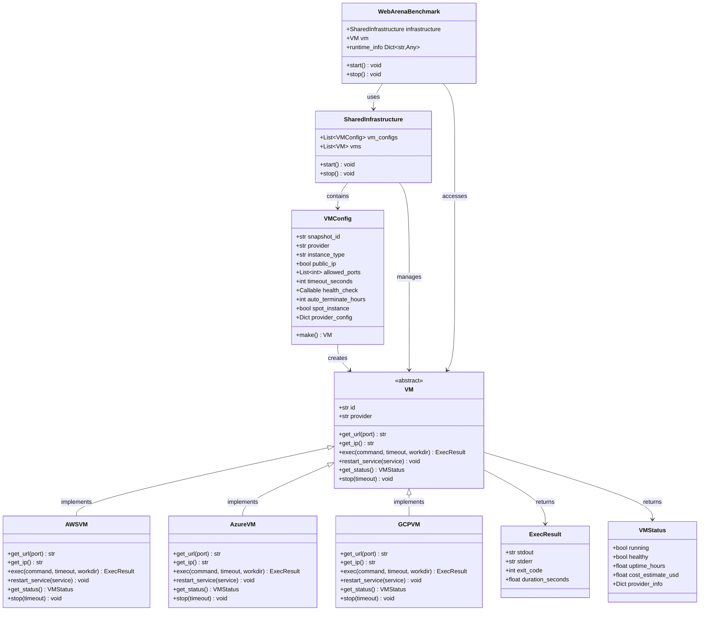

# CUBE VM API Specification

> **CUBE Layer:** Benchmark-level infrastructure (VMs)
> **Related:** [main_specs.md](main_specs.md) | [docker_wrapper.md](docker_wrapper.md) | [user_experience.md](user_experience.md)

## Overview

The VM API provides persistent virtual machine infrastructure for benchmarks that require full OS environments (WebArena, OSWorld, etc). Unlike containers, VMs are created once per benchmark instance and live for hours, with fast state resets between tasks.

## Primary Use Case

Benchmark-level VM that persists across many tasks, with application-level resets between tasks.

```python
# Benchmark initialization (once)
benchmark = WebArenaBenchmark(vm_config, tool_config)
benchmark.start()  # Blocks 5 min - creates VM

# Get task configs
task_configs = benchmark.get_task_list()

# Each task runs on Ray worker
@ray.remote
def evaluate_task(task_config, agent_config, runtime_info):
    task = task_config.make(runtime_info=runtime_info)  # Fast: uses existing VM
    agent = agent_config.make()
    obs = task.reset()  # App-level reset (5-10 sec, not minutes)
    # ... agent loop ...
    result = task.get_result()
    task.close()
    return result

# Parallel evaluation
runtime_info = benchmark.runtime_info
futures = [evaluate_task.remote(tc, agent_config, runtime_info) for tc in task_configs]
results = ray.get(futures)

# Cleanup
benchmark.stop()  # Destroys VM
```

## Key Design Decisions

**1. VM Lifecycle ≠ Task Lifecycle**
- Container: 1 per task, lives minutes
- VM: 1 per benchmark, lives hours
- Tasks reset state, don't recreate VM

**2. Application-Level Resets (Not VM Snapshots)**
- VM snapshots take 2-5 minutes (too slow for per-task)
- Fast resets: SQL scripts, container restarts, file cleanup (5-10 seconds)
- VM snapshots only for disaster recovery

**3. Sync API (Not Async)**
- Ray workers can block (same as containers)
- Most operations are serial (reset, then evaluate)
- Simpler implementation and usage

**4. Provider Abstraction**
- AWS, Azure, GCP have different APIs but same concepts
- Backend-specific implementations like containers

## Core API

### VMConfig

Declarative specification for VM creation.

```python
@dataclass
class VMConfig:
    """VM specification. Calling make() creates long-running VM."""
    
    # Required
    snapshot_id: str  # AMI ID (AWS), Image ID (Azure), etc
    provider: Literal["aws", "azure", "gcp"]
    
    # Instance sizing
    instance_type: str = "t3.medium"  # Provider-specific
    
    # Networking (critical for accessing services)
    public_ip: bool = True  # Most benchmarks need this
    allowed_ports: List[int] = [80, 443, 22]  # Firewall rules
    
    # Lifecycle
    timeout_seconds: int = 600  # Max wait for VM boot
    health_check: Callable[[VM], bool] | None = None
    auto_terminate_hours: int = 8  # Safety: prevent runaway costs
    
    # Cost control
    spot_instance: bool = False  # Cheaper but can be terminated
    
    # Provider-specific options
    provider_config: Dict[str, Any] | None = None
    # Examples:
    # - aws: {"security_group_id": "sg-123", "subnet_id": "subnet-456"}
    # - azure: {"resource_group": "benchmarks", "location": "eastus"}
    
    def make(self) -> VM:
        """
        Create and start VM. Blocks until ready or timeout.
        
        Returns: Connected VM object
        Raises: TimeoutError, HealthCheckError, QuotaError, CostLimitError
        """
```

**Why separate from VM?** Config is serializable. VM has live SSH connections.

### VM (Abstract Base Class)

Long-running VM with state management capabilities.

```python
class VM(ABC):
    """Running VM for benchmark infrastructure."""
    
    # Access
    @abstractmethod
    def get_url(self, port: int = 80) -> str:
        """
        Get public URL to access service on VM.
        
        Returns: http://12.34.56.78:port or http://hostname:port
        """
    
    @abstractmethod
    def get_ip(self) -> str:
        """Get public IP address."""
    
    # Execution (for application-level resets)
    @abstractmethod
    def exec(
        self,
        command: str,
        timeout: int | None = None,
        workdir: str | None = None,
    ) -> ExecResult:
        """
        Execute command via SSH.
        
        Primary use: Application-level state reset
        Example: vm.exec("psql -f reset_database.sql")
        
        Returns: ExecResult(stdout, stderr, exit_code, duration_seconds)
        Raises: TimeoutError, SSHError
        """
    
    # Service management (optional, for Docker-based benchmarks)
    @abstractmethod
    def restart_service(self, service: str):
        """
        Restart systemd service or Docker container.
        
        Examples:
        - vm.restart_service("postgresql")  # systemd
        - vm.restart_service("docker:webarena-shopping")  # Docker container
        
        Use: Fast reset when app-level reset insufficient
        Time: ~10-30 seconds
        """
    
    # Health monitoring (VMs run for hours)
    @abstractmethod
    def get_status(self) -> VMStatus:
        """
        Check VM and services health.
        
        Returns: VMStatus with running state, uptime, cost estimate
        Use: Detect VM crashes during long benchmark runs
        """
    
    # Lifecycle
    @abstractmethod
    def stop(self, timeout: int = 30):
        """
        Terminate VM and clean up.
        
        Cleanup: Stop instance, delete temporary resources, close SSH
        """
    
    # Properties
    @property
    @abstractmethod
    def id(self) -> str:
        """Unique VM identifier (instance ID)."""
    
    @property
    @abstractmethod
    def provider(self) -> str:
        """Provider: 'aws', 'azure', 'gcp'."""


# Note: ExecResult is shared with the Container API (docker_wrapper.md).
# In implementation, define once in a shared module (e.g., cube.types).
@dataclass
class ExecResult:
    stdout: str
    stderr: str
    exit_code: int
    duration_seconds: float


@dataclass
class VMStatus:
    running: bool
    healthy: bool  # Based on health_check if provided
    uptime_hours: float
    cost_estimate_usd: float  # Running cost so far
    provider_info: Dict[str, Any]  # Provider-specific details
```

### Backend Implementations

Each provider subclasses `VM`:

```python
class AWSVM(VM):
    """Uses boto3. EC2 instances and AMIs."""

class AzureVM(VM):
    """Uses Azure SDK. Virtual Machines and Images."""

class GCPVM(VM):
    """Uses GCP SDK. Compute Engine instances."""
```

## State Reset Strategies

Benchmarks choose reset strategy based on speed/isolation tradeoff.

### Fast Reset (5-10 seconds) - Recommended for Most Tasks

Application-level state reset via commands:

```python
class WebArenaTaskLogic:
    def setup(self, vm: VM):
        """Application-level state reset via VM commands."""
        # Reset database
        vm.exec("psql -c 'TRUNCATE users, orders, products CASCADE'")
        vm.exec("psql -f /fixtures/base_data.sql")

        # Clear cache
        vm.exec("redis-cli FLUSHALL")

        # Reset uploads directory
        vm.exec("rm -rf /var/uploads && cp -r /fixtures/uploads /var/")
```

### Medium Reset (10-30 seconds) - When Services Corrupted

Restart services without VM recreation:

```python
def setup(self, vm: VM):
    # If using Docker Compose on VM
    vm.exec("docker-compose restart")

    # Or systemd services
    vm.restart_service("postgresql")
    vm.restart_service("nginx")
```

### Slow Reset (Never for Per-Task)

VM snapshots are too slow (2-5 minutes). Only for disaster recovery.

## Configuration Examples

### AWS WebArena VM

```python
config = VMConfig(
    snapshot_id="ami-0abcdef1234567890",  # Pre-built WebArena AMI
    provider="aws",
    instance_type="t3.large",
    public_ip=True,
    allowed_ports=[80, 443, 22, 3000, 5432],
    timeout_seconds=600,
    health_check=lambda vm: requests.get(vm.get_url()).status_code == 200,
    auto_terminate_hours=8,
    spot_instance=True,  # Save cost
    provider_config={
        "security_group_id": "sg-webarena",
        "subnet_id": "subnet-public-1a",
    },
)
```

### Azure OSWorld VM

```python
config = VMConfig(
    snapshot_id="osworld-ubuntu-desktop-v1",
    provider="azure",
    instance_type="Standard_D4s_v3",
    public_ip=True,
    allowed_ports=[3389, 22],  # RDP, SSH
    timeout_seconds=900,  # Desktop OS takes longer
    provider_config={
        "resource_group": "osworld-benchmarks",
        "location": "eastus",
    },
)
```

## Integration with CUBE Hierarchy

VMs fit into the benchmark-level infrastructure pattern. The canonical `Benchmark` ABC is defined in [main_specs.md](main_specs.md). For container-based task-level infrastructure, see [docker_wrapper.md](docker_wrapper.md).

> **Note:** The `SharedInfrastructure` and `SharedInfraBenchmark` classes below are proposed helper classes for the composable "blocks" approach described in [user_experience.md](user_experience.md). The canonical Benchmark ABC is defined in [main_specs.md](main_specs.md).

```python
class SharedInfrastructure:
    """Persistent infrastructure shared across tasks."""

    def __init__(self, vms: List[VMConfig]):
        self.vm_configs = vms
        self.vms: List[VM] = []

    def start(self):
        """Launch all VMs, wait for ready."""
        self.vms = [config.make() for config in self.vm_configs]

    def stop(self):
        """Cleanup all VMs."""
        for vm in self.vms:
            vm.stop()


class WebArenaBenchmark(Benchmark):
    def __init__(self):
        vm_config = VMConfig(snapshot_id="webarena-shopping", provider="aws")
        self.infrastructure = SharedInfrastructure([vm_config])

    def start(self):
        self.infrastructure.start()

    @property
    def runtime_info(self) -> Dict[str, Any] | None:
        if not self.infrastructure.vms:
            return None
        return {"base_url": self.infrastructure.vms[0].get_url(80)}

    def stop(self):
        self.infrastructure.stop()
```

## Error Handling

**Fail-fast with diagnostics.** Error messages indicate failure point:
- Instance quota exceeded
- VM started but SSH unreachable
- Health check failed (services not ready)
- Cost limit would be exceeded

**Cleanup on failure.** If `make()` fails, must clean up: terminate instance, release IP, close connections.

**Safety mechanisms:**
- Auto-terminate after configured hours (prevent runaway costs)
- Cost estimation before launch
- Quota checks before submission

## Extension Points (Future)

The minimal API can be extended with:

1. **VM snapshots for recovery** (not per-task reset)
   ```python
   vm.create_snapshot("disaster-recovery")
   vm.restore_snapshot("disaster-recovery")  # 5 min
   ```

2. **Async support** (if complex orchestration needed)
   ```python
   async def aexec(self, command: str) -> ExecResult
   ```

3. **Multi-VM networking** (for distributed benchmarks)
   ```python
   VMConfig(network="benchmark-vpc", private_ip="10.0.1.5")
   ```

4. **GPU support** (for ML benchmarks)
   ```python
   VMConfig(gpu_type="nvidia-t4", gpu_count=1)
   ```

5. **Spot instance handling** (restart on termination)
   ```python
   vm.on_spot_termination(callback=restart_handler)
   ```

## Success Criteria

The design succeeds if:
1. CUBE-Developer can swap AWS/Azure/GCP by changing one parameter
2. VM creation happens once per benchmark (not per task)
3. Task resets are fast (5-10 seconds via application-level reset)
4. Cost is controlled (auto-terminate, spot instances)
5. Error messages clearly indicate failure point
6. No resource leaks on failures or crashes

## Class Diagram

