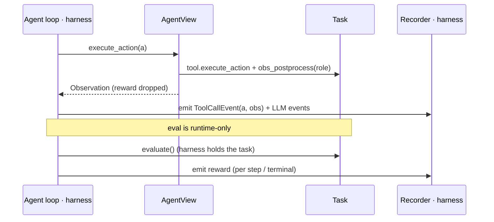
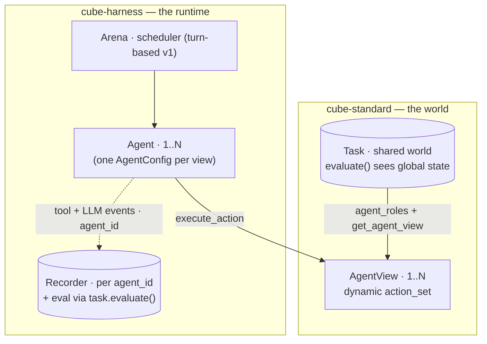

# RFC: The streamable Task — a tool view for agents (+ multi-agent)

**Status:** DRAFT
**Author:** Alexandre Lacoste (w/ Claude)
**Date:** 2026-06
**Companion (harness):** `cube-harness/openspec/changes/multi-agent-episode`.

## The idea

A `Task` is the **world**: it owns shared state + lifecycle (`reset` / `evaluate` /
`close`). The **default** way an agent interacts with it is a thin **`AgentView`** — an
obs-in/action-out view (`execute_action` + a dynamic `action_set`) that returns just the
**observation** — held *instead of* the task. A multi-agent task exposes **one `AgentView`
per seat** (the runtime walks `agent_roles()` + `get_agent_view(role)`; single-agent = N=1).

`step()` is **retained as a gym-compatibility view** (gym / RL / NeMo callers) — no longer
the primary surface. The `AgentView` is, because it's the one that fits **parallel tool
calls** (the caller decides multiplicity) and **multi-agent** (N views) naturally, where the
batched single-`EnvironmentOutput` `step` is awkward.

The standard stays tiny: the `AgentView`, the `agent_roles()` + `get_agent_view()` seam, and
a few **optional** hooks. Trajectory **capture** and **orchestration** (loops, scheduling,
budget, sinks) stay in the harness — so the standard never learns the words *LLM*, *loop*,
*turn*, or *budget*.

## What cube-standard adds (minimal)

```python
class Task:                               # the world — runtime-driven; never held by an agent
    def step(self, action) -> EnvironmentOutput: ...   # gym-COMPATIBILITY view; FINALIZED, do-not-override
    def evaluate(...) -> tuple[float, dict]: ...        # EXISTING — reward; runtime-side only
    def agent_roles(self) -> dict[str|None, int]: ...  # NEW: roster, role->seats (default {None:1})
    def _make_tool(self, role=None) -> Tool: ...        # NEW: the SINGLE tool-lifecycle hook — world prep +
        # build, a fresh session per seat. Base ignores `role` (tool_config.make). Multi-agent overrides
        # to bind it; may raise NotImplementedError for role=None (roleless opt-out).
    def get_agent_view(self, role=None) -> AgentView: ...  # NEW: per-seat view. Base ONLY does role=None
        # (reuses self.tool); raises NotImplementedError for a named role. Multi-agent OVERRIDES it and
        # owns the seat index internally — the runtime passes no seat.
    @property
    def tool(self): ...                                 # the task's own no-role tool (built in
        # model_post_init via _make_tool(None)); RAISES if that opt-out'd (NotImplementedError).
    def _filter_actions(self, actions, role=None): ...  # NEW: advisory whitelist/mask (default = all)
    def obs_postprocess(self, obs, role=None): ...       # EXISTING hook, now role-aware (per-seat views)

class AgentView:                          # the ONLY surface an agent holds (carries role + seat + its tool)
    @property
    def action_set(self) -> list[ActionSchema]: ...    # = its tool's actions, _filter_actions(role); dynamic.
        # Already includes `final_step` (every Tool exposes it) — never appended.
    def execute_action(self, action: Action) -> Observation: ...
    async def async_execute_action(self, action: Action) -> Observation: ...
        # Runs the action through ITS tool + obs_postprocess(role); returns the OBS ONLY (no reward, no done).
        # `final_step` is a real tool action that raises AgentStop. Per-step eval is the runtime's concern.
    agent_id  # "agent" (single seat) else "{role}-{seat}"
```

There is **no** shared `_execute_action` core and **no** `agent_tools()`: both views dispatch
straight through a tool's own `execute_action` (the gym `step` loops the task's `_tool`; an
`AgentView` runs its seat's tool), and the runtime expands the roster by walking
`agent_roles()` + `get_agent_view(role)` itself. Per-action behaviour is identical because
both go through the **same `Tool.execute_action`** — not a Task-level core.

## One path — the cube can't be bypassed

The per-action work — argument validation, dispatch, error → observation, `final_step` →
`AgentStop` — lives in **`Tool.execute_action`**, the single chokepoint both views call. gym
`step` wraps it with the batch loop + `finished` + `evaluate` + `EnvironmentOutput`; an
`AgentView` wraps it with `obs_postprocess(role)`, returning the **obs only** (per-step eval is
the runtime's concern). Because both
funnel through the **same `Tool.execute_action`**, per-action behavior is identical **by
construction**. The *only* things the two views do differently are **when `evaluate` runs**
and **how `AgentStop` is handled**:

- **`AgentView.execute_action()`** — the **default** agent view: `tool.execute_action` +
  `obs_postprocess(role)`, returning **obs only** (no reward, no done). The runtime calls
  `finished` / `evaluate` at its own cadence (per-action for the agent path) — so the agent
  never sees reward and there's no double eval. `final_step` raises `AgentStop`, which
  propagates to the runtime.
- **`step()`** — the **gym-compatibility** view: loop `self._tool.execute_action` over the
  batch → `finished` → `evaluate` (per batch) → `obs_postprocess` → `EnvironmentOutput`. It
  **catches** `AgentStop` → `done=True`. **Finalized, do-not-override.**

Not re-running `evaluate` / `finished` per action (the agent view leaves them to the runtime)
is what avoids double eval. Whatever a cube puts in `evaluate` / `finished` / `obs_postprocess`
runs identically under gym `step`, an in-process agent loop, or an external agent — **cubes
customize the existing hooks, never the orchestration.** A tool **error is always an
observation** (gym included) — `Tool.execute_action` returns `StepError.to_observation()`
(text for the agent + structured `Observation.error` for telemetry); never terminal, only
`finished` / `evaluate` decide termination. (No new `pre_step` / `post_step` hooks — the one
cube that overrode `step` is fixed directly.)

## STOP — now a real base-class action; the special-casing is gone

`final_step` (the agent's "I'm done" sentinel) is a real **`@tool_action` on the `Tool`
base**: dispatching it raises `AgentStop` (a `BaseException`), which the runtime catches with
`try/except` — the agent loop never introspects actions. It is **discovered like any other
action** (it shows up in every tool's `action_set`), so it is **never appended** and there is
**no STOP special-casing** anywhere in the dispatch path.

What this removes is the *sprawl* from the old approach:
- per-tool-leaf STOP registration + dedup band-aids,
- the manual `STOP_ACTION` appends in `react` / `genny` / `legacy`,
- the `filter_actions`-appending + `accept_agent_stop` flag (`stop-action-auto-include`, now
  superseded),
- and the `done`-flag plumbing

all delete themselves — net code removal, no new mechanism. gym `step` still catches the
exception → `done=True`; the agent loop still lets it propagate. The Anthropic-safe empty-
object schema lives on the `STOP_ACTION` constant / `Tool.final_step`, and identical
`final_step` actions across `Toolbox` leaves dedup automatically (`_dedup_actions` collapses
same-name-identical-schema; same-name-different-schema still raises).

## Capture & eval live in the harness — no standard seam

Trajectory capture needs nothing in the standard:

- The agent loop already has each `(action, obs)` (it *called* `execute_action`), so it
  **emits its own tool + LLM events** through the recorder it already uses.
- **Reward** is hidden from the agent; the harness holds the `Task` and **recovers it
  directly** via `task.evaluate()` (per step / terminal). When `task.validate_per_step` is set,
  the harness's `RecordingTaskTool` calls `task.evaluate()` after each action and records the
  step-wise reward as an `EvaluationEvent` — `AgentView.execute_action` returns obs only, so
  reward never reaches the agent.



## Multi-agent — one task, many tools, with roles

The task declares a **roster** — `agent_roles() -> {role: seat_count}` (default `{None: 1}`,
single-agent) — and the runtime expands it by walking the roster and calling
`get_agent_view(role)` once per seat, yielding **one `AgentView` per seat** over a **single
shared `Task`**. `role=None` is the lone single-agent seat; every multi-agent seat carries a
**role** (`"buyer"`/`"seller"`, or a symmetric `"player"`). A role is not just a label: each
seat holds **its own tool** from `_make_tool(role)` — the **actor's session** (the SSH model:
identity bound at session creation), so a buyer's tool exposes buyer actions and a seller's
exposes seller actions, and "who acted" is implicit in *which* tool ran the action — nothing
role-specific touches the `Action`. The role also yields a stable `agent_id` (`"buyer-0"`).
The base `get_agent_view` implements **only** `role=None`; a multi-agent cube **overrides** it
to build each seat (assigning the seat index and per-role tool internally — the runtime passes
no seat). The runtime attributes the right seat to the right agent by role (heterogeneous
per-role `AgentConfig`s = a forward extension; v1 is homogeneous). Multiplicity is
**task-fixed** for now (concrete counts); experiment-chosen counts (ranges) can come later.
Centralizing the world on one task is what makes the hard parts fall
out for free: its `evaluate()` sees the **global** state, so per-agent / general-sum reward
is attributable from the joint outcome; all tools mutate **one coherent world**; lifecycle
runs **once**.

**Scope — multi-agent ships in *this* change, not a follow-up.** Single-agent is just N=1 of
the same `agent_roles()` + `get_agent_view()` seam, so cube-standard gets multi-agent for free
(the N≥1 default of the roster), and the harness arena (companion #497) lands **together** with
the single-agent rewire. Timing variants beyond **turn-based** (`async` / `batch` / real-time)
are the only multi-agent piece left for later.

The harness drives it (companion RFC): an **arena** runs N agents under a **scheduler**
(turn-based first), one agent per `AgentView` from a single `AgentConfig` parameterized by
each view's identity + action set.



**What stays cube-side** (surveyed ~20 multi-agent benchmarks — no standard primitives
needed): **communication** = an ordinary cube `send_message(to, content)` **action** — *not*
a standard primitive; cube-standard has no messaging concept. Executing it runs the cube's
code, which writes to the shared world, so the recipient observes it next turn; topology
(broadcast / targeted / team-private / neighbor-graph) is the cube's delivery logic.
**teams / zero-sum / mixed-motive** = how `evaluate()` maps joint state → per-agent reward;
**opponents & partners** = environment-internal agents the cube runs (`agent_roles()`
declares only the seats under test); **multi-metric eval** = `evaluate()` returns a metrics
dict; **chance** = sampled inside `execute_action`.

**Contracts the standard states explicitly:** the world may advance *between/without* an
agent's action (real-time engines tick natively; observe/no-op is a valid action); one
agent's action may mutate another's next observation (one shared task).

**Scheduling vs legality:** the cube expresses *legality* (dynamic `action_set`); the
arena only decides *who acts next*. Timing variants
(turn-based first; `async` / `batch` / real-time later) are harness scheduler policies.

**Non-goal:** JAX-vectorized MARL training libs (JaxMARL, CAMAR). GPU `vmap` over thousands
of functional worlds is a different *resource*, RL-training-shaped, not agent-eval — scoped
out rather than bending the standard.

## Forward extensions (add when needed — not in this change)

- **Parallel tool calls within a step.** The per-action core runs sequentially. Real
  concurrent intra-step dispatch means running it concurrently — add only when an agent
  actually needs sub-step parallelism.
- **External / black-box agent capture.** An in-process loop self-emits; a CLI / A2A agent
  driven over `cube.server` can't. Add a capture hook (a `Streamer`-style seam) on the
  `AgentView` when external agents land — server-side, which also gives hard eval isolation.

## Relation to in-flight / archived changes

- **`core-extensions` — `MultiAgentTask` / `per_agent_action_set` (competing seam, must
  reconcile).** That change proposes a `MultiAgentTask(Task)` subclass exposing
  `per_agent_action_set() -> dict[id, list[ActionSchema]]` + a `MultiAgentEnvironmentOutput`.
  This RFC **supersedes that multi-agent seam**: the `agent_roles()` + `get_agent_view()`
  seam on the **base** `Task` (N=1 default) unifies single- and multi-agent, each `AgentView`
  carries its own **dynamic** `action_set` (replacing the per-agent dict), and per-agent
  reward comes from `evaluate()` over global state (no `MultiAgentEnvironmentOutput`).
  core-extensions' async / streaming-obs concerns are orthogonal. *To confirm with that
  change's author.*
- **`stop-action-auto-include` (superseded).** STOP is now a real `@tool_action`
  (`Tool.final_step`) discovered like any action — so the `filter_actions`-appending +
  `accept_agent_stop` flag that change proposed are **removed**, not kept. The Anthropic-safe
  empty-object schema survives on the `STOP_ACTION` constant / `final_step`.
- **`agent-owns-loop` (archived) — the baseline this revises.** It shipped
  `build_monitored_env_tool` + `agent.run(obs, env_tool)`. This RFC swaps the
  `env_tool` / `MonitoredTool` surface for `AgentView` + the `get_agent_view()` seam. Its
  "monitoring is not a cube-standard concern" invariant is preserved (no `Streamer` in the
  standard).
- **`primitive_toolbox()` + `tool-consolidation`** — orthogonal; `AgentView` is defined
  against the consolidated `Tool` surface and coexists with the Pi-style primitive toolset.

## Landing footprint (what to update so it lands cleanly)

Mostly specs/docs; **one** real cube break.

- **cube-standard `openspec/specs/task/spec.md`** (load-bearing): re-word `step` as
  *finalized = gym-compatibility view*; add `AgentView` + the `agent_roles()` /
  `get_agent_view()` seam; restate STOP as *a real `Tool.final_step` action that raises
  `AgentStop`* (discovered, not appended); state *tool error → observation*. ✅ **done** (code +
  this change).
- **Skills:** `new-cube` (`references/architecture.md`, `SKILL.md`, `todo-checklist.md`) +
  `review-cube` (`references/checks.md`) — document `AgentView`; flag a `step()` override as a
  smell (use the existing hooks instead).
- **cube-harness `openspec/specs/{agent,episode}/spec.md`** — the loop hands an `AgentView`,
  self-emits events, recovers reward via `task.evaluate()` (its `RecordingTaskTool` evaluates
  per step when `validate_per_step` and records an `EvaluationEvent`),
  catches `AgentStop`. Agents keep taking `action_set` at `make()` (static today); per-turn
  re-read is a forward extension.
- **The one real break + the STOP cleanup:** `cubes/workarena/.../task.py` overrides `step()`
  for per-step cache invalidation → fix directly (drop the override; invalidate per action,
  not per step). The STOP machinery is **deleted**: per-leaf STOP registration / dedup
  band-aids and the manual `STOP_ACTION` appends in `react` / `genny` / `legacy` agents
  (`final_step` is now inherited from `Tool` and dedups via `Toolbox._dedup_actions`).

## Decisions (resolved) & open gates

**(1) Eval cadence — RESOLVED.** There is no "turn" once tool calls can be parallel — only
events. For the agent view eval is the **runtime's** concern (the harness calls `task.evaluate()`
per action when `validate_per_step`); gym `step` evaluates **per batch**. Since most benchmarks
score only at the end, terminal eval is the norm and the existing `validate_per_step` flag opts
into mid-episode eval — `AgentView` just exposes the flag + `evaluate`, never the reward. No new
surface. *(Implemented.)*

**(2) `StepError` policy — RESOLVED.** A tool error **always becomes an observation**
(non-terminal), gym included — "it should have been like that in the gym case." Only
`finished` / `evaluate` decide termination. No per-caller knob. *(Implemented:
`StepError.to_observation()`; gym `step` no longer sets `done` on error.)*

**(3) `pre_step` / `post_step` — RESOLVED: not added.** The hooks existed only to generalize
workarena's `step()` override; simpler to **fix workarena directly** (invalidate its validate
cache per action, not per step) than to add a contract surface. The agent's per-action eval
boundary is the harness's concern (companion #497).

**(4) `core-extensions` reconciliation (agreement gate, not code).**
`core-extensions` proposes `MultiAgentTask` + `per_agent_action_set`; this RFC's
`agent_roles()` + `get_agent_view()` seam **supersedes** that (see *Relation to in-flight
changes*). Because
multi-agent ships in **this** change, the reconciliation **gates the whole landing** (not
just a later phase) — get that change's author to agree up front.

**(5) Multi-agent v1 specifics (harness companion #497).** Decided: **joint budget**;
episode ends when **all agents are done OR the budget is exhausted**. Still a first pass:
`AgentConfig.make(action_set, agent_id)` vs `make(agent_view)`, and heterogeneous per-role
configs — all in #497.

Decisions (1)–(3) are settled and implemented; only gate (4) remains before the harness rewire.
