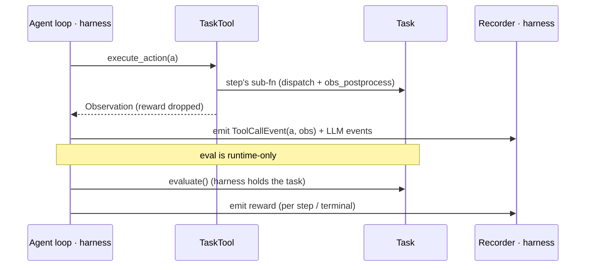
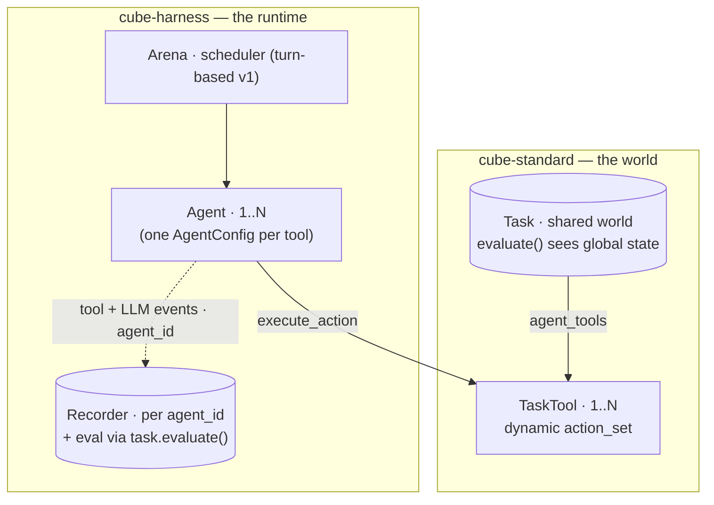

# RFC: The streamable Task — a tool view for agents (+ multi-agent)

**Status:** DRAFT
**Author:** Alexandre Lacoste (w/ Claude)
**Date:** 2026-06
**Companion (harness):** `cube-harness/openspec/changes/multi-agent-episode`.

## The idea

A `Task` is the **world**: it owns shared state + lifecycle (`reset` / `evaluate` /
`close`). The **default** way an agent interacts with it is a thin **`TaskTool`** — a
tool-shaped view (`execute_action` + a dynamic `action_set`) that returns just the
**observation** — held *instead of* the task. A multi-agent task exposes **one `TaskTool`
per agent** (`agent_tools()`; single-agent = N=1).

`step()` is **retained as a gym-compatibility view** (gym / RL / NeMo callers) — no longer
the primary surface. The `TaskTool` is, because it's the one that fits **parallel tool
calls** (the caller decides multiplicity) and **multi-agent** (N tools) naturally, where the
batched single-`EnvironmentOutput` `step` is awkward.

The standard stays tiny: the `TaskTool` view, `agent_tools()`, and two **optional** hooks.
Trajectory **capture** and **orchestration** (loops, scheduling, budget, sinks) stay in the
harness — so the standard never learns the words *LLM*, *loop*, *turn*, or *budget*.

## What cube-standard adds (minimal)

```python
class Task:                               # the world — runtime-driven; never held by an agent
    def step(self, action) -> EnvironmentOutput: ...   # gym-COMPATIBILITY view; FINALIZED, do-not-override
    def evaluate(...) -> tuple[float, dict]: ...        # EXISTING — reward; runtime-side only
    def agent_roles(self) -> dict[str|None, int]: ...  # NEW: roster, role->seats (default {None:1})
    def make_tool(self, role=None) -> Tool: ...         # NEW: the role/ACTOR seam — a fresh session per seat
    def get_task_tool(self, role=None): ...             # NEW: per-seat view (role=None reuses self.tool)
    def agent_tools(self) -> list[TaskTool]: ...        # CONCRETE: expands agent_roles, assigns seat index
    def prepare_world(self): ...                        # NEW: eager once-per-task world setup (default no-op)
    @property
    def tool(self): ...                                 # LAZY + memoized: default no-role tool / admin handle
    def _execute_action(self, action, tool=None): ...   # NEW: shared per-action CORE (STOP->AgentStop,
        # dispatch through `tool`, error->observation). Both views run THIS. No action_set_for/tool_for —
        # per-role actions fall out of each seat holding its own make_tool(role) tool.

class TaskTool:                           # the ONLY surface an agent holds (carries role + seat + its tool)
    @property
    def action_set(self) -> list[ActionSchema]: ...    # = its tool's actions (filtered) + STOP; dynamic
    def execute_action(self, action: Action) -> Observation: ...
        # Runs the SAME core through ITS tool + obs_postprocess; returns the OBS ONLY. final_step raises
        # AgentStop. When validate_per_step, triggers evaluate() and surfaces (reward,info) via the callback.
    def set_eval_callback(self, fn): ...                # runtime recuperates per-step eval out-of-band (no reward to agent)
```

## One path — the cube can't be bypassed

`step` is internally a small **per-action core** `_execute_action` — STOP → `AgentStop`,
tool dispatch, error → observation — wrapped by the gym logic (`finished` + `evaluate` +
`EnvironmentOutput`). **Both views run the *same* core**, so the per-action behavior is
identical **by construction** — that's the invariant that matters. The *only* things the two
views do differently are **when `evaluate` runs** and **how `AgentStop` is handled**:

- **`TaskTool.execute_action()`** — the **default** agent view: the core + `obs_postprocess`,
  returning **obs only** (no reward, no done). The runtime calls `finished` / `evaluate` at
  its own cadence (per-action for the agent path) — so the agent never sees reward and there's
  no double eval. `final_step` raises `AgentStop`, which propagates to the runtime.
- **`step()`** — the **gym-compatibility** view: loop the core over the batch → `finished` →
  `evaluate` (per batch) → `obs_postprocess` → `EnvironmentOutput`. It **catches** `AgentStop`
  → `done=True`. **Finalized, do-not-override.**

Running the core (not full `step`) is what avoids re-running `evaluate` / `finished` per
action. Whatever a cube puts in `evaluate` / `finished` / `obs_postprocess` runs identically
under gym `step`, an in-process agent loop, or an external agent — **cubes customize the
existing hooks, never the orchestration.** A tool **error is always an observation** (gym
included) — never terminal; only `finished` / `evaluate` decide termination. (No new
`pre_step` / `post_step` hooks — the one cube that overrode `step` is fixed directly.)

## STOP — already an exception; the refactor just removes the sprawl

`final_step` (the agent's "I'm done" sentinel) **already** works this way: dispatching it
raises `AgentStop` (today's `TaskDone`, a `BaseException`), which the runtime catches with
`try/except` — the agent loop never introspects actions. **This RFC does not re-architect
STOP.**

What it removes is the *sprawl* from wrapping each toolbox leaf today. Because the agent now
holds a single `TaskTool` and STOP is recognized in **one** shared per-action place,
- per-tool-leaf STOP registration + `_dedup_stop_actions` (the duplicate-name band-aid),
- the manual `STOP_ACTION` appends in `react` / `genny` / `legacy`,
- and the `done`-flag plumbing

all delete themselves — net code removal, no new mechanism. gym `step` still catches the
exception → `done=True`; the agent loop still lets it propagate. The auto-include +
Anthropic-safe schema (`stop-action-auto-include`) stay, now on the dynamic
`TaskTool.action_set`.

## Capture & eval live in the harness — no standard seam

Trajectory capture needs nothing in the standard:

- The agent loop already has each `(action, obs)` (it *called* `execute_action`), so it
  **emits its own tool + LLM events** through the recorder it already uses.
- **Reward** is hidden from the agent; the harness holds the `Task` and **recovers it
  directly** via `task.evaluate()` (per step / terminal). Keeping eval off the `TaskTool` is
  also what keeps it out of the agent's reach.



## Multi-agent — one task, many tools, with roles

The task declares a **roster** — `agent_roles() -> {role: seat_count}` (default `{None: 1}`,
single-agent) — and the runtime expands it (`agent_tools()`, concrete) into **one `TaskTool`
per seat** over a **single shared `Task`**. `role=None` is the lone single-agent seat; every
multi-agent seat carries a **role** (`"buyer"`/`"seller"`, or a symmetric `"player"`). A role
is not just a label: each seat holds **its own tool** from `make_tool(role)` — the **actor's
session** (the SSH model: identity bound at session creation), so a buyer's tool exposes buyer
actions and a seller's exposes seller actions, and "who acted" is implicit in *which* tool ran
the action — nothing role-specific touches the `Action`. The role also yields a stable
`agent_id` (`"buyer-0"`). The runtime attributes the right seat to the right agent by role
(heterogeneous per-role `AgentConfig`s = a forward extension; v1 is homogeneous). Multiplicity
is **task-fixed** for now (concrete counts); experiment-chosen counts (ranges) can come later.
Centralizing the world on one task is what makes the hard parts fall
out for free: its `evaluate()` sees the **global** state, so per-agent / general-sum reward
is attributable from the joint outcome; all tools mutate **one coherent world**; lifecycle
runs **once**.

**Scope — multi-agent ships in *this* change, not a follow-up.** Single-agent is just N=1 of
the same `agent_tools()` seam, so cube-standard gets multi-agent for free (the N≥1 default of
one method), and the harness arena (companion #497) lands **together** with the single-agent
rewire. Timing variants beyond **turn-based** (`async` / `batch` / real-time) are the only
multi-agent piece left for later.

The harness drives it (companion RFC): an **arena** runs N agents under a **scheduler**
(turn-based first), one agent per `TaskTool` from a single `AgentConfig` parameterized by
each tool's identity + action set.



**What stays cube-side** (surveyed ~20 multi-agent benchmarks — no standard primitives
needed): **communication** = an ordinary cube `send_message(to, content)` **action** — *not*
a standard primitive; cube-standard has no messaging concept. Executing it runs the cube's
code, which writes to the shared world, so the recipient observes it next turn; topology
(broadcast / targeted / team-private / neighbor-graph) is the cube's delivery logic.
**teams / zero-sum / mixed-motive** = how `evaluate()` maps joint state → per-agent reward;
**opponents & partners** = environment-internal agents the cube runs (`agent_tools()`
returns only the seats under test); **multi-metric eval** = `evaluate()` returns a metrics
dict; **chance** = sampled inside `execute_action`.

**Contracts the standard states explicitly:** the world may advance *between/without* an
agent's action (real-time engines tick natively; observe/no-op is a valid action); one
agent's action may mutate another's next observation (one shared task).

**Scheduling vs legality:** the cube expresses *legality* (dynamic `action_set`); the
arena only decides *who acts next*. Timing variants
(turn-based first; `async` / `batch` / real-time later) are harness scheduler policies.

**Non-goal:** JAX-vectorized MARL training libs (JaxMARL, CAMAR). GPU `vmap` over thousands
of functional worlds is a different *resource*, RL-training-shaped, not agent-eval — scoped
out rather than bending the standard.

## Forward extensions (add when needed — not in this change)

- **Parallel tool calls within a step.** The per-action core runs sequentially. Real
  concurrent intra-step dispatch means running it concurrently — add only when an agent
  actually needs sub-step parallelism.
- **External / black-box agent capture.** An in-process loop self-emits; a CLI / A2A agent
  driven over `cube.server` can't. Add a capture hook (a `Streamer`-style seam) on the
  `TaskTool` when external agents land — server-side, which also gives hard eval isolation.

## Relation to in-flight / archived changes

- **`core-extensions` — `MultiAgentTask` / `per_agent_action_set` (competing seam, must
  reconcile).** That change proposes a `MultiAgentTask(Task)` subclass exposing
  `per_agent_action_set() -> dict[id, list[ActionSchema]]` + a `MultiAgentEnvironmentOutput`.
  This RFC **supersedes that multi-agent seam**: `agent_tools()` on the **base** `Task`
  (N=1 default) unifies single- and multi-agent, each `TaskTool` carries its own **dynamic**
  `action_set` (replacing the per-agent dict), and per-agent reward comes from `evaluate()`
  over global state (no `MultiAgentEnvironmentOutput`). core-extensions' async / streaming-obs
  concerns are orthogonal. *To confirm with that change's author.*
- **`stop-action-auto-include`.** Keep the auto-include + Anthropic-safe schema — now
  surfaced through the **dynamic `TaskTool.action_set`**. STOP *stays* an action that raises
  `AgentStop` (it already does); the simplification is that the per-leaf registration / dedup
  and the per-agent manual appends this change was working around all **go away**.
- **`agent-owns-loop` (archived) — the baseline this revises.** It shipped
  `build_monitored_env_tool` + `agent.run(obs, env_tool)`. This RFC swaps the
  `env_tool` / `MonitoredTool` surface for `TaskTool` + `agent_tools()`. Its "monitoring is
  not a cube-standard concern" invariant is preserved (no `Streamer` in the standard).
- **`primitive_toolbox()` + `tool-consolidation`** — orthogonal; `TaskTool` is defined
  against the consolidated `Tool` surface and coexists with the Pi-style primitive toolset.

## Landing footprint (what to update so it lands cleanly)

Mostly specs/docs; **one** real cube break.

- **cube-standard `openspec/specs/task/spec.md`** (load-bearing): re-word `step` as
  *finalized = gym-compatibility view*; add `TaskTool` + `agent_tools()` + the shared
  per-action core; restate STOP as *an action that raises `AgentStop`* (keep the auto-include
  on the dynamic `TaskTool.action_set`); state *tool error → observation*. ✅ **done** (code +
  this change).
- **Skills:** `new-cube` (`references/architecture.md`, `SKILL.md`, `todo-checklist.md`) +
  `review-cube` (`references/checks.md`) — document `TaskTool`; flag a `step()` override as a
  smell (use the existing hooks instead).
- **cube-harness `openspec/specs/{agent,episode}/spec.md`** — the loop hands a `TaskTool`,
  self-emits events, recovers reward via `task.evaluate()`, catches `AgentStop`. Agents keep
  taking `action_set` at `make()` (static today); per-turn re-read is a forward extension.
- **The one real break + the STOP cleanup:** `cubes/workarena/.../task.py` overrides `step()`
  for per-step cache invalidation → fix directly (drop the override; invalidate per action,
  not per step). The STOP machinery is **deleted**: `_dedup_stop_actions` + per-leaf STOP in
  `MonitoredTool`, and the manual `STOP_ACTION` appends in `react` / `genny` / `legacy` agents.

## Decisions (resolved) & open gates

**(1) Eval cadence — RESOLVED.** There is no "turn" once tool calls can be parallel — only
events. Eval runs **per `execute_action`** for the agent view and **per batch** for gym
`step`; since most benchmarks score only at the end, terminal eval is the norm and the
existing `validate_per_step` flag opts into mid-episode eval. No new surface. *(Implemented.)*

**(2) `StepError` policy — RESOLVED.** A tool error **always becomes an observation**
(non-terminal), gym included — "it should have been like that in the gym case." Only
`finished` / `evaluate` decide termination. No per-caller knob. *(Implemented:
`StepError.to_observation()`; gym `step` no longer sets `done` on error.)*

**(3) `pre_step` / `post_step` — RESOLVED: not added.** The hooks existed only to generalize
workarena's `step()` override; simpler to **fix workarena directly** (invalidate its validate
cache per action, not per step) than to add a contract surface. The agent's per-action eval
boundary is the harness's concern (companion #497).

**(4) `core-extensions` reconciliation (agreement gate, not code).**
`core-extensions` proposes `MultiAgentTask` + `per_agent_action_set`; this RFC's
`agent_tools()` **supersedes** that seam (see *Relation to in-flight changes*). Because
multi-agent ships in **this** change, the reconciliation **gates the whole landing** (not
just a later phase) — get that change's author to agree up front.

**(5) Multi-agent v1 specifics (harness companion #497).** Decided: **joint budget**;
episode ends when **all agents are done OR the budget is exhausted**. Still a first pass:
`AgentConfig.make(action_set, agent_id)` vs `make(task_tool)`, and heterogeneous per-role
configs — all in #497.

Decisions (1)–(3) are settled and implemented; only gate (4) remains before the harness rewire.
