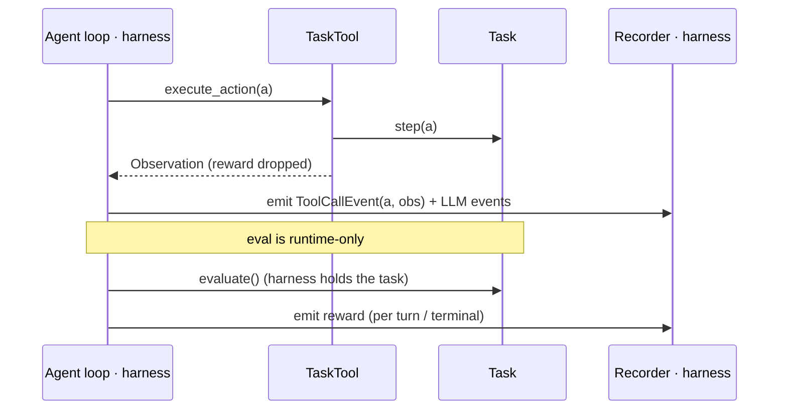
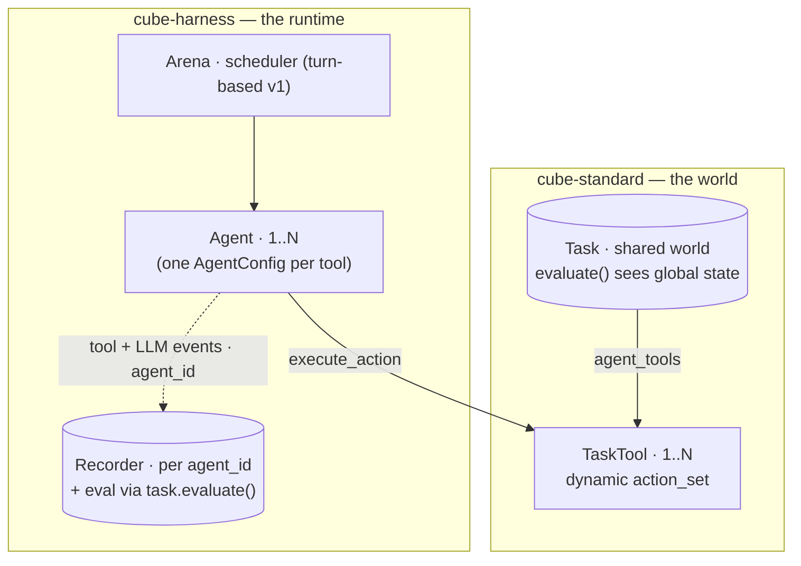

# RFC: The streamable Task — a tool view for agents (+ multi-agent)

**Status:** DRAFT
**Author:** Alexandre Lacoste (w/ Claude)
**Date:** 2026-06
**Companion (harness):** `cube-harness/openspec/changes/multi-agent-episode`.

## The idea

A `Task` is the **world**: it owns shared state + lifecycle (`reset` / `evaluate` /
`close`), and `step()` is its complete **gym view**. Agents never hold the task — they hold
a thin **`TaskTool`**: a tool-shaped view (`execute_action` + a dynamic `action_set`) that
returns just the **observation**. A multi-agent task exposes **one `TaskTool` per agent**
(`agent_tools()`; single-agent = N=1).

The standard stays tiny: it gains the `TaskTool` view, a per-turn hook, and `agent_tools()`.
Trajectory **capture** and **orchestration** (loops, scheduling, budget, sinks) stay in the
harness — so the standard never learns the words *LLM*, *loop*, *turn*, or *budget*.

## What cube-standard adds (minimal)

```python
class Task:                               # the world — runtime-driven; never held by an agent
    def step(self, action) -> EnvironmentOutput: ...   # the complete gym view; do-not-override
    def evaluate(...) -> tuple[float, dict]: ...        # reward — runtime-side only
    def on_turn_start(self) -> None: ...               # NEW: per-turn cube setup
    def agent_tools(self) -> list[TaskTool]: ...        # NEW: one view per agent (N=1 default)

class TaskTool:                           # the ONLY surface an agent holds
    @property
    def action_set(self) -> list[ActionSchema]: ...    # DYNAMIC — recomputed each turn
        # (legal-action masking, phase gating, real-time observe/no-op). Agents re-read it.
    def execute_action(self, action: Action | list[Action]) -> Observation | StepError: ...
        # RELAYS to step's per-action sub-function (tool dispatch + obs_postprocess) and
        # returns the OBS ONLY; done/final_step → AgentStop. It does NOT evaluate (the
        # harness does, at its own cadence — no double eval). Single vs batched is the
        # caller's (agent/harness) choice. No reset / evaluate / close.
```

## One path — the cube can't be bypassed

`step` is internally one **per-action sub-function** (tool dispatch + `obs_postprocess` +
`finished`/`STOP`) plus a gym wrapper (`evaluate` + `EnvironmentOutput` packaging). Both
views share that sub-function — there is no second implementation:

- **`step()`** — the complete gym view: the sub-function (looped over a batch) + `evaluate`
  + `EnvironmentOutput` (obs + reward + done). **Finalized, do-not-override.** Cubes that
  need per-turn logic use `on_turn_start`, not a `step` override.
- **`TaskTool.execute_action()`** — the agent view: the **same sub-function**, returning the
  **obs only** (no reward, no evaluate), `done`/`final_step` → `AgentStop`. The caller
  decides one action or a batch; the harness evaluates separately.

So whatever a cube puts in `evaluate` / `finished` / `obs_postprocess` / `on_turn_start`
runs identically under gym `step`, an in-process agent loop, or an external agent —
**cubes customize hooks, never the orchestration.** The one per-caller knob is the
**`StepError` policy** (gym: error ⇒ done; agent loop: error ⇒ returned to the agent to
recover).

## Capture & eval live in the harness — no standard seam

Trajectory capture needs nothing in the standard:

- The agent loop already has each `(action, obs)` (it *called* `execute_action`), so it
  **emits its own tool + LLM events** through the recorder it already uses.
- **Reward** is hidden from the agent; the harness holds the `Task` and **recovers it
  directly** via `task.evaluate()` (per turn / terminal). Keeping eval off the `TaskTool`
  is also what keeps it out of the agent's reach.



## Multi-agent — one task, many tools

`agent_tools()` returns **one `TaskTool` per agent** over a **single shared `Task`**
(single-agent = N=1). Centralizing the world on one task is what makes the hard parts fall
out for free: its `evaluate()` sees the **global** state, so per-agent / general-sum reward
is attributable from the joint outcome; all tools mutate **one coherent world**; lifecycle
runs **once**.

The harness drives it (companion RFC): an **arena** runs N agents under a **scheduler**
(turn-based first), one agent per `TaskTool` from a single `AgentConfig` parameterized by
each tool's identity + action set.



**What stays cube-side** (surveyed ~20 multi-agent benchmarks — no standard primitives
needed): **communication** = a `send_message(to, content)` action (observable, routable via
the cube's delivery logic — broadcast / targeted / team-private / neighbor-graph);
**teams / zero-sum / mixed-motive** = how `evaluate()` maps joint state → per-agent reward;
**opponents & partners** = environment-internal agents the cube runs (`agent_tools()`
returns only the seats under test); **multi-metric eval** = `evaluate()` returns a metrics
dict; **chance** = sampled inside `execute_action` / `on_turn_start`.

**Contracts the standard states explicitly:** the world may advance *between/without* an
agent's action (real-time engines tick natively; observe/no-op is a valid action); one
agent's action may mutate another's next observation (one shared task).

**Scheduling vs legality:** the cube expresses *legality* (dynamic `action_set` +
`on_turn_start`); the arena only decides *who acts next*. Timing variants (turn-based first;
`async` / `batch` / real-time later) are harness scheduler policies.

**Non-goal:** JAX-vectorized MARL training libs (JaxMARL, CAMAR). GPU `vmap` over thousands
of functional worlds is a different *resource*, RL-training-shaped, not agent-eval — scoped
out rather than bending the standard.

## Forward extensions (add when needed — not in this change)

- **Parallel tool calls within a turn.** The per-action sub-function runs sequentially.
  Real concurrent intra-turn dispatch means running it concurrently — add only when an
  agent actually needs sub-turn parallelism.
- **External / black-box agent capture.** An in-process loop self-emits; a CLI / A2A agent
  driven over `cube.server` can't. Add a capture hook (a `Streamer`-style seam) on the
  `TaskTool` when external agents land — server-side, which also gives hard eval isolation.

## Relation to in-flight / archived changes

- **`core-extensions` — `MultiAgentTask` / `per_agent_action_set` (competing seam, must
  reconcile).** That change proposes a `MultiAgentTask(Task)` subclass exposing
  `per_agent_action_set() -> dict[id, list[ActionSchema]]` + a `MultiAgentEnvironmentOutput`.
  This RFC **supersedes that multi-agent seam**: `agent_tools()` on the **base** `Task`
  (N=1 default) unifies single- and multi-agent, each `TaskTool` carries its own **dynamic**
  `action_set` (replacing the per-agent dict), and per-agent reward comes from `evaluate()`
  over global state (no `MultiAgentEnvironmentOutput`). core-extensions' async / streaming-obs
  concerns are orthogonal. *To confirm with that change's author.*
- **`stop-action-auto-include`.** STOP stays auto-included with its Anthropic-safe schema —
  just surfaced through the **per-turn `TaskTool.action_set`** now; `final_step` → `AgentStop`
  is the runtime/tool-side handling. The auto-append relocates; no conflict.
- **`agent-owns-loop` (archived) — the baseline this revises.** It shipped
  `build_monitored_env_tool` + `agent.run(obs, env_tool)`. This RFC swaps the
  `env_tool`/`MonitoredTool` surface for `TaskTool` + `agent_tools()` and adds
  `on_turn_start()`. Its "monitoring is not a cube-standard concern" invariant is preserved
  (no `Streamer` in the standard).
- **`primitive_toolbox()` + `tool-consolidation`** — orthogonal; `TaskTool` is defined
  against the consolidated `Tool` surface and coexists with the Pi-style primitive toolset.

## Landing footprint (what to update so it lands cleanly)

Mostly specs/docs; **one** real cube break.

- **cube-standard `openspec/specs/task/spec.md`** (load-bearing): re-word `step` as
  *finalized = complete gym view*; add **`on_turn_start()`** to the hooks list; add `TaskTool`
  + `agent_tools()`; relocate the STOP / `action_set` text into the per-turn `TaskTool.action_set`.
- **Skills:** `new-cube` (`references/architecture.md`, `SKILL.md`, `todo-checklist.md`) +
  `review-cube` (`references/checks.md`) — add `on_turn_start`; stop treating a `step()`
  override as normal.
- **`src/cube/_template/.../task.py`** — a commented `on_turn_start` stub (discoverability).
- **cube-harness `openspec/specs/{agent,episode}/spec.md`** — `make(action_set)`-once +
  per-turn re-read; the loop hands a `TaskTool`, self-emits events, recovers reward via
  `task.evaluate()`.
- **The one real break:** `cubes/workarena/.../task.py` overrides `step()` for per-turn
  cache invalidation → migrate to `on_turn_start()`. Harness agents' manual `STOP_ACTION`
  appends (`react`/`genny`/`legacy`) adapt to dynamic `action_set` + `final_step → AgentStop`.

## Open decisions

- **(1)** `finished` / `evaluate` cadence: **per-turn** (proposed) vs per-action.
- **(2)** `StepError` policy default + whether it's a per-caller knob.
- **(3)** Multi-agent v1 specifics (termination, budget, `AgentConfig.make()` signature)
  live in the harness companion.

`deltas.md` stays thin until (1)–(2) settle.
