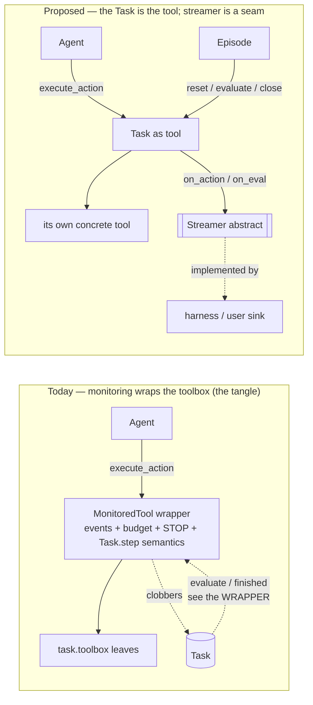
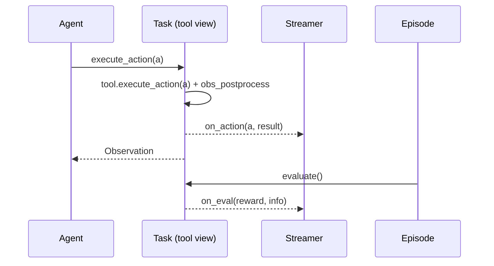
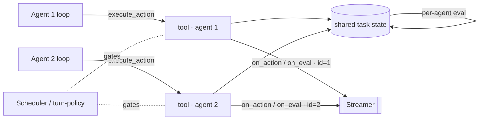

# RFC: The Task as a streamable tool (+ a path to multi-agent)

**Status:** DRAFT — high-level (we expand as we go)
**Scope note:** single-agent now; multi-agent shape committed now, runtime later (see §Multi-agent).
**Author:** Alexandre Lacoste (w/ Claude)
**Date:** 2026-06-05
**Related:** `agent-owns-loop`, `stop-action-auto-include`

## The idea

Give `Task` a second *view*: **a Task is a tool an agent interacts with.** The agent
calls `task.execute_action(action)` and gets an `Observation` back — same surface as
any `Tool`. You can **attach a `Streamer`** to the task; every time an action is
executed or an evaluation is produced, the task notifies the streamer.

`Streamer` is an **abstract class in cube-standard** — just the seam. The harness (or
any user) implements a concrete one (write to disk, XRay, OTel, RL-HTTP…). cube-standard
defines *when* it fires and *with what data*, never *where it goes*.

The gym `Task.step()` stays as-is — a second view of the same task, for gym/RL callers.

## Why

Today the harness re-implements the task's execution semantics in a `MonitoredTool`
that wraps the toolbox. Because that wrapper sits *outside* the task, it produced a
cluster of recent bugs — all the same root cause:

- It **replaced the task's own tool**, so the task's `evaluate()`/`setup()` lost access
  to their concrete tool — private attributes, `isinstance`, and `Toolbox.find_tool`
  all broke.
- It had to **register the `final_step` stop sentinel on every tool leaf**, which
  collided as a duplicate action name for any multi-tool task.
- It **bypassed `Task.step()` entirely**, silently disabling per-turn logic a cube had
  put there (workarena invalidates a validation cache per turn; bypassed, its score
  freezes at the first check).

All three exist only because monitoring lives *outside* the task, in a wrapper. If the
task executes its own actions and owns the streamer seam, the wrapper disappears and
that class of bug vanishes by construction.



## What changes in cube-standard (kept minimal)

```python
class Streamer(ABC):                       # NEW — just the seam
    def on_action(self, action: Action, result: Observation | StepError) -> None: ...
    def on_eval(self, reward: float, info: dict) -> None: ...
    # no event types, no storage, no budget — those live downstream

class Task:
    # tool view (NEW): execute one action through the tool + obs_postprocess,
    # notify the streamer. final_step raises AgentStop (today's TaskDone).
    def execute_action(self, action: Action) -> Observation | StepError: ...

    def attach_streamer(self, streamer: Streamer | None) -> None: ...   # NEW

    def on_turn_start(self) -> None: ...    # NEW hook: per-turn cube setup, the
                                            # supported replacement for overriding step()

    def step(self, action) -> EnvironmentOutput: ...   # UNCHANGED gym view
```

Everything else stays downstream: trajectory **event types**, **budget/limits**,
**LLM/agent capture**, and all **persistence**. cube-standard only learns the words
"a task can stream what it executes."



## Is this view complete? (read this first)

You asked whether the view is shallow. It's the right *shape*, but two things in it are
load-bearing and not yet addressed — if we don't, it fails:

1. **A task-streamer only sees the *environment* half of the trajectory.** `on_action` /
   `on_eval` capture what the task did — **not the agent's LLM calls / reasoning.** Those
   originate in the agent, not the task. So "attach a streamer to the task" does **not**
   by itself produce a full trajectory; the harness still has to capture the agent side
   and *merge* the two streams. Decision needed: is a `Streamer` attached to **both** the
   task and the agent, or does the harness own the merge? *(This is the one most likely to
   bite — the mental model "streamer on the task = full capture" is the shallow part.)*

2. **"The Task is the tool the agent holds" reverses a deliberate decision.** The
   agent-owns-loop change (cube-harness `#386`) kept the `task` reference *away* from the
   agent so it couldn't call `reset`/`evaluate`/`close`. If the agent now holds the
   task-as-tool, it can reach the lifecycle. Decision:
   expose a **restricted tool facet** (only `execute_action` / `action_set`) to the agent,
   vs. hand it the whole task and trust it.

Three more that need a decision but won't sink it:

3. **`Streamer`-in-standard reverses an existing invariant.** The `agent-owns-loop`
   companion says *"monitoring is not a cube-standard concern."* Putting even an abstract
   `Streamer` in the standard is a (small, deliberate) reversal — worth stating. Mitigated
   by keeping it a pure seam (no event types, no storage).
4. **`finished` / `done` / granularity.** `on_eval` covers evaluation, but where does
   "task is finished" fire, and is `finished`/`evaluate` per-action or per-turn? (The
   harness loop silently shifted these to per-action; workarena's `validate()` is
   expensive, so per-turn matters.)
5. **Concurrency.** Parallel `execute_action` (the agent-owns-loop fans out via `gather`)
   means concurrent `on_action` emits — the `Streamer` contract must state whether it can
   assume serialized calls.

## Multi-agent (shape it now)

The tool view generalizes: **a multi-agent task exposes a set of agent-facing tools —
one per agent.** Each carries its agent's id, action space, observation, and reward
attribution; a streamer records a unified, per-agent-tagged trajectory. **Single-agent
is the N=1 case** — a good sign this is the right shape. We commit to the shape now (it
doesn't fork the design); we don't build the runtime yet.



**Variants to support:** timing (**async** any agent any time · **turn-based** in order
· **batch** all at once per turn); per-agent **action + observation** spaces; per-agent
or **joint/general-sum reward**; **inter-agent communication** (direct vs through-env);
**shared vs partitioned** world state; **dynamic membership** (join/leave/spawn);
**per-agent vs episode** termination; **partial observability** (an agent's obs reflects
others' intervening actions).

**Load-bearing considerations (what makes it fail):**

1. **Shared state must serialize even in "async".** Tools are views on one world; two
   simultaneous `execute_action`s race. "Async" = interleaved with serialized state
   access; a returned obs is a snapshot others are concurrently changing.
2. **Batch ≠ turns.** No agent acts unilaterally: collect all N actions → resolve jointly
   (incl. conflicts) → return each obs. A batch `execute_action` is *submit + await the
   joint step*, not an immediate execute.
3. **Make the schedule explicit.** "Who acts when" should be a named **scheduler /
   turn-policy**, not ad-hoc blocking inside the env. Blocking N loops to simulate turns
   is uniform for authors but pushes deadlock/ordering risk into the runtime.
4. **Reward attribution needs the joint state.** "Each tool knows its eval" works only if
   that eval can see the **global** state — otherwise general-sum rewards are
   unexpressible.
5. **The streamer is multi-stream.** Every event needs an **agent id**; the trajectory is
   one interleaved timeline *and* per-agent slices. Compounds open decision (1): N agents'
   LLM streams + the env stream all merge.
6. **The harness needs a multi-agent runner.** `Episode` (one loop) → an **arena** running
   N agent loops + the scheduler. The bigger-scope piece; spans cube-standard (task = set
   of agent-tools + per-agent eval + schedule hook) and cube-harness (the runner).

## Open decisions

- **(1)** streamer on the task only, or task + agent, or harness-owned merge.
- **(2)** restricted tool facet vs whole task to the agent.
- **(3)** accept `Streamer` in cube-standard as a pure seam (vs harness-only).
- **(4)** `finished` / `evaluate` cadence: per-turn (proposed) vs per-action.
- **(5) multi-agent scope for v1:** which variants land first (async/turn/batch?),
  is inter-agent communication an action or a channel, and is the scheduler a
  cube-standard concept or a harness one?

`deltas.md` stays intentionally thin until we settle (1)–(5).
