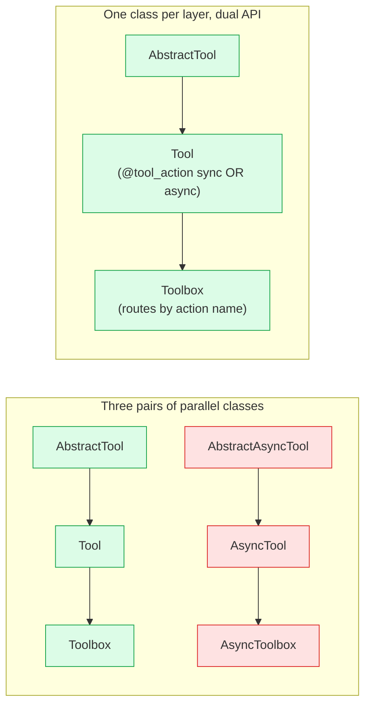
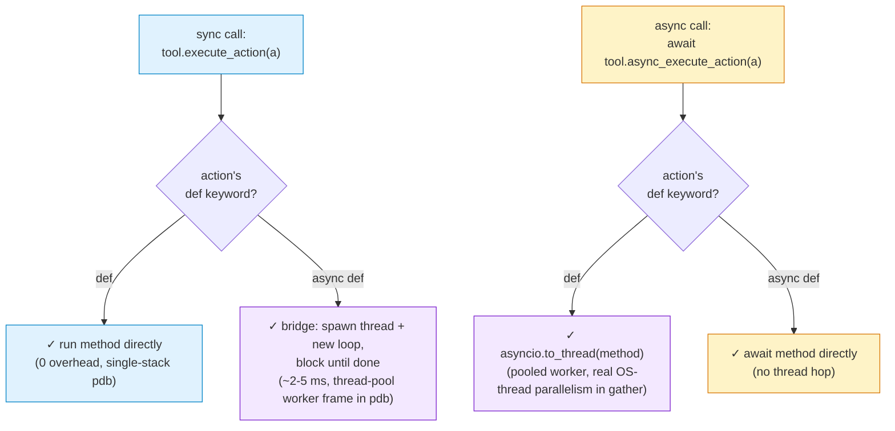

# Proposal: Collapse `Tool` + `AsyncTool` into one `Tool`

## What this is, in one sentence

Today, a cube tool author has to pick *sync tool* or *async tool* upfront, and once they pick, every `@tool_action` method on the class has to match. This proposal lets one tool class carry both kinds of methods, with dispatch routed per method.

## The friction today

Two parallel hierarchies live in `cube.tool`:

```python
# Option A: sync
class CalculatorTool(Tool):
    @tool_action
    def add(self, a: float, b: float) -> str:
        return f"{a + b}"

# Option B: async — and every @tool_action MUST be async
class AsyncBrowserTool(AsyncTool):
    @tool_action
    async def click(self, selector: str) -> str:
        await self._page.click(selector)
        return f"clicked {selector}"
```

A browser tool with one async operation (a Playwright `click` that awaits a network event) but ten sync helpers (a `screenshot` that reads a local PNG, a `scroll_to_top` one-liner) can't live on one class. Either:

- Make everything async (the sync helpers acquire a meaningless `async`/`await`), or
- Split into two classes (your cube now has `BrowserSyncHelpers` and `AsyncBrowserTool`).

`AsyncBrowserTool` is the only `AsyncTool` subclass in the entire codebase. Tool authors hit this friction once and just pick sync.

Second problem: the sync/async distinction is encoded in the **class name** and the **base class**, but conceptually it's a per-method property. A reader can't tell from `class WebTool(AsyncTool)` whether `screenshot()` is fast-local or slow-network — they have to read each method.

## The change in one diagram

The same dual-API pattern (`execute_action` sync + `async_execute_action` async on every class) applies at all three layers — the abstract base, the concrete leaf, and the container. Three pairs collapse to one column:



`AbstractAsyncTool`, `AsyncTool`, and `AsyncToolbox` are deleted outright — we're pre-1.0, there's no external surface to preserve.

## What you write after this lands

The three cases authors care about, each in 4 lines:

```python
# Case 1 — pure sync (unchanged from today).
class CalculatorTool(Tool):
    @tool_action
    def add(self, a: float, b: float) -> str:
        return f"{a + b}"

# Case 2 — pure async (was AsyncTool; same body).
class AsyncBrowserTool(Tool):
    @tool_action
    async def click(self, selector: str) -> str:
        await self._page.click(selector)
        return f"clicked {selector}"

# Case 3 — mixed (the new affordance).
class BrowserTool(Tool):
    @tool_action
    def screenshot(self) -> bytes:
        return self._page.screenshot()         # sync local file read

    @tool_action
    async def navigate(self, url: str) -> str:
        await self._page.goto(url)             # async network roundtrip
        return f"loaded {url}"
```

Case 3 is the new thing.

## How dispatch works (the two call sites, four routes)

A `Tool` exposes **two** ways to execute an action. The caller picks based on its own call-site shape, not based on the tool:

```python
# Sync call-site (Agent._run, sync test, sync helper):
result = tool.execute_action(action)

# Async call-site (Agent._arun + asyncio.gather):
result = await tool.async_execute_action(action)
```

Both call-sites work **for both action kinds** — the framework bridges the impedance mismatch automatically when needed:



|  | action `def` (sync) | action `async def` (async) |
|---|---|---|
| `execute_action()` (sync caller) | direct call, no overhead | thread+loop bridge, ~2-5 ms |
| `await async_execute_action()` (async caller) | `asyncio.to_thread`, pooled worker | direct await, no thread |

The two "fast" cells handle most calls. The two "bridge" cells let mixed-action tools just work from any call-site — you pay the bridge cost only on the mismatch, and only for that one call.

## What this means for agent authors

cube-harness's `Agent` base class has two loop-body methods, picked by a config flag:

- **`Agent._run`** — sync body. The default. Loops `step → execute_action → step → ...`. No `await` anywhere on the action path.
- **`Agent._arun`** — async body. Opt-in via `AgentConfig.parallel_actions=True`. Dispatches N actions per step in parallel via `asyncio.gather`.

Each loop body maps cleanly to one dispatch method:

| Agent loop | Tool call site | Best for |
|---|---|---|
| `_run` (sync, default) | `tool.execute_action(a)` | The 99% case. Single-stack pdb. Bridges to a thread+loop for the rare async-action call so mixed tools still work. |
| `_arun` (async, opt-in) | `await tool.async_execute_action(a)` | LLM emits N independent tool calls per turn; wall-clock = max(latencies). Sync actions pool through `asyncio.to_thread` for real parallelism. |

Both bodies work against the **same** tool class **and any mix of sync/async actions inside it**. The agent author picks based on their loop semantics, not the tool's. A tool author shipping `BrowserTool` (mixed case 3 above) doesn't have to know or care which agent uses it.

## What the implementation looks like

The base `Tool` class gains two dispatch methods that handle the per-method routing. Sketch:

```python
class Tool(_ToolActionsMixin, AbstractTool):

    def execute_action(self, action: Action) -> Observation | StepError:
        method = self.get_action_method(action)
        if inspect.iscoroutinefunction(method):
            return self._bridge_async_to_sync(method, action)
        # Fast path: sync action, sync caller. No overhead.
        try:
            result = method(**action.arguments) or "Success"
        except Exception as e:
            return StepError.from_exception(e)
        return Observation(contents=[Content.from_data(result, tool_call_id=action.id)])

    async def async_execute_action(self, action: Action) -> Observation | StepError:
        method = self.get_action_method(action)
        if inspect.iscoroutinefunction(method):
            # Fast path: async action, async caller. Direct await.
            try:
                result = await method(**action.arguments) or "Success"
            except Exception as e:
                return StepError.from_exception(e)
        else:
            # Sync action, async caller: hop to the default ThreadPoolExecutor
            # (pooled, reused — no per-call thread spawn).
            try:
                result = await asyncio.to_thread(method, **action.arguments) or "Success"
            except Exception as e:
                return StepError.from_exception(e)
        return Observation(contents=[Content.from_data(result, tool_call_id=action.id)])

    def _bridge_async_to_sync(
        self, async_method: Callable, action: Action
    ) -> Observation | StepError:
        """Spawn a worker thread with its own event loop. ~2–5 ms overhead.

        Used only when a sync caller invokes an async @tool_action. The
        thread is one-shot (no pool) and daemonised. `contextvars.copy_context()`
        propagates the caller's context (OTel spans, logging state) into
        the worker so tracing isn't lost across the bridge.
        """
        ctx = contextvars.copy_context()
        fut: concurrent.futures.Future = concurrent.futures.Future()

        def runner() -> None:
            try:
                fut.set_result(ctx.run(asyncio.run, async_method(**action.arguments)))
            except Exception as e:
                fut.set_exception(e)

        threading.Thread(target=runner, daemon=True).start()
        try:
            result = fut.result() or "Success"
        except Exception as e:
            return StepError.from_exception(e)
        return Observation(contents=[Content.from_data(result, tool_call_id=action.id)])
```

~50 lines of dispatch on the base class. Subclasses don't touch any of it.

### Thread-affine tools (override hook)

Some tools wrap thread-affine resources — sync Playwright sessions, some database drivers, anything that pins state to the thread it was created on. The default `asyncio.to_thread` rotates through pool threads, which breaks affinity.

Such tools override `async_execute_action` to dispatch through a per-instance single-threaded executor:

```python
class PlaywrightTool(Tool):
    def __init__(self) -> None:
        self._executor = concurrent.futures.ThreadPoolExecutor(max_workers=1)
        # Initialize the session ON the executor thread so the session
        # and all subsequent calls share thread identity.
        self._session = self._executor.submit(self._init_session).result()

    async def async_execute_action(self, action: Action) -> Observation | StepError:
        method = self.get_action_method(action)
        if inspect.iscoroutinefunction(method):
            return await super().async_execute_action(action)
        # Sync action: route through the affinity-preserving executor.
        loop = asyncio.get_running_loop()
        try:
            result = await loop.run_in_executor(
                self._executor, lambda: method(**action.arguments)
            ) or "Success"
        except Exception as e:
            return StepError.from_exception(e)
        return Observation(contents=[Content.from_data(result, tool_call_id=action.id)])
```

A documented extension point, not a hidden gotcha — thread affinity is a real Python concern for some libraries, and the override is the right level of abstraction.

## Why this helps debugging

Actual call stacks when you hit a `breakpoint()` inside a tool action method:

**Sync agent (`_run`) calling a sync action via `execute_action`:**

```
pdb> bt
agent.py        _run                 result = env_tool.execute_action(action)
toolbox.py      execute_action       return leaf.execute_action(action)
user_tool.py    my_action            x = self.compute(...)      ← breakpoint here
```

Three frames. All on the main thread. `pdb> step` walks the code linearly. No event-loop frames, no thread-pool worker frames. **This is the property `Agent._run` was designed to preserve, and the unified `Tool` keeps it intact.**

**Async agent (`_arun`) calling a sync action via `async_execute_action` + `gather`:**

```
pdb> bt
agent.py        _arun                results = await asyncio.gather(...)
asyncio         gather               (event-loop machinery)
toolbox.py      async_execute_action result = await leaf.async_execute_action(a)
monitored_tool  async_execute_action await asyncio.to_thread(inner.execute_action, a)
<worker thread> user_tool   my_action    x = self.compute(...)  ← breakpoint here
```

More frames, jumps to a thread-pool worker for the sync method. Still debuggable, just harder to reason about. The cost of opting into parallel dispatch.

Agent authors who don't need parallelism keep the cheap, debuggable path. Tool authors write one class and don't care which side calls them.

## Why this helps efficiency

**Sync default**: zero async overhead, zero thread-pool overhead. One frame from toolbox into the tool method. Same as today.

**Parallel dispatch**: N actions of K seconds each finish in `max(K_i)` wall-clock instead of `sum(K_i)`. Sync actions inside `asyncio.gather` hop to a thread-pool worker via `asyncio.to_thread`; async actions are awaited directly. Real OS-thread parallelism for I/O-bound work.

Reference data point: cube-harness's parallelism smoke (`scripts/smoke/investigator_drivers.py`) measures clean dispatch through 24 parallel sync-action calls before any CLI-side contention. The new shape preserves that.

## Migration

| What you have today | After this lands |
|---|---|
| `class FooTool(Tool)` (all sync) | unchanged |
| `class FooTool(AsyncTool)` (all async) | one-line edit: `(AsyncTool)` → `(Tool)` |
| `AsyncBrowserTool(AsyncTool)` | flips to `Tool` in this PR (canonical example) |
| `tb = Toolbox([...])` + `tb.execute_action(...)` | unchanged |
| `tb = AsyncToolbox([...])` + `await tb.execute_action(...)` | `Toolbox([...])` + `await tb.async_execute_action(...)` |
| `from cube.tool import AsyncTool, AbstractAsyncTool, AsyncToolbox` | rename to `Tool` / `AbstractTool` / `Toolbox` |

cube-harness has the only consumer of `AbstractAsyncTool`/`AsyncToolbox` (in `MonitoredTool` and `as_async`). A paired cube-harness PR migrates those off in lockstep with this PR.

## Alternatives we considered

- **Keep the split.** Status quo. The "one async tool method forces the whole class to be async" friction stays. Inconsistent with cube-harness `MonitoredTool` shape.
- **Make `execute_action` always async on the unified class, drop the sync method.** Cleaner one-method API, but the debuggable single-stack pdb story for `Agent._run` goes away — every tool call would have at least an event-loop frame in between. The dual surface is the point.
- **Ship deprecation aliases for one release window.** Considered but rejected: we're pre-1.0, the only consumer of these aliases is cube-harness (paired PR), and the alias machinery (~70 LOC) adds code now to delete later. Cleaner to do the migration atomically.
- **Consolidate `Tool` only, leave `Toolbox` / `AsyncToolbox` split.** The same dual-API pattern collapses Toolbox cleanly; shipping both consolidations together leaves the codebase with one consistent pattern rather than half-and-half.

## Risks

- **Class-definition-time validation goes away.** Today, `class FooTool(AsyncTool)` with a sync `@tool_action def` is an import-time error. After this PR, mixing is explicitly supported, so that check is dropped. Authors who previously caught structural mistakes at import now catch them at first call (or never, if the path isn't exercised) — slight regression in early-error guarantees.
- **`Tool` is a moderately exposed name.** Every cube subclasses it. The unit-test matrix in `tests/test_tool.py` covers all four dispatch combinations (sync/async action × sync/async caller); downstream cubes should also run their own `pytest tests/` once the change lands.
- **Bridge overhead is invisible in the call site.** A sync agent calling an async-action tool spawns a thread + new loop — ~2–5 ms per call. If a hot path silently bridges every iteration, it adds up. Mitigation: the docstring on `execute_action` flags the bridge; agents that care about per-call latency switch to `_arun` and use `async_execute_action` directly.
- **Thread affinity stays an author's concern.** Default `async_execute_action` uses pooled threads (`asyncio.to_thread`). Tools wrapping thread-affine resources (sync Playwright, some DB drivers) must override `async_execute_action` to dispatch through a per-instance single-threaded executor (documented above). Not solved by this RFC — it's an unavoidable Python concern, and the override hook is the right level of abstraction.

## Known harness-side follow-ups (out of scope for this RFC)

- **F1 — sync-browser cubes broken on the agent-owns-loop episode** (miniwob, workarena, browsercomp). `Episode.run` runs under `asyncio.run`, and sync Playwright refuses to start with a running loop on the thread. Fix lands in cube-harness (route `task.reset/evaluate/close` + sync tool dispatch through a per-episode env-executor). Orthogonal to this RFC: F1 is about where Episode runs sync work; this RFC is about how `Tool` dispatches it.
- **cube-harness PR #487** — `install_monitoring` was wrapping `task.tool` in place, breaking task-side `setup/reset/evaluate/finished` for nearly every cube. Already fixed: the helper now returns a separate `env_tool` for the agent and leaves `task._tool` concrete. Independent of this RFC but worth merging before downstream cubes adopt the consolidated `Tool`.

## Companion work

- **Paired cube-harness PR** migrates `MonitoredTool`, `as_async`, and the agent's `isinstance(env_tool, AbstractAsyncTool)` checks off the deleted symbols. Merges in lockstep with this PR.
- **`AsyncBrowserTool`** (in `cube/tools/browser.py`) flips from `AsyncTool` → `Tool` in this PR (canonical example; one-line edit).
